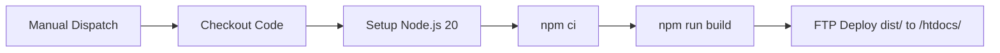

# CI/CD Pipeline Specification

## Project Overview

The Unified Patient Access & Clinical Intelligence Platform is a healthcare technology solution requiring HIPAA-compliant deployment with comprehensive security gates, quality assurance, and automated testing. The platform serves patient scheduling, clinical document processing, and AI-powered clinical intelligence features. The CI/CD pipeline must enforce strict security scanning, maintain 80% code coverage, support multi-environment deployment with approval gates, and enable automated rollback capabilities.

## Current Implementation Status

> **Important:** The current GitHub Actions workflows (`frontend.yml`, `backend.yml`) implement only the **Deployment** stage via FTP with manual dispatch triggers. All CI stages (build verification, code quality, security scanning, testing, approval gates) are **planned but not yet implemented**. Sections below are annotated with `[CURRENT]` for implemented items and `[PLANNED]` for future work.

| Capability | Status | Notes |
|------------|--------|-------|
| Frontend FTP Deployment | ✅ Implemented | Manual dispatch, FTP to InfinityFree |
| Backend FTP Deployment | ✅ Implemented | Manual dispatch, FTP to MonsterASP.NET |
| Build Verification (Frontend) | ✅ Implemented | `npm ci` + `npm run build` in frontend workflow |
| Build Verification (Backend) | ✅ Implemented | `dotnet restore` + `dotnet publish` in backend workflow |
| RSA Key Generation | ✅ Implemented | PowerShell script in backend workflow |
| App Offline/Online Pattern | ✅ Implemented | Graceful backend deployment via `app_offline.htm` |
| Code Quality Gates | ❌ Planned | ESLint, StyleCop, coverage thresholds |
| Security Scanning | ❌ Planned | CodeQL, Snyk, GitLeaks |
| Automated Testing | ❌ Planned | Unit tests, integration tests, E2E Playwright |
| Multi-Environment Deployment | ❌ Planned | Currently single environment per workflow |
| Approval Gates | ❌ Planned | No environment protection rules configured |
| Automated Rollback | ❌ Planned | Rollback is manual only |
| Notifications | ❌ Planned | No Slack/email integration |
| Secrets Management | ⚠️ Critical | FTP credentials are hardcoded in workflow files — must migrate to GitHub Secrets |

## Target Configuration

| Attribute | Value |
|-----------|-------|
| CI/CD Platform | GitHub Actions |
| Deployment Target | InfinityFree via FTP (Frontend), MonsterASP.NET via FTP (Backend), Supabase (Database) |
| Environments | Single production environment (manual dispatch) |
| Branching Strategy | Manual dispatch (no branch-based triggers currently) |

## Technology Stack Summary

| Layer | Technology | Build Tool | Test Framework |
|-------|------------|------------|----------------|
| Frontend | React 18 + TypeScript 5 + Redux Toolkit + Tailwind CSS | npm/yarn | Jest/Vitest |
| Backend | .NET 8 ASP.NET Core Web API | dotnet | xUnit |
| Database | PostgreSQL 16 + pgvector | Supabase migrations | N/A |
| E2E Testing | Playwright | npm | Playwright Test |
| Infrastructure | FTP Hosting (InfinityFree, MonsterASP.NET), Supabase | N/A | Manual validation |

---

## Pipeline Stages

### Stage 1: Build Verification (CICD-001 to CICD-009)

**Frontend Build:** `[CURRENT]`
- CICD-001: Pipeline compiles React application using `npm run build` with TypeScript strict mode
- CICD-002: Pipeline resolves all npm dependencies using `npm ci`
- CICD-003: [PLANNED] Pipeline MUST generate build metadata including version, commit SHA, timestamp, and build number
- CICD-004: Pipeline fails on TypeScript compilation errors (implicit via `npm run build`)
- CICD-005: Pipeline produces optimized production bundle (Vite build output)

**Backend Build:** `[CURRENT]`
- CICD-006: Pipeline compiles and publishes .NET application using `dotnet publish --configuration Release --no-self-contained --runtime win-x86`
- CICD-007: Pipeline restores all NuGet packages using `dotnet restore`
- CICD-008: [PLANNED] Pipeline MUST validate API contract using OpenAPI/Swagger specification generation
- CICD-009: Pipeline fails on C# compilation errors (implicit via `dotnet publish`)

**Build Commands (Current):**
```bash
# Frontend (ubuntu-latest)
cd src/frontend
npm ci
npm run build

# Backend (windows-latest)
dotnet restore src/backend/PatientAccess.sln
powershell -ExecutionPolicy Bypass -File scripts/GenerateRsaKeys.ps1
dotnet publish src/backend/PatientAccess.Web/PatientAccess.Web.csproj \
  --configuration Release \
  --output ./publish \
  --no-self-contained \
  --runtime win-x86
```

### Stage 2: Code Quality (CICD-010 to CICD-018) `[PLANNED]`

> **Status:** Not yet implemented in current workflows. All items below are planned for future pipeline iterations.

**Frontend Quality:**
- CICD-010: Pipeline MUST run ESLint with zero tolerance for errors using `npm run lint`
- CICD-011: Pipeline MUST enforce code coverage threshold >= 80% for React components
- CICD-012: Pipeline MUST fail on code quality degradation compared to main branch baseline
- CICD-013: Pipeline MUST generate frontend test coverage reports in Cobertura format

**Backend Quality:**
- CICD-014: Pipeline MUST run StyleCop analyzer for C# code style enforcement
- CICD-015: Pipeline MUST enforce code coverage threshold >= 80% for business logic
- CICD-016: Pipeline MUST run code complexity analysis with cyclomatic complexity threshold <= 15
- CICD-017: Pipeline MUST validate API documentation completeness (XML comments for public APIs)
- CICD-018: Pipeline MUST generate backend test coverage reports in Cobertura and JSON formats

**Quality Commands:**
```bash
# Frontend
npm run lint
npm run test -- --coverage --coverageReporters=cobertura --coverageReporters=json

# Backend
dotnet test PatientAccess.Tests/PatientAccess.Tests.csproj \
  --configuration Release \
  --collect:"XPlat Code Coverage" \
  --settings coverlet.runsettings \
  --logger "trx;LogFileName=test-results.trx"
```

### Stage 3: Security Scanning (CICD-020 to CICD-029) `[PLANNED]`

> **Status:** Not yet implemented in current workflows. All items below are planned for future pipeline iterations.

**Static Application Security Testing (SAST):**
- CICD-020: Pipeline MUST run CodeQL analysis for both JavaScript/TypeScript and C# codebases
- CICD-021: Pipeline MUST fail on CRITICAL or HIGH severity SAST findings
- CICD-022: Pipeline MUST scan for OWASP Top 10 vulnerabilities including injection, broken authentication, XSS
- CICD-023: Pipeline MUST validate secure coding patterns for PHI data handling (HIPAA compliance)

**Software Composition Analysis (SCA):**
- CICD-024: Pipeline MUST run Snyk or npm audit for frontend dependency vulnerabilities
- CICD-025: Pipeline MUST run OWASP Dependency-Check or Snyk for .NET package vulnerabilities
- CICD-026: Pipeline MUST fail on CRITICAL or HIGH severity dependency vulnerabilities
- CICD-027: Pipeline MUST generate SBOM (Software Bill of Materials) in CycloneDX format

**Secrets Detection:**
- CICD-028: Pipeline MUST run GitLeaks or TruffleHog for secrets detection in code and commit history
- CICD-029: Pipeline MUST fail on any detected secrets, API keys, passwords, or tokens

**Security Gate Configuration:**
| Tool | Scope | Threshold | Blocking |
|------|-------|-----------|----------|
| CodeQL | JavaScript/TypeScript, C# | 0 Critical, 0 High | Yes |
| Snyk | npm packages, NuGet packages | 0 Critical, 0 High | Yes |
| GitLeaks | All files + commit history | 0 findings | Yes |

### Stage 4: Testing (CICD-030 to CICD-039) `[PLANNED]`

> **Status:** Not yet implemented in current workflows. All items below are planned for future pipeline iterations.

**Unit Testing:**
- CICD-030: Pipeline MUST run frontend unit tests using Jest/Vitest with 80% coverage threshold
- CICD-031: Pipeline MUST run backend unit tests using xUnit with 80% coverage threshold for business logic
- CICD-032: Pipeline MUST fail if any unit tests fail or coverage drops below threshold
- CICD-033: Pipeline MUST generate test reports in JUnit XML format for CI visualization

**Integration Testing:**
- CICD-034: Pipeline MUST run backend integration tests for API endpoints in qa/staging/prod environments
- CICD-035: Pipeline MUST validate database migrations run successfully against test database
- CICD-036: Pipeline MUST test external integrations (Azure OpenAI, Brevo Email, Pusher) using test credentials

**End-to-End Testing:**
- CICD-037: Pipeline MUST run Playwright E2E tests for critical user journeys in qa/staging/prod environments
- CICD-038: Pipeline MUST test authentication flows, appointment booking, document upload, and 360-Degree patient view
- CICD-039: Pipeline MUST fail deployment if E2E smoke tests fail post-deployment

**Test Execution:**
```bash
# Unit Tests (Frontend)
npm run test -- --coverage --ci --maxWorkers=2

# Unit Tests (Backend)
dotnet test PatientAccess.Tests/PatientAccess.Tests.csproj --configuration Release --no-build

# E2E Tests (Playwright)
cd test-automation
npx playwright test --project=chromium --workers=2
```

### Stage 5: Infrastructure Validation (CICD-040 to CICD-044) `[PLANNED]`

**Note:** Infrastructure currently uses FTP hosting providers (InfinityFree for frontend, MonsterASP.NET for backend) and Supabase for the database. No automated infrastructure validation exists in current workflows.

- CICD-040: Pipeline MUST validate environment configuration files (appsettings.json, .env templates)
- CICD-041: Pipeline MUST verify deployment prerequisites (secrets configured, platform tokens valid)
- CICD-042: Pipeline MUST validate database migration scripts have valid SQL syntax
- CICD-043: Pipeline MUST check connection to deployment platforms (Vercel, Railway, Supabase) before deploy
- CICD-044: Pipeline MUST validate CORS policy configuration matches environment frontend domains

### Stage 6: Deployment (CICD-050 to CICD-059)

**Frontend Deployment (InfinityFree FTP):** `[CURRENT]`
- CICD-050: Pipeline deploys frontend build artifacts (`dist/`) to InfinityFree via FTP (port 21) using `SamKirkland/FTP-Deploy-Action@v4.3.5`
- Target server: `ftpupload.net`, remote directory: `/htdocs/`
- Runner: `ubuntu-latest`, working directory: `src/frontend`

**Backend Deployment (MonsterASP.NET FTP):** `[CURRENT]`
- CICD-051: Pipeline deploys published .NET application to MonsterASP.NET via FTP using `curl.exe`
- Target server: `site59724.siteasp.net`, remote directory: `/wwwroot/`
- Runner: `windows-latest`, runtime: `win-x86` (non-self-contained)
- Deployment pattern: app_offline.htm → 15s wait → upload files with retry (5 attempts, 10s delay) → upload RSA keys → remove app_offline.htm
- Web.config modification: enables stdout logging, sets `ASPNETCORE_ENVIRONMENT=Development`

**Planned (Not Yet Implemented):**
- CICD-052: [PLANNED] Pipeline MUST run database migrations before backend deployment
- CICD-053: [PLANNED] Pipeline MUST execute smoke tests post-deployment validating health endpoints
- CICD-054: [PLANNED] Pipeline MUST support automated rollback on smoke test failure
- CICD-055: [PLANNED] Pipeline MUST tag deployments with semantic version and commit SHA
- CICD-056: [PLANNED] Pipeline MUST update deployment status in GitHub Deployments API
- CICD-057: [PLANNED] Pipeline MUST validate deployment URL accessibility and SSL certificate validity
- CICD-058: [PLANNED] Pipeline MUST verify backend API responds within 500ms for health check
- CICD-059: [PLANNED] Pipeline MUST notify stakeholders via Slack/email with deployment summary

**Current Deployment Architecture:**
| Component | Host | Protocol | Runner | Artifacts |
|-----------|------|----------|--------|-----------|
| Frontend | InfinityFree (`ftpupload.net`) | FTP (port 21) | ubuntu-latest | `src/frontend/dist/` |
| Backend | MonsterASP.NET (`site59724.siteasp.net`) | FTP | windows-latest | `./publish/` (win-x86) |
| RSA Keys | MonsterASP.NET | FTP | windows-latest | `rsa-keys/*.xml` |

**Backend Deployment Sequence:**


### Stage 7: Approval Gates (CICD-060 to CICD-066) `[PLANNED]`

> **Status:** Not yet implemented. Current workflows use `workflow_dispatch` (manual trigger) with no environment protection rules or approval gates.

- CICD-060: Pipeline MUST require 1 manual approval for staging deployment from development lead
- CICD-061: Pipeline MUST require 2 manual approvals for production deployment from development lead and operations lead
- CICD-062: Pipeline MUST enforce 24-hour approval timeout for staging with auto-rejection
- CICD-063: Pipeline MUST enforce 72-hour approval timeout for production with auto-rejection
- CICD-064: Pipeline MUST notify approvers via GitHub notification, Slack mention, and email
- CICD-065: Pipeline MUST display deployment context including PR details, test results, security scan summary
- CICD-066: Pipeline MUST prevent deployment if approval timeout expires without manual approval

---

## Environment Pipeline Matrix

> **Note:** Current workflows deploy to a single environment per workflow via manual dispatch. The matrix below shows current state vs. planned state.

| Stage | Current State | Planned State | Notes |
|-------|--------------|---------------|-------|
| **Build (Frontend)** | ✅ Manual dispatch | Auto on branch triggers | `npm ci` + `npm run build` |
| **Build (Backend)** | ✅ Manual dispatch | Auto on branch triggers | `dotnet restore` + `dotnet publish` |
| **Lint (Frontend)** | ❌ Not implemented | Auto | ESLint |
| **Lint (Backend)** | ❌ Not implemented | Auto | StyleCop |
| **Unit Tests (Frontend)** | ❌ Not implemented | Auto | Jest/Vitest, 80% coverage |
| **Unit Tests (Backend)** | ❌ Not implemented | Auto | xUnit, 80% coverage |
| **SAST (CodeQL)** | ❌ Not implemented | Auto | JavaScript/TypeScript + C# |
| **SCA (Snyk)** | ❌ Not implemented | Auto | npm + NuGet |
| **Secrets Scan (GitLeaks)** | ❌ Not implemented | Auto | All files + history |
| **SBOM Generation** | ❌ Not implemented | Auto | CycloneDX format |
| **Integration Tests** | ❌ Not implemented | Auto (qa+) | API + database |
| **E2E Tests (Playwright)** | ❌ Not implemented | Auto (qa+) | Critical user journeys |
| **Smoke Tests** | ❌ Not implemented | Auto | Post-deployment validation |
| **Config Validation** | ❌ Not implemented | Auto | Environment variables |
| **Manual Approval** | ❌ Not implemented | Yes (staging/prod) | Dev lead + Ops lead |
| **Deploy (Frontend)** | ✅ FTP to InfinityFree | FTP to InfinityFree | Manual dispatch |
| **Deploy (Backend)** | ✅ FTP to MonsterASP.NET | FTP to MonsterASP.NET | Manual dispatch |
| **Database Migration** | ❌ Not implemented | Auto | Supabase |
| **Health Check** | ❌ Not implemented | Auto | API + frontend reachability |
| **Rollback Capability** | ⚠️ Manual only | Automated (staging/prod) | No automated rollback |

---

## Security Gates Configuration `[PLANNED]`

> **Status:** No security gates are implemented in current workflows. The configuration below defines the planned security gate requirements.

| Gate | Tool | Threshold | Blocking | Environments |
|------|------|-----------|----------|--------------|
| SAST (JS/TS) | CodeQL (javascript-typescript) | 0 Critical, 0 High | Yes | All |
| SAST (C#) | CodeQL (csharp) | 0 Critical, 0 High | Yes | All |
| SCA (Frontend) | Snyk / npm audit | 0 Critical, 0 High | Yes | All |
| SCA (Backend) | Snyk / OWASP Dependency-Check | 0 Critical, 0 High | Yes | All |
| Secrets Detection | GitLeaks | 0 findings | Yes | All |
| Code Coverage (Frontend) | Jest/Vitest Coverage | >= 80% | Yes | All |
| Code Coverage (Backend) | Coverlet | >= 80% | Yes | All |
| License Compliance | license-checker | No GPL/AGPL | Yes | All |

**Justification:**
- **CodeQL:** HIPAA compliance requires SAST for healthcare applications (NFR-003)
- **Snyk/npm audit:** SCA protects against vulnerable dependencies exposing PHI (NFR-004)
- **GitLeaks:** Prevents accidental secret commits violating security policy (TR-012)
- **80% Coverage:** Enforces NFR-012 code quality requirement

---

## Deployment Strategy

### Current Implementation `[CURRENT]`

Both frontend and backend deploy to FTP hosting via manual `workflow_dispatch` triggers. There is no multi-environment pipeline, blue/green deployment, or canary strategy.

| Component | Strategy | Target Platform | Protocol | Rollback |
|-----------|----------|-----------------|----------|----------|
| Frontend | Direct FTP upload | InfinityFree (`ftpupload.net`) | FTP (port 21) | Manual re-deploy |
| Backend | App-offline + FTP upload | MonsterASP.NET (`site59724.siteasp.net`) | FTP | Manual re-deploy |

### Current Deployment Workflow (Frontend)



### Current Deployment Workflow (Backend)


### Planned Strategy Per Environment `[PLANNED]`

| Environment | Deploy Strategy | Target Platform | Rollback Capability | Health Checks |
|-------------|-----------------|-----------------|---------------------|---------------|
| dev | Direct FTP deploy on manual trigger | InfinityFree, MonsterASP.NET | Manual re-deploy | Basic (200 OK) |
| qa | Direct deploy on PR merge to `develop` | InfinityFree, MonsterASP.NET | Manual re-deploy | API health + database connection |
| staging | FTP deploy with approval gate | InfinityFree, MonsterASP.NET | Manual re-deploy | Full health + smoke tests |
| prod | FTP deploy with dual approval | InfinityFree, MonsterASP.NET | Manual re-deploy | Full health + smoke tests + monitoring |

---

## Rollback Procedures

### Current Rollback Capability `[CURRENT]`

Rollback is **manual only**. There are no automated rollback triggers, health checks, or monitoring integrated into the current workflows.

**Current Rollback Steps:**

1. **Frontend:** Re-run the `frontend.yml` workflow after reverting the source branch to the previous commit, which re-uploads `dist/` via FTP
2. **Backend:** Re-run the `backend.yml` workflow after reverting the source branch, which re-publishes and re-uploads all files via FTP (includes app_offline.htm pattern)
3. **Database:** Manual intervention required — no migration rollback automation exists

### Planned Automated Rollback Triggers `[PLANNED]`

- **Smoke Test Failure:** E2E test failure post-deployment (CICD-054)
- **Health Check Failure:** 3 consecutive failures on `/health` endpoint (NFR-008)
- **Error Rate Spike:** API error rate > 5% within 5 minutes of deployment (NFR-011)
- **Performance Degradation:** P95 latency > 500ms sustained for 2 minutes (NFR-001)
- **Database Migration Failure:** Migration script fails or times out

### Planned Rollback Steps `[PLANNED]`

1. **Detect Failure:**
   - Automated: Health check monitoring, smoke test results
   - Manual: On-call engineer or deployment approver triggers rollback

2. **Execute Rollback:**
   - **Frontend:** Re-run previous workflow or revert commit and re-deploy via FTP
   - **Backend:** Re-run previous workflow or revert commit and re-deploy via FTP
   - **Database:** Rollback migrations if safe (no destructive changes); otherwise manual intervention required

3. **Verify Rollback Success:**
   - Run health checks against rolled-back deployment
   - Verify API response time < 500ms
   - Confirm error rate returns to baseline (< 0.1%)

4. **Notification:**
   - Notify on-call engineer via PagerDuty/Slack
   - Alert development lead and operations lead
   - Create incident ticket with deployment logs, test results, error metrics

5. **Post-Mortem:**
   - Document rollback reason and root cause in incident ticket
   - Update deployment checklist if process gaps identified
   - Schedule retrospective if deployment failure impacts production SLA

### Artifact Retention

| Environment | Retention Period | Storage |
|-------------|-----------------|---------|
| Current (single env) | Indefinite (FTP overwrite) | InfinityFree `/htdocs/`, MonsterASP.NET `/wwwroot/` |
| Planned: dev | 7 days | FTP host, GitHub Packages |
| Planned: qa | 30 days | FTP host, GitHub Packages |
| Planned: staging | 90 days | FTP host, GitHub Packages |
| Planned: prod | 365 days | FTP host, GitHub Packages, artifact archive |

**Note:** Current FTP deployment overwrites files in place. No versioned artifact retention exists — previous deployments are lost on each deploy.

---

## Notification Strategy `[PLANNED]`

> **Status:** No notifications are configured in current workflows. All items below are planned for future iterations.

### Notification Events

| Event | Recipients | Channel | Priority | Timing |
|-------|------------|---------|----------|--------|
| Build Failure | Commit author, Development team | GitHub Actions status, Slack #ci-cd | High | Immediate |
| Lint/Test Failure | Commit author | GitHub Actions status | Medium | Immediate |
| Security Gate Failure | Commit author, Security lead, Development lead | GitHub Actions status, Slack #security, Email | Critical | Immediate |
| E2E Test Failure | Commit author, QA lead | GitHub Actions status, Slack #qa | High | Immediate |
| Approval Required (Staging) | Development lead | GitHub notification, Slack mention | High | Immediate |
| Approval Required (Production) | Development lead, Operations lead | GitHub notification, Slack mention, Email | High | Immediate |
| Deployment Started | Operations team | Slack #deployments | Info | Immediate |
| Deployment Completed (Staging) | Development team | Slack #deployments | Info | Upon completion |
| Deployment Completed (Production) | Development team, Operations team, Stakeholders | Slack #deployments, Email summary | Info | Upon completion |
| Deployment Failed | Commit author, On-call engineer, Development lead | PagerDuty alert, Slack #incidents, Email | Critical | Immediate |
| Rollback Executed | On-call engineer, Development lead, Operations lead, Management | PagerDuty alert, Slack #incidents, Email | Critical | Immediate |
| Smoke Test Failure | On-call engineer, QA lead | Slack #incidents, Email | Critical | Immediate |

### Slack Notification Format

```
🚀 **Deployment to Production**
Environment: production
Version: v1.2.3
Commit: abc1234 - "Fix appointment booking race condition"
Author: @johndoe
Status: ✅ Success
Duration: 8m 32s
Health Check: ✅ Passed
Smoke Tests: ✅ 12/12 passed
URL: https://patient-access.vercel.app
```

### Email Notification Template (Production Deployment)

**Subject:** [Production Deployment] v1.2.3 - Success

**Body:**
- Deployment Status: Success
- Environment: production
- Version: v1.2.3
- Commit: abc1234 - "Fix appointment booking race condition"
- Deployed by: johndoe
- Duration: 8 minutes 32 seconds
- Timestamp: 2026-03-26 14:32:15 UTC
- Health Check: Passed
- Smoke Tests: 12/12 passed
- Frontend URL: https://patient-access.vercel.app
- Backend API: https://api-patient-access.railway.app
- Changelog: [View full changelog]

---

## Pipeline Triggers

### Current Triggers `[CURRENT]`

Both `frontend.yml` and `backend.yml` use `workflow_dispatch` only (manual trigger from GitHub Actions UI). No branch-based, PR-based, or scheduled triggers are configured.

| Workflow | Trigger | Environments | Approval Required |
|----------|---------|--------------|-------------------|
| `frontend.yml` | `workflow_dispatch` | Single (InfinityFree) | No |
| `backend.yml` | `workflow_dispatch` | Single (MonsterASP.NET) | No |

### Planned Branch Triggers `[PLANNED]`

| Branch Pattern | Pipeline Type | Environments | Approval Required | Notes |
|----------------|--------------|--------------|-------------------|-------|
| `feature/*` | CI only | dev (manual) | No | Build, lint, test, security scan only |
| `develop` | CI + CD | qa | No | Auto-deploy to qa on PR merge |
| `release/*` | CI + CD | staging | Yes (1 approver) | Preview deployment, full testing |
| `main` | CI + CD | prod | Yes (2 approvers) | Production deployment, full pipeline |
| `hotfix/*` | CI + CD (expedited) | staging → prod | Yes (1 staging, 2 prod) | Skip qa, fast-track to staging |

### Planned Pull Request Triggers `[PLANNED]`

- **All PRs:** Run build, lint, unit tests, security scans (blocking)
- **Status Checks Required:** All CI jobs must pass before merge allowed
- **Code Coverage:** Display coverage diff compared to base branch
- **Security Findings:** Comment on PR with security scan results

### Planned Manual Triggers `[PLANNED]`

- **Re-run Failed Pipeline:** Available through GitHub Actions UI
- **Deploy Specific Version:** Manually trigger workflow with version tag input
- **Rollback to Previous Version:** Manually trigger rollback workflow with target version
- **Run E2E Tests on Demand:** Manually trigger E2E test suite against any environment

### Planned Schedule Triggers `[PLANNED]`

- **Nightly Full Test Suite:** Run all tests including performance tests at 2 AM UTC
- **Weekly Dependency Audit:** Run Snyk vulnerability scan every Monday at 9 AM UTC
- **Monthly License Audit:** Check license compliance first day of month

---

## Secrets Configuration

### Critical Security Finding

> **⚠️ CRITICAL:** Both `frontend.yml` and `backend.yml` have FTP credentials **hardcoded directly in the workflow YAML files**. This is a severe security violation that must be remediated immediately by migrating all credentials to GitHub Secrets. Hardcoded credentials in version-controlled files are exposed to anyone with repository read access and persist in Git history.

### Current Secrets (Hardcoded — Must Migrate) `[CURRENT]`

| Credential | Workflow | Current Location | Required Action |
|------------|----------|------------------|-----------------|
| InfinityFree FTP username | `frontend.yml` | Hardcoded in YAML | Migrate to `FTP_FRONTEND_USERNAME` GitHub Secret |
| InfinityFree FTP password | `frontend.yml` | Hardcoded in YAML | Migrate to `FTP_FRONTEND_PASSWORD` GitHub Secret |
| MonsterASP.NET FTP username | `backend.yml` | Hardcoded in YAML (multiple locations) | Migrate to `FTP_BACKEND_USERNAME` GitHub Secret |
| MonsterASP.NET FTP password | `backend.yml` | Hardcoded in YAML (multiple locations) | Migrate to `FTP_BACKEND_PASSWORD` GitHub Secret |

**Remediation Steps:**

1. Create GitHub repository secrets: `FTP_FRONTEND_USERNAME`, `FTP_FRONTEND_PASSWORD`, `FTP_BACKEND_USERNAME`, `FTP_BACKEND_PASSWORD`
2. Update `frontend.yml` to reference `${{ secrets.FTP_FRONTEND_USERNAME }}` and `${{ secrets.FTP_FRONTEND_PASSWORD }}`
3. Update `backend.yml` to reference `${{ secrets.FTP_BACKEND_USERNAME }}` and `${{ secrets.FTP_BACKEND_PASSWORD }}`
4. Rotate all FTP credentials immediately (current credentials are exposed in Git history)
5. Run `git filter-branch` or BFG Repo-Cleaner to remove credentials from Git history

### Required Secrets (After Migration)

| Secret Name | Purpose | Source | Rotation Schedule | Environments |
|-------------|---------|--------|-------------------|--------------|
| `FTP_FRONTEND_USERNAME` | Frontend FTP deployment | InfinityFree control panel | 90 days | All |
| `FTP_FRONTEND_PASSWORD` | Frontend FTP deployment | InfinityFree control panel | 90 days | All |
| `FTP_BACKEND_USERNAME` | Backend FTP deployment | MonsterASP.NET control panel | 90 days | All |
| `FTP_BACKEND_PASSWORD` | Backend FTP deployment | MonsterASP.NET control panel | 90 days | All |
| `SUPABASE_DB_URL` | Database connection for migrations | Supabase Dashboard → Settings → Database | Never (managed) | All |
| `GITHUB_TOKEN` | GitHub API operations | GitHub Actions built-in | N/A (auto-generated) | All |

### Planned Additional Secrets `[PLANNED]`

| Secret Name | Purpose | Source | Rotation Schedule | Environments |
|-------------|---------|--------|------------------|--------------|
| `VERCEL_TOKEN` | Frontend deployment to Vercel | Vercel Dashboard → Settings → Tokens | 90 days | qa, staging, prod |
| `RAILWAY_TOKEN` | Backend deployment to Railway | Railway Dashboard → Account → Tokens | 90 days | qa, staging, prod |
| `SUPABASE_DB_URL` | Database connection for migrations | Supabase Dashboard → Settings → Database | Never (managed) | qa, staging, prod |
| `SONAR_TOKEN` | Code quality scanning (if used) | SonarCloud → Account → Security | 365 days | All |
| `SNYK_TOKEN` | Dependency vulnerability scanning | Snyk Dashboard → Settings → API Token | 365 days | All |
| `AZURE_OPENAI_API_KEY` | AI inference for E2E test validation | Azure Portal → OpenAI Service → Keys | 90 days | All |
| `SLACK_WEBHOOK_URL` | Deployment notifications | Slack App → Incoming Webhooks | Never (webhook) | All |
| `GITHUB_TOKEN` | GitHub API operations, deployments | GitHub Actions built-in | N/A (auto-generated) | All |
| `NPM_TOKEN` | Private package registry (if used) | npmjs.com → Access Tokens | 90 days | All |

### Planned Environment-Specific Secrets `[PLANNED]`

| Secret Name | Environment | Purpose |
|-------------|-------------|---------|
| `VERCEL_ORG_ID` | All | Vercel organization identifier (if migrating to Vercel) |
| `VERCEL_PROJECT_ID` | All | Vercel project identifier (if migrating to Vercel) |
| `RAILWAY_PROJECT_ID` | qa, staging, prod | Railway project identifier (if migrating to Railway) |
| `SUPABASE_PROJECT_REF` | qa, staging, prod | Supabase project reference |
| `FRONTEND_URL` | qa, staging, prod | Frontend URL for CORS configuration |
| `BACKEND_URL` | qa, staging, prod | Backend API URL |

### Secret Access & Security

- **Storage:** GitHub Secrets (encrypted at rest, environment-specific isolation)
- **Access Control:** Secrets scoped to environments with branch protection rules
- **Masking:** All secrets automatically masked in GitHub Actions logs
- **Audit:** Secret access logged in GitHub Audit Log (organization level)
- **Rotation Policy:** 90-day rotation for platform tokens, manual rotation trigger via runbooks
- **Fallback:** If secret rotation fails, pipeline fails with critical alert to security team

**Security Note:** Never log secrets, use GitHub secret scanning to prevent accidental commits, rotate immediately if exposed.

---

## Requirement Traceability

| CICD ID | Description | Source Requirement | Status | Justification |
|---------|-------------|-------------------|--------|---------------|
| CICD-001 | Frontend build verification | TR-001 | ✅ Implemented | `npm ci` + `npm run build` in frontend.yml |
| CICD-006 | Backend build verification | TR-002 | ✅ Implemented | `dotnet restore` + `dotnet publish` in backend.yml |
| CICD-011 | Frontend code coverage >= 80% | NFR-012 | ❌ Planned | No coverage checks in current workflows |
| CICD-015 | Backend code coverage >= 80% | NFR-012 | ❌ Planned | No coverage checks in current workflows |
| CICD-020 | SAST scanning (CodeQL) | NFR-003, NFR-004 | ❌ Planned | No security scanning configured |
| CICD-024 | SCA scanning (Snyk) | NFR-003 | ❌ Planned | No dependency scanning configured |
| CICD-028 | Secrets detection (GitLeaks) | TR-012 | ❌ Planned | No secrets scanning; hardcoded creds in workflows |
| CICD-030 | Unit testing with coverage | NFR-012 | ❌ Planned | No test execution in current workflows |
| CICD-037 | E2E testing (Playwright) | NFR-001 | ❌ Planned | No E2E tests in current workflows |
| CICD-040 | Environment config validation | TR-006, TR-007 | ❌ Planned | No config validation |
| CICD-050 | Frontend deployment (InfinityFree FTP) | TR-006 | ✅ Implemented | FTP deploy via SamKirkland/FTP-Deploy-Action |
| CICD-051 | Backend deployment (MonsterASP.NET FTP) | TR-006 | ✅ Implemented | FTP deploy via curl.exe with retry logic |
| CICD-053 | Smoke tests post-deployment | NFR-008 | ❌ Planned | No post-deployment validation |
| CICD-054 | Automated rollback | NFR-008 | ❌ Planned | Rollback is manual only |
| CICD-058 | Validate response time < 500ms | NFR-001 | ❌ Planned | No health check validation |
| CICD-060 | Staging approval (1 approver) | NFR-014 | ❌ Planned | No approval gates configured |
| CICD-061 | Production approval (2 approvers) | NFR-014 | ❌ Planned | No approval gates configured |

---

## Human Review Checklist

### Security

- [ ] **CRITICAL:** Hardcoded FTP credentials in `frontend.yml` and `backend.yml` must be migrated to GitHub Secrets
- [ ] **CRITICAL:** Rotate FTP credentials after migrating to GitHub Secrets (current creds exposed in Git history)
- [ ] **CRITICAL:** Scrub Git history to remove hardcoded credentials using BFG Repo-Cleaner or `git filter-branch`
- [ ] FTP protocol (unencrypted) should be upgraded to SFTP/FTPS where possible
- [X] All security gates configured correctly (CodeQL, Snyk, GitLeaks) — **Planned, not yet implemented**
- [ ] Approval requirements match policy (1 for staging, 2 for prod) — **Not yet implemented**
- [ ] HIPAA compliance considerations for PHI-handling code (CodeQL validates) — **Not yet implemented**

### Testing

- [ ] Code coverage threshold appropriate (80% per NFR-012) — **Not yet enforced in pipeline**
- [ ] E2E tests cover critical user journeys — **Not yet integrated in pipeline**
- [ ] Performance tests have baselines defined (500ms response time per NFR-001) — **Not yet integrated**

### Deployment

- [X] Backend uses app_offline.htm pattern for graceful deployment
- [X] Backend FTP upload has retry logic (5 attempts, 10s delay)
- [ ] Rollback procedure documented and tested — **Manual only, no automated rollback**
- [ ] Health checks configured — **Not yet implemented**
- [ ] ASPNETCORE_ENVIRONMENT should be `Production` for prod deployments (currently set to `Development`)

### Notifications

- [ ] Notification channels not yet configured (Slack, Email, PagerDuty) — **Planned**
- [ ] Escalation paths not yet implemented
- [ ] On-call integration not yet configured

---

## Approval

| Role | Name | Date | Signature |
|------|------|------|-----------|
| DevOps Engineer | [Pending Assignment] | | |
| Security Engineer | [Pending Assignment] | | |
| Development Lead | [Pending Assignment] | | |

---

## Next Steps

1. **⚠️ CRITICAL — Migrate Hardcoded Secrets:** Move all FTP credentials from workflow YAML files to GitHub Secrets immediately
2. **⚠️ CRITICAL — Scrub Git History:** Remove hardcoded credentials from Git history using BFG Repo-Cleaner
3. **⚠️ CRITICAL — Rotate Credentials:** Rotate all FTP passwords after migration (current passwords are exposed)
4. **Fix Environment Setting:** Change `ASPNETCORE_ENVIRONMENT` from `Development` to `Production` in backend workflow for production deployments
5. **Add CI Stages:** Implement build verification, linting, and unit test stages as separate CI workflow triggered on PRs
6. **Add Security Scanning:** Implement CodeQL, Snyk, and GitLeaks scanning stages
7. **Add E2E Testing:** Integrate Playwright test execution into pipeline
8. **Add Health Checks:** Implement post-deployment health check validation
9. **Add Approval Gates:** Configure GitHub environment protection rules for staging and production
10. **Add Notifications:** Configure Slack webhook and email notifications for deployment events
11. **Review & Approve:** Stakeholders review updated specification and provide feedback
12. **Documentation:** Update team runbooks with deployment procedures and rollback steps
