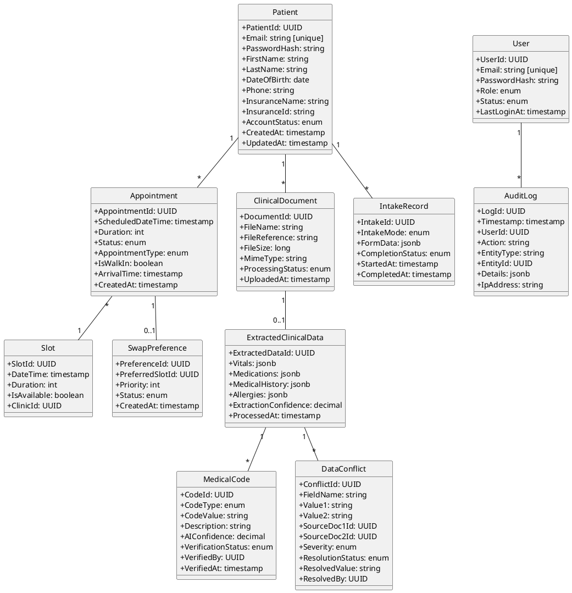
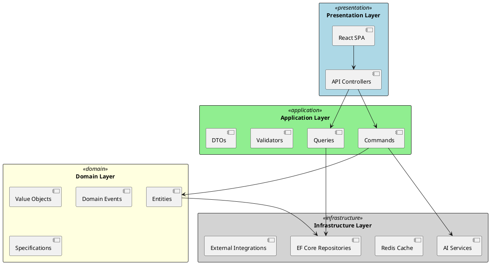

# Architecture Design

## Project Overview

The **Unified Patient Access & Clinical Intelligence Platform** bridges patient scheduling with clinical data management for healthcare organizations. It combines a patient-centric appointment booking system with a "Trust-First" clinical intelligence engine, delivering an end-to-end data lifecycle from initial booking to post-visit data consolidation.

**Target Users:**
- **Patients**: Healthcare consumers booking appointments, completing intake, uploading clinical documents
- **Staff**: Front desk and clinical personnel managing queues, verifying data, reviewing AI-suggested codes
- **Administrators**: System maintainers managing users, roles, and compliance monitoring

**High-Level Capabilities:**
- Self-service appointment booking with dynamic preferred slot swap
- AI-driven conversational intake with seamless manual fallback
- Clinical document upload with automated structured data extraction
- ICD-10/CPT medical code suggestion with human verification workflow
- 360-degree patient view with conflict detection
- HIPAA-compliant data handling with immutable audit logging

## Architecture Goals

- **AG-001**: Enable patients to self-book appointments with <3 minutes average completion time
- **AG-002**: Transform 20+ minute manual clinical data extraction into 2-minute verification workflow
- **AG-003**: Achieve >98% AI-Human Agreement Rate for medical code suggestions
- **AG-004**: Maintain 100% HIPAA compliance across all data operations
- **AG-005**: Deploy on free-tier infrastructure (Netlify/Vercel + Windows Services/IIS)
- **AG-006**: Support 99.9% system availability for healthcare-critical operations
- **AG-007**: Implement Trust-First AI architecture with mandatory human verification

## Non-Functional Requirements

### Performance Requirements

- NFR-001: System MUST respond to user-facing API requests within 2 seconds (p95)
- NFR-002: System MUST process clinical document extraction within 30 seconds for documents up to 50 pages
- NFR-003: System MUST support 200 concurrent users without performance degradation
- NFR-004: System MUST deliver real-time appointment availability updates within 500ms

### Availability Requirements

- NFR-005: System MUST achieve 99.9% uptime (8.76 hours maximum annual downtime)
- NFR-006: System MUST implement graceful degradation when external services (AI, calendar sync) are unavailable
- NFR-007: System MUST provide health check endpoints for monitoring infrastructure

### Security Requirements

- NFR-008: System MUST encrypt all PHI at rest using AES-256 encryption
- NFR-009: System MUST encrypt all data in transit using TLS 1.3
- NFR-010: System MUST implement role-based access control (Patient, Staff, Admin)
- NFR-011: System MUST enforce 15-minute automatic session timeout with graceful re-authentication
- NFR-012: System MUST implement account lockout after 5 consecutive failed authentication attempts
- NFR-013: System MUST sanitize all user inputs to prevent injection attacks

### Compliance Requirements

- NFR-014: System MUST maintain immutable audit logs for all patient and staff actions
- NFR-015: System MUST retain audit logs for minimum 7 years per HIPAA requirements
- NFR-016: System MUST implement minimum necessary access standard for PHI
- NFR-017: System MUST support audit log search and export for compliance investigations

### Scalability Requirements

- NFR-018: System MUST support horizontal scaling of API services
- NFR-019: System MUST handle appointment queue of 500+ same-day patients per facility
- NFR-020: System MUST support storage of 10,000+ clinical documents per patient

### Reliability Requirements

- NFR-021: System MUST implement retry logic with exponential backoff for external service calls
- NFR-022: System MUST preserve partial data on session timeout during intake

**Note**: Mark unclear requirements with [UNCLEAR] tag.

## Data Requirements

### Data Structure Requirements

- DR-001: System MUST store patient records with email as unique identifier
- DR-002: System MUST store appointments with immutable audit trail of status changes
- DR-003: System MUST store clinical documents with secure file references (not inline BLOB)
- DR-004: System MUST store extracted clinical data with source document traceability
- DR-005: System MUST store medical codes (ICD-10/CPT) with AI confidence scores and verification status

### Data Integrity Requirements

- DR-006: System MUST enforce referential integrity between patients, appointments, and documents
- DR-007: System MUST validate insurance information against internal predefined dummy records
- DR-008: System MUST de-duplicate patient data when consolidating multiple document sources
- DR-009: System MUST maintain version history for patient profile changes

### Data Retention Requirements

- DR-010: System MUST retain audit logs for minimum 7 years (HIPAA requirement)
- DR-011: System MUST support configurable document retention policies
- DR-012: System MUST implement soft delete for patient records (deactivation without data loss)

### Data Backup Requirements

- DR-013: System MUST perform daily automated database backups
- DR-014: System MUST support point-in-time recovery within 24-hour window
- DR-015: System MUST store backups in encrypted format with separate key management

### Data Migration Requirements

- DR-016: System MUST support zero-downtime schema migrations
- DR-017: System MUST version database schema with rollback capability

### Data Security Requirements

- DR-018: System MUST mask PHI in non-production environments
- DR-019: System MUST encrypt PHI columns using database-level transparent encryption

**Note**: Mark unclear requirements with [UNCLEAR] tag.

### Domain Entities

- **Patient**: Healthcare consumer with account credentials, demographics, and insurance. Unique by email. Owns appointments, documents, and intake records.
- **Appointment**: Scheduled visit with status workflow (Scheduled → Arrived → Completed/Cancelled/NoShow). Links to slot and optional swap preference.
- **Slot**: Available time block for appointments. Managed by clinic schedule.
- **SwapPreference**: Patient's preferred unavailable slot for automatic swap when available.
- **ClinicalDocument**: Uploaded PDF with processing status tracking. Stored as secure file reference.
- **ExtractedClinicalData**: Structured data extracted from document via AI. Contains vitals, medications, history as JSON.
- **MedicalCode**: ICD-10 or CPT code suggested by AI with confidence score and verification workflow.
- **DataConflict**: Detected inconsistency between multiple documents requiring human resolution.
- **IntakeRecord**: Patient-provided information via AI conversational or manual form mode.
- **User**: Staff or Admin user with role-based access.
- **AuditLog**: Immutable record of all system actions for compliance.

## AI Consideration

**Status:** Applicable

**Rationale:** Spec.md contains 5 `[AI-CANDIDATE]` and 2 `[HYBRID]` tagged requirements:
- FR-010: AI-driven conversational intake
- FR-015: Extract structured data from clinical documents
- FR-016: Generate unified 360-degree patient view
- FR-017: Detect data conflicts (HYBRID)
- FR-019: Map to ICD-10 codes
- FR-020: Map to CPT codes
- FR-033: No-show risk assessment (HYBRID)

**GenAI Fit Assessment:**

| Feature | AI Fit Score (1-5) | Classification | Rationale |
|---------|-------------------|----------------|-----------|
| Conversational Intake | 5 | HIGH-FIT | NLU required, natural dialogue, structured extraction |
| Clinical Data Extraction | 5 | HIGH-FIT | Document understanding, entity extraction, OCR+NLP |
| 360-Degree View Generation | 4 | HIGH-FIT | Semantic aggregation, data synthesis |
| ICD-10 Code Mapping | 5 | HIGH-FIT | Medical NLU, code suggestion from clinical text |
| CPT Code Mapping | 5 | HIGH-FIT | Procedure inference from clinical narratives |
| Data Conflict Detection | 3 | HYBRID | AI detection + mandatory human verification |
| No-Show Risk Assessment | 2 | HYBRID | Rule-based primary, pattern detection assist |

**Average Fit Score:** 4.1 (HIGH-FIT)

## AI Requirements

### AI Functional Requirements

- AIR-001: System MUST extract structured clinical data (vitals, medications, medical history) from uploaded PDF documents using RAG pattern with document grounding
- AIR-002: System MUST map extracted clinical data to ICD-10 diagnostic codes with citation of source text
- AIR-003: System MUST map extracted clinical data to CPT procedure codes with citation of source text
- AIR-004: System MUST generate patient intake responses through natural language dialogue using Tool Calling pattern
- AIR-005: System MUST detect semantic data conflicts across multiple clinical documents
- AIR-006: System MUST provide source citations for all AI-generated suggestions linking to original document locations

### AI Quality Requirements

- AIR-Q01: System MUST maintain hallucination rate below 2% on clinical extraction evaluation set
- AIR-Q02: System MUST achieve AI-Human Agreement Rate ≥98% for suggested medical codes
- AIR-Q03: System MUST achieve p95 latency ≤5 seconds for AI extraction responses
- AIR-Q04: System MUST enforce output schema validity ≥99% for structured extractions

### AI Safety Requirements

- AIR-S01: System MUST redact PII from prompts before model invocation (patient names, SSN, addresses)
- AIR-S02: System MUST enforce role-based document access filtering in RAG retrieval
- AIR-S03: System MUST log all prompts and responses for audit with 7-year retention (HIPAA)
- AIR-S04: System MUST fallback to manual extraction workflow when AI confidence <80%

### AI Operational Requirements

- AIR-O01: System MUST enforce token budget of 4,000 tokens per extraction request
- AIR-O02: System MUST implement circuit breaker for model provider failures (3 failures → 30s cooldown)
- AIR-O03: System MUST support model version rollback within 1 hour of deployment
- AIR-O04: System MUST cache embeddings for previously processed documents

### RAG Pipeline Requirements

- AIR-R01: System MUST chunk clinical documents into 512-token segments with 10% overlap
- AIR-R02: System MUST retrieve top-5 chunks with cosine similarity ≥0.75
- AIR-R03: System MUST re-rank retrieved chunks using semantic scoring with source recency weighting
- AIR-R04: System MUST store document embeddings in pgvector with HNSW indexing

**Note:** Each AIR traces to NFR for justification. AIR-Q02 maps to NFR-001 (performance) and success criteria.

### AI Architecture Pattern

**Selected Pattern:** HYBRID (RAG + Tool Calling)

**Pattern Justification:**

| Component | Pattern | Rationale |
|-----------|---------|-----------|
| Clinical Document Extraction | RAG | Documents serve as grounding data, citation required for trust |
| Medical Code Mapping | RAG + Reference DB | ICD-10/CPT codes require official reference grounding |
| Conversational Intake | Tool Calling | Must populate structured form schema with validation |
| Conflict Detection | HYBRID | Rules for known conflicts + AI for semantic similarity |

**Trust-First Implementation:**
- All AI suggestions require mandatory human verification before persistence
- Confidence scores visibly displayed to reviewing staff
- Full audit trail comparing AI suggestions vs. human decisions
- Automatic fallback to manual workflow when confidence thresholds not met

## Architecture and Design Decisions

### Clean Architecture with CQRS

The system follows Clean Architecture principles with CQRS (Command Query Responsibility Segregation) for clear separation of read and write operations:

**Decisions:**

1. **CQRS Pattern**: Separates read-optimized queries from write commands, enabling independent scaling and optimization for appointment availability (read-heavy) vs. booking operations (write)

2. **MediatR for Command/Query Dispatch**: Decouples controllers from handlers, enables cross-cutting concerns (logging, validation) via pipeline behaviors

3. **Domain Events for Async Processing**: Appointment bookings trigger domain events for notification dispatch, calendar sync, and audit logging without blocking the user

4. **Repository Pattern with Unit of Work**: Abstracts data access, enables testing, and ensures transactional consistency

5. **AI Service Abstraction**: LLM provider interface allows swapping between Azure OpenAI, OpenAI, or other providers without application code changes

6. **Circuit Breaker for External Services**: Prevents cascade failures when AI, calendar, or notification services are unavailable

## Technology Stack

| Layer | Technology | Version | Justification (NFR/DR/AIR) |
|-------|------------|---------|----------------------------|
| Frontend | React | 18.2+ | NFR-001 (performance), NFR-003 (concurrent users), free-tier Netlify/Vercel hosting |
| Frontend State | Zustand | 4.x | Lightweight state management, NFR-001 (performance) |
| Frontend Build | Vite | 5.x | Fast build times, optimal bundle splitting |
| Backend | ASP.NET Core | 8.0 | NFR-005 (availability), TR-004 (IIS/Windows), HIPAA compliance patterns |
| API Documentation | Swagger/OpenAPI | 3.0 | Developer experience, API contract |
| Database | PostgreSQL | 16+ | DR-001-019 (data requirements), pgvector for AIR-R04, free-tier compatible |
| Vector Store | pgvector | 0.5+ | AIR-R01-R04 (RAG pipeline), integrated with PostgreSQL |
| Cache | Upstash Redis | Latest | NFR-001 (performance), session management, specified in requirements |
| AI Provider | Azure OpenAI | GPT-4 | AIR-001-006 (AI functional), HIPAA BAA available, healthcare compliance |
| Embeddings | text-embedding-3-small | Latest | AIR-R01 (chunking), cost-effective, good medical text performance |
| AI Gateway | Custom Middleware | N/A | AIR-O01-O04 (AI ops), token budgeting, circuit breaker, logging |
| Testing - Unit | xUnit + FluentAssertions | Latest | NFR-021 (reliability), .NET ecosystem |
| Testing - Integration | TestContainers | Latest | Database integration testing |
| Testing - E2E | Playwright | Latest | Cross-browser testing, NFR-001 (performance) |
| Infrastructure | Windows Services/IIS | IIS 10 | Explicit deployment requirement from spec |
| Hosting - Frontend | Netlify or Vercel | Free tier | Budget constraint (C-001) |
| Security | ASP.NET Identity + JWT | N/A | NFR-008-013 (security), HIPAA compliance |
| Monitoring | Serilog + Seq | Latest | NFR-014-017 (compliance), structured logging |
| Documentation | Markdown + PlantUML | N/A | NFR-017 (audit), architecture documentation |

### Alternative Technology Options

| Category | Selected | Alternative | Non-Selection Rationale |
|----------|----------|-------------|-------------------------|
| Backend | .NET 8 | Spring Boot (Java) | .NET scores higher on IIS/Windows requirement (TR-004), native Windows Services support |
| Database | PostgreSQL | SQL Server | SQL Server licensing costs conflict with free-tier constraint (C-001); PostgreSQL provides pgvector for AI |
| Frontend | React | Angular | React has better Netlify/Vercel deployment experience; Angular's enterprise features not critical for Phase 1 |
| AI Provider | Azure OpenAI | OpenAI Direct | Azure OpenAI provides HIPAA BAA and enterprise compliance features required for healthcare |
| Vector Store | pgvector | Pinecone | Pinecone is paid service conflicting with C-001; pgvector integrates with existing PostgreSQL |

### AI Component Stack

| Component | Technology | Purpose |
|-----------|------------|---------|
| Model Provider | Azure OpenAI (GPT-4) | LLM inference for extraction, coding, conversation |
| Embedding Model | text-embedding-3-small | Document chunk embeddings (1536 dimensions) |
| Vector Store | pgvector (PostgreSQL) | Embedding storage and similarity search |
| AI Gateway | Custom ASP.NET Middleware | Request routing, token budgeting, circuit breaker, audit logging |
| Guardrails | Structured Output + Validation | JSON schema enforcement, PII redaction, confidence thresholds |
| Document Processing | Azure Document Intelligence (optional) | OCR for scanned PDFs (fallback: Tesseract) |

### Technology Decision

| Metric (from NFR/DR/AIR) | .NET 8 + PostgreSQL | Spring Boot + SQL Server | Rationale |
|--------------------------|---------------------|--------------------------|-----------|
| HIPAA Compliance (NFR-008-016) | 10 | 9 | Both compliant; .NET has stronger Windows integration |
| Free-Tier Cost (C-001) | 10 | 6 | PostgreSQL free; SQL Server licensing |
| IIS/Windows Native (TR-004) | 10 | 5 | .NET native; Java requires additional config |
| AI Integration (AIR-R04) | 10 | 7 | pgvector excellent; SQL Server vector support newer |
| Performance (NFR-001) | 9 | 9 | Both capable; .NET AOT compilation advantage |
| **Weighted Total** | **49** | **36** | **.NET 8 + PostgreSQL Selected** |

## Technical Requirements

### Technology Choice Requirements

- TR-001: System MUST use ASP.NET Core 8.0 for backend API services (justified by NFR-005, IIS requirement)
- TR-002: System MUST use React 18+ for frontend single-page application (justified by NFR-003, free-tier hosting)
- TR-003: System MUST use PostgreSQL 16+ with pgvector extension as primary database (justified by DR-001-019, AIR-R04)
- TR-004: System MUST deploy backend services via Windows Services or IIS (justified by explicit deployment constraint)
- TR-005: System MUST use Upstash Redis for session management and caching (justified by NFR-001, spec requirement)

### Architecture Pattern Requirements

- TR-006: System MUST implement Clean Architecture with distinct Domain, Application, Infrastructure layers
- TR-007: System MUST implement CQRS pattern separating read queries from write commands
- TR-008: System MUST implement Repository pattern with Unit of Work for data access
- TR-009: System MUST use domain events for asynchronous cross-cutting operations

### Platform Requirements

- TR-010: System MUST support deployment on free-tier platforms (Netlify, Vercel, GitHub Codespaces)
- TR-011: System MUST be deployable without containerization (native Windows Services/IIS)
- TR-012: [UNCLEAR] System MUST define specific cloud provider for production scaling beyond free tier

### Integration Requirements

- TR-013: System MUST integrate with Google Calendar API for appointment synchronization
- TR-014: System MUST integrate with Outlook Calendar API for appointment synchronization
- TR-015: System MUST integrate with SMS gateway for appointment reminders
- TR-016: System MUST integrate with Email gateway for confirmations and reminders
- TR-017: System MUST implement queuing with retry logic for calendar API rate limit handling

### Development Standards Requirements

- TR-018: System MUST use FluentValidation for input validation
- TR-019: System MUST use MediatR for CQRS command/query dispatch
- TR-020: System MUST use Entity Framework Core 8 for ORM
- TR-021: System MUST implement comprehensive logging via Serilog with structured output

**Note:** Each TR traces to NFR/DR/AIR. Mark unclear requirements with [UNCLEAR] tag.

## Technical Constraints & Assumptions

### Constraints

| ID | Constraint | Impact | Source |
|----|------------|--------|--------|
| C-001 | Free-tier hosting only (Netlify, Vercel, GitHub Codespaces) | Limits compute resources, no paid cloud services | BRD Section 5 |
| C-002 | Windows Services/IIS deployment required | Excludes Linux-only containerization options | BRD Section 7 |
| C-003 | No patient self-check-in (QR/mobile) | All arrivals must be staff-marked | BRD Section 6 |
| C-004 | 15-minute session timeout | Requires auto-save for long intake forms | FR-003 |
| C-005 | 99.9% uptime target | Requires high availability architecture | Spec |

### Assumptions

| ID | Assumption | Risk if Invalid | Mitigation |
|----|------------|-----------------|------------|
| A-001 | Internal dummy insurance records sufficient for Phase 1 | No real insurance validation | Document as Phase 2 scope |
| A-002 | Patients primarily upload PDF documents | Other formats unsupported | Clear format guidance, future enhancement |
| A-003 | Azure OpenAI HIPAA BAA available | AI provider change required | Abstracted LLM interface for swap |
| A-004 | Free-tier API limits sufficient for MVP | Calendar sync degradation | Implement queueing and rate limiting |
| A-005 | pgvector performance adequate for RAG | May need dedicated vector DB | Monitor and evaluate Pinecone for Phase 2 |

## Development Workflow

1. **Environment Setup**
   - Install .NET 8 SDK, Node.js 20+, PostgreSQL 16, Redis
   - Configure pgvector extension in PostgreSQL
   - Set up Azure OpenAI API access with HIPAA BAA
   - Configure Upstash Redis connection

2. **Database Foundation**
   - Create EF Core migrations for domain entities
   - Implement database-level encryption for PHI columns
   - Seed reference data (ICD-10/CPT code sets, dummy insurance records)
   - Configure audit log table with immutable trigger

3. **Backend API Development**
   - Implement domain entities and value objects
   - Create application layer commands/queries with MediatR
   - Build API controllers with FluentValidation
   - Implement authentication (ASP.NET Identity + JWT)
   - Configure CORS, rate limiting, security headers

4. **AI Integration**
   - Implement LLM provider abstraction interface
   - Build RAG pipeline (chunking, embedding, retrieval)
   - Create clinical extraction prompts with structured output
   - Implement medical code mapping with citation
   - Build AI gateway middleware (token budget, circuit breaker)

5. **Frontend Development**
   - Set up React 18 + Vite project structure
   - Implement component library (shadcn/ui or similar)
   - Build appointment booking flow with calendar UI
   - Create intake forms with AI/manual mode switching
   - Implement 360-degree patient dashboard

6. **Integration & Testing**
   - Unit tests with xUnit + FluentAssertions (80%+ coverage)
   - Integration tests with TestContainers for PostgreSQL
   - E2E tests with Playwright for critical flows
   - AI extraction accuracy evaluation against test set

7. **Deployment & Monitoring**
   - Configure IIS application pools and Windows Services
   - Set up Serilog with Seq for centralized logging
   - Implement health check endpoints
   - Configure SSL/TLS 1.3 certificates
   - Deploy frontend to Netlify/Vercel
