## Epic Summary Table

| Epic ID | Epic Title | Mapped Requirement IDs |
|---------|------------|------------------------|
| EP-TECH | Project Foundation & Infrastructure Setup | TR-001, TR-002, TR-003, TR-004, TR-005, TR-006, TR-007, TR-012, TR-013, TR-014, TR-018, NFR-008, NFR-009, NFR-012 |
| EP-DATA-I | Core Data Schema & Relationships | DR-001, DR-002, DR-003, DR-004, DR-005, DR-006, DR-008, DR-009, DR-010 |
| EP-DATA-II | Extended Entities & Reference Data | DR-007, DR-011, DR-012, DR-013, DR-014, DR-015, DR-016 |
| EP-001 | User Authentication & Access Control | FR-001, FR-002, FR-003, FR-004, FR-005, NFR-005, NFR-006, NFR-014, UXR-604 |
| EP-002 | Patient Appointment Booking & Scheduling | FR-006, FR-007, FR-008, FR-009, FR-010, FR-011, FR-012, TR-019, NFR-001, UXR-101 |
| EP-003 | Staff Operations & Queue Management | FR-013, FR-014, FR-015, FR-016, UXR-004, UXR-605 |
| EP-004 | Patient Intake — AI & Manual Modes | FR-017, FR-018, FR-019, FR-020, FR-021, TR-021, AIR-001, AIR-S03, AIR-O01, UXR-102, UXR-103 |
| EP-005 | Notifications, Calendar & No-Show Prevention | FR-022, FR-023, FR-024, FR-025, FR-026, TR-008, TR-009, TR-010, TR-011, TR-020, TR-023, NFR-016, NFR-017 |
| EP-006-I | Clinical Document Upload & Processing Pipeline | FR-027, FR-029, TR-017, TR-022, NFR-010, NFR-018, UXR-503, UXR-207 |
| EP-006-II | Clinical Document AI Extraction | FR-028, TR-016, AIR-002, AIR-008, AIR-009, AIR-Q02, AIR-Q04, AIR-Q05, AIR-O02, AIR-O04, NFR-013 |
| EP-007 | Clinical Intelligence — 360-Degree Patient View | FR-030, FR-031, FR-032, FR-033, AIR-005, AIR-006, AIR-007, NFR-002, UXR-402 |
| EP-008 | Medical Coding & RAG Pipeline | FR-034, FR-035, FR-036, AIR-003, AIR-004, AIR-R01, AIR-R02, AIR-R03, AIR-R04, TR-015, AIR-Q01, AIR-Q03 |
| EP-009 | Clinical Data Verification — Trust-First Workflow | FR-037, FR-038, FR-039, AIR-S04, AIR-S05, UXR-602 |
| EP-010 | Audit, Compliance & Security | FR-040, FR-041, FR-042, FR-043, NFR-003, NFR-004, NFR-007, NFR-011, NFR-015, AIR-S01, AIR-S02, AIR-O03, AIR-O05 |
| EP-011-I | Accessibility & Responsive Design | UXR-201, UXR-202, UXR-203, UXR-204, UXR-205, UXR-206, UXR-301, UXR-302, UXR-303, UXR-304 |
| EP-011-II | Visual Design, Interactions & Error Handling | UXR-001, UXR-002, UXR-003, UXR-401, UXR-403, UXR-501, UXR-502, UXR-504, UXR-601, UXR-603 |
| EP-012 | Missing UI Screens & UX Completion | SCR-008, SCR-009, SCR-011, SCR-016, SCR-017, SCR-023, SCR-024, SCR-005, SCR-026, UXR-001, UXR-003 |

## Epic Description

### EP-TECH: Project Foundation & Infrastructure Setup

**Business Value**: Enables all subsequent development by establishing project foundation, CI/CD pipelines, and base architecture for the entire platform.

**Description**: Bootstrap the green-field project with the full technology stack defined in design.md. This includes scaffolding the React 18 + TypeScript + Redux Toolkit + Tailwind CSS frontend, the .NET 8 ASP.NET Core Web API backend, PostgreSQL 16 with pgvector extension, and Upstash Redis for session caching. Establish RESTful API contracts via OpenAPI 3.0, configure JWT Bearer authentication with RS256 signing, BCrypt password hashing (cost factor 12), and CORS policy. Set up free-tier deployment targets (Vercel for frontend, Railway/Render for backend, Supabase for database) and Windows Services/IIS deployment support. Implement health check endpoints and baseline CI/CD pipelines via GitHub Actions. Establish test infrastructure targeting 80% code coverage.

**UI Impact**: No

**Screen References**: N/A

**Key Deliverables**:

- React 18 + TypeScript + Tailwind CSS project scaffolding with Vite
- .NET 8 ASP.NET Core Web API project structure (three-layer architecture)
- PostgreSQL 16 + pgvector database provisioning on Supabase
- Upstash Redis session cache configuration with 15-minute TTL
- OpenAPI 3.0 specification and Swagger documentation setup
- JWT Bearer authentication middleware with RS256
- BCrypt password hashing (cost factor 12)
- CORS policy restricting origins to configured domains
- Health check endpoints for monitoring and load balancing
- GitHub Actions CI/CD pipeline (build, test, deploy)
- Free-tier deployment configuration (Vercel, Railway/Render, Supabase)
- Windows Services/IIS deployment support
- Test infrastructure (xUnit, Jest, Playwright scaffolding)

**Dependent EPICs**:

- None

---

### EP-DATA-I: Core Data Schema & Relationships

**Business Value**: Establishes the foundational data persistence layer that all feature epics depend on for storing and retrieving healthcare data.

**Description**: Create the core database schema covering primary entities: Users, Appointments, Clinical Documents, Extracted Clinical Data, and Audit Logs. Implement referential integrity constraints between patient records and related entities. Configure PostgreSQL backups with 15-minute point-in-time recovery. Implement versioned migration scripts supporting zero-downtime schema changes. Set up pgvector extension with 1536-dimensional vector storage for AI embedding use cases.

**UI Impact**: No

**Screen References**: N/A

**Key Deliverables**:

- User entity with email uniqueness, credentials hash, role, and status (DR-001)
- Appointment entity with status lifecycle, provider reference, visit reason (DR-002)
- Clinical Document entity with processing status and file metadata (DR-003)
- Extracted Clinical Data entity with data type, confidence score, verification status (DR-004)
- Audit Log entity with immutable structure and action details (DR-005)
- Referential integrity constraints across all patient-related entities (DR-006)
- Database backup configuration with 15-minute PITR (DR-008)
- Zero-downtime versioned migration scripts (DR-009)
- pgvector extension with 1536-dimensional vector indices (DR-010)
- Entity Framework Core configurations and DbContext setup

**Dependent EPICs**:

- EP-TECH - Foundational - Requires database infrastructure and project scaffolding

---

### EP-DATA-II: Extended Entities & Reference Data

**Business Value**: Completes the data layer with extended entities for waitlist, intake, medical coding, notifications, insurance validation, and no-show tracking, enabling all feature epics.

**Description**: Build remaining data entities including Waitlist Entries, Intake Records, Medical Code suggestions, Notification records, Insurance reference data, and No-Show History. Implement audit log retention policy (7-year minimum per HIPAA). Create data seeders for insurance provider reference data and provider availability data.

**UI Impact**: No

**Screen References**: N/A

**Key Deliverables**:

- Audit log 7-year retention policy enforcement (DR-007)
- Waitlist Entry entity with preferred time ranges and priority ordering (DR-011)
- Intake Record entity with mode indicator and structured health data (DR-012)
- Medical Code entity with ICD-10/CPT values and confidence scores (DR-013)
- Notification entity with channel type, status, and delivery tracking (DR-014)
- Insurance Record reference data with validation patterns (DR-015)
- No-Show History entity with aggregated risk metrics (DR-016)
- Insurance data seeder with dummy records for pre-check validation
- Provider data seeder with availability schedules

**Dependent EPICs**:

- EP-DATA-I - Decomposed - This is Part II of the Data Layer epic

---

### EP-001: User Authentication & Access Control

**Business Value**: Gates all platform access by enabling secure patient registration, multi-role authentication, and RBAC enforcement — prerequisite for every user-facing feature.

**Description**: Implement complete authentication lifecycle: patient self-registration with email validation, secure login with session token generation (15-minute auto-timeout), role-based access control for Patient/Staff/Admin roles, admin user management (create/update/deactivate), and immutable authentication audit logging. Enforce minimum necessary access principle and session timeout warnings.

**UI Impact**: Yes

**Screen References**: SCR-001, SCR-002, SCR-005, SCR-021, SCR-022

**Key Deliverables**:

- Patient registration with email validation, name, DOB, contact info (FR-001)
- Email/password authentication with secure session tokens and 15-minute timeout (FR-002)
- Role-based access control (Patient, Staff, Admin) with route guards (FR-003)
- Admin user management — create, update, deactivate accounts (FR-004)
- Immutable audit logs for all authentication events (FR-005)
- Automatic session termination after 15 minutes inactivity (NFR-005)
- RBAC middleware restricting functionality by role (NFR-006)
- Minimum necessary access enforcement (NFR-014)
- Session timeout warning modal at 13-minute mark (UXR-604)

**Dependent EPICs**:

- EP-TECH - Foundational - Requires JWT auth infrastructure and project scaffolding

---

### EP-002: Patient Appointment Booking & Scheduling

**Business Value**: Delivers the core patient-facing workflow — browsing providers, booking appointments, managing waitlists, and dynamic slot swaps — directly reducing scheduling friction and revenue loss.

**Description**: Build the complete patient appointment booking flow: provider/service browsing with filtering and search, real-time availability calendar view, appointment booking with provider/date/time/reason selection, waitlist enrollment for unavailable slots, dynamic preferred slot swap mechanism, cancel/reschedule with configurable notice requirements, and appointment confirmation PDF generation with email delivery.

**UI Impact**: Yes

**Screen References**: SCR-006, SCR-007, SCR-008, SCR-009, SCR-010, SCR-011

**Key Deliverables**:

- Provider/service browser with filtering and search (FR-006)
- Real-time availability calendar view with time slot selection (FR-007)
- Appointment booking with provider, date, time, visit reason (FR-008)
- Waitlist enrollment with preferences and contact method (FR-009)
- Dynamic preferred slot swap — auto-swap when preferred slot opens (FR-010)
- Cancel/reschedule with configurable advance notice rules (FR-011)
- Appointment confirmation PDF generation and email delivery (FR-012)
- QuestPDF integration for confirmation PDF generation (TR-019)
- API response time within 500ms at 95th percentile (NFR-001)
- Progress indicators for multi-step booking flow (UXR-101)

**Dependent EPICs**:

- EP-TECH - Foundational - Requires API infrastructure and frontend scaffolding

---

### EP-003: Staff Operations & Queue Management

**Business Value**: Enables front desk/call center staff to manage walk-in patients, queues, and arrivals — ensuring smooth in-person patient flow and reducing wait times.

**Description**: Implement staff-exclusive operational workflows: walk-in booking with optional patient account creation, same-day queue management interface with chronological ordering and estimated wait times, arrival status marking (staff-only — no patient self-check-in), and patient search for locating existing records.

**UI Impact**: Yes

**Screen References**: SCR-004, SCR-018, SCR-019, SCR-020

**Key Deliverables**:

- Walk-in booking restricted to Staff with optional patient account creation (FR-013)
- Same-day queue management with chronological order and wait times (FR-014)
- "Arrived" status marking by Staff only (FR-015)
- Patient search functionality for existing records (FR-016)
- Inline search with real-time filtering for patient search (UXR-004)
- Empty state illustrations with guiding CTAs for empty queues (UXR-605)

**Dependent EPICs**:

- EP-TECH - Foundational - Requires API infrastructure and frontend scaffolding

---

### EP-004: Patient Intake — AI & Manual Modes

**Business Value**: Streamlines pre-visit data collection through dual-mode intake (AI conversational and traditional form), improving patient experience while capturing structured health data for clinical use.

**Description**: Build the dual-mode patient intake system: AI-assisted conversational intake using natural language processing to guide patients through health history, medications, allergies, and visit concerns; traditional manual form intake as alternative/fallback; seamless mode switching preserving entered data; intake response editing without human assistance; and insurance pre-check validation against internal reference records.

**UI Impact**: Yes

**Screen References**: SCR-012, SCR-013

**Key Deliverables**:

- AI conversational intake with NLU for structured data extraction (FR-017, AIR-001)
- Manual form intake with structured fields for all required data (FR-018)
- Seamless AI-to-manual and manual-to-AI mode switching with data preservation (FR-019)
- Intake response editing without human assistance (FR-020)
- Insurance pre-check validation against dummy insurance records (FR-021, TR-021)
- AI confidence fallback — switch to manual when confidence drops below 70% (AIR-S03)
- Token budget enforcement of 4000 tokens per AI request (AIR-O01)
- Data preservation during intake mode switch (UXR-102)
- Contextual help tooltips for clinical terminology (UXR-103)

**Dependent EPICs**:

- EP-TECH - Foundational - Requires API infrastructure, frontend scaffolding, and AI gateway

---

### EP-005: Notifications, Calendar & No-Show Prevention

**Business Value**: Reduces no-show rates through automated multi-channel reminders, risk-based engagement, waitlist notifications, and calendar synchronization — directly protecting revenue.

**Description**: Implement the complete notification and scheduling engagement system: automated SMS and Email reminders at configurable intervals, rule-based no-show risk assessment engine (considering lead time, history, confirmation response rate), Google Calendar and Outlook Calendar synchronization via free APIs, and waitlist slot-available notifications with confirm/decline workflow. Include retry strategy with exponential backoff for failed deliveries.

**UI Impact**: Yes

**Screen References**: SCR-003, SCR-026

**Key Deliverables**:

- Multi-channel automated reminders at configurable intervals (FR-022)
- Rule-based no-show risk assessment with weighted scoring factors (FR-023, TR-020)
- Google Calendar synchronization via free API (FR-024, TR-008)
- Microsoft Outlook Calendar synchronization via free API (FR-025, TR-009)
- Waitlist notifications when preferred slots become available (FR-026)
- SMS gateway integration (Twilio free tier) (TR-010)
- Email service integration (SendGrid free tier) (TR-011)
- Notification retry with exponential backoff (max 3 retries) (TR-023)
- No-show risk score calculation within 100ms of booking (NFR-016)
- Reminder delivery within 30 seconds of scheduled trigger (NFR-017)

**Dependent EPICs**:

- EP-TECH - Foundational - Requires API infrastructure and external service integration setup

---

### EP-006-I: Clinical Document Upload & Processing Pipeline

**Business Value**: Enables patients to upload historical clinical documents and track processing status, establishing the pipeline foundation for AI-powered clinical data extraction.

**Description**: Build the clinical document upload and processing infrastructure: patient document upload with drag-and-drop file selection, PDF format and size validation, chunked upload with real-time progress tracking via Pusher Channels, background job queue for document processing, and processing status tracking (uploaded, processing, completed, failed) with patient notifications.

**UI Impact**: Yes

**Screen References**: SCR-014, SCR-015

**Key Deliverables**:

- PDF document upload with progress indication and confirmation (FR-027)
- Document processing status tracking (uploaded/processing/completed/failed) (FR-029)
- Background job processing queue using Hangfire (TR-017)
- Chunked file upload with Pusher Channels progress streaming (TR-022)
- Document processing within 60 seconds for files up to 10MB (NFR-010)
- Real-time upload progress indication (NFR-018)
- Real-time progress bar during upload (UXR-503)
- ARIA live region announcements for status changes (UXR-207)

**Dependent EPICs**:

- EP-TECH - Foundational - Requires API infrastructure, background job setup, and Pusher integration

---

### EP-006-II: Clinical Document AI Extraction

**Business Value**: Transforms unstructured clinical PDFs into structured, actionable health data through AI-powered extraction — the core technology differentiator that enables the 360-Degree Patient View.

**Description**: Implement AI-powered clinical data extraction from uploaded PDF documents using Azure AI Document Intelligence. Extract vitals, medical history, medications, allergies, lab results, and diagnoses. Provide confidence scores and source document references (page number, text excerpt) for all extracted data points. Implement circuit breaker pattern for AI provider failures and queue-based processing to handle burst uploads.

**UI Impact**: No

**Screen References**: N/A

**Key Deliverables**:

- AI extraction of clinical data from unstructured PDFs (FR-028)
- Azure AI Document Intelligence integration for PDF processing (TR-016)
- Structured data extraction: vitals, history, medications, allergies, labs, diagnoses (AIR-002)
- Confidence scores (0-100%) for all extracted data points (AIR-008)
- Source document references (page, text excerpt) for each extraction (AIR-009)
- AI inference within 5 seconds per document page at P95 (AIR-Q02, NFR-013)
- Hallucination rate below 2% on extraction evaluation set (AIR-Q04)
- Extraction recall above 95% for critical data elements (AIR-Q05)
- Circuit breaker for AI failures with 30-second timeout and exponential backoff (AIR-O02)
- Queue-based processing for burst upload handling (AIR-O04)

**Dependent EPICs**:

- EP-006-I - Decomposed - This is Part II of the Clinical Document epic; requires upload pipeline

---

### EP-007: Clinical Intelligence — 360-Degree Patient View

**Business Value**: Delivers the flagship "Trust-First" 360-Degree Patient View that consolidates clinical data from multiple sources, reduces clinical prep from 20+ minutes to under 2 minutes, and surfaces critical conflicts for staff safety review.

**Description**: Build the aggregated patient health intelligence layer: de-duplicate and consolidate extracted data from multiple clinical documents into a unified patient profile using entity resolution; detect and highlight critical data conflicts (conflicting medications, inconsistent diagnoses) for staff verification; generate the 360-Degree Patient View with demographics, conditions, medications, allergies, vital trends, and recent encounters; provide read-only patient dashboard view and staff verification view with AI vs. verified data badges.

**UI Impact**: Yes

**Screen References**: SCR-016, SCR-017

**Key Deliverables**:

- Data aggregation with de-duplication from multiple documents (FR-030, AIR-005)
- Critical data conflict detection and highlighting (FR-031, AIR-006)
- 360-Degree Patient View with unified health summary (FR-032, AIR-007)
- Read-only patient health dashboard (FR-033)
- 360-Degree view retrieval within 2 seconds (NFR-002)
- Visual distinction: AI-suggested (amber) vs. staff-verified (green) badges (UXR-402)

**Dependent EPICs**:

- EP-TECH - Foundational - Requires API infrastructure and frontend scaffolding

---

### EP-008: Medical Coding & RAG Pipeline

**Business Value**: Automates ICD-10 and CPT code mapping from clinical data using RAG-grounded AI, reducing manual coding effort while maintaining >98% agreement rate with staff verification.

**Description**: Implement the medical coding pipeline: build RAG (Retrieval-Augmented Generation) knowledge base with ICD-10 and CPT code documents; chunk medical coding documents (512 tokens, 64-token overlap); create separate vector indices for ICD-10, CPT, and clinical terminology; implement hybrid retrieval (semantic + keyword) for code mapping queries; map extracted clinical data to ICD-10 diagnosis codes and CPT procedure codes with confidence scores; present suggested codes to staff for verification with accept/modify/reject workflow.

**UI Impact**: Yes

**Screen References**: SCR-023

**Key Deliverables**:

- ICD-10 diagnosis code mapping with confidence scores (FR-034, AIR-003)
- CPT procedure code mapping with confidence scores (FR-035, AIR-004)
- Staff verification workflow: accept, modify, or reject AI suggestions (FR-036)
- Medical coding document chunking (512 tokens, 64-token overlap) (AIR-R01)
- Top-5 chunk retrieval with cosine similarity above 0.75 (AIR-R02)
- Hybrid retrieval: semantic similarity + keyword matching (AIR-R03)
- Separate vector indices for ICD-10, CPT, and clinical terminology (AIR-R04)
- Azure OpenAI Service integration with HIPAA BAA (TR-015)
- AI-Human Agreement Rate above 98% (AIR-Q01)
- Output schema validity rate above 99% for structured responses (AIR-Q03)

**Dependent EPICs**:

- EP-TECH - Foundational - Requires API infrastructure and pgvector setup

---

### EP-009: Clinical Data Verification — Trust-First Workflow

**Business Value**: Completes the Trust-First principle by enabling staff to review, verify, correct, or reject all AI-extracted clinical data before clinical use — ensuring patient safety and maintaining audit trail integrity.

**Description**: Build the staff-facing clinical data verification interface: display AI-extracted data with source document references for side-by-side comparison; allow staff to verify, correct, or reject each data point; track verification status (AI-suggested vs. staff-verified) for every element; maintain complete audit trail of all modifications; present conflict resolution workflow for data inconsistencies.

**UI Impact**: Yes

**Screen References**: SCR-023, SCR-024

**Key Deliverables**:

- Staff review interface with source document references (FR-037)
- Verify, correct, or reject AI-extracted data with audit trail (FR-038)
- Verification status tracking per data element (FR-039)
- Mandatory staff verification before clinical use (AIR-S04)
- Clear UI distinction between AI-suggested and verified data (AIR-S05)
- Actionable error messages with recovery instructions (UXR-602)

**Dependent EPICs**:

- EP-TECH - Foundational - Requires API infrastructure and frontend scaffolding

---

### EP-010: Audit, Compliance & Security

**Business Value**: Ensures 100% HIPAA compliance through comprehensive encryption, immutable audit trails, PHI access controls, and AI safety guardrails — non-negotiable for healthcare platform operation.

**Description**: Implement the security and compliance layer: AES-256 encryption for all PHI at rest, TLS 1.2+ for all data in transit, immutable audit logs for all patient data access and modifications, minimum necessary access enforcement, API error rate monitoring (below 0.1% for non-AI endpoints), graceful AI degradation maintaining core functionality when AI is unavailable, PII/PHI redaction from AI prompts, AI prompt/response audit logging, model version rollback capability, and AI rate limiting for cost management.

**UI Impact**: Yes

**Screen References**: SCR-025

**Key Deliverables**:

- Immutable audit logs for all PHI access and modifications (FR-040)
- AES-256 encryption for all PHI at rest (FR-041, NFR-003)
- TLS 1.2+ encryption for all data in transit (FR-042, NFR-004)
- Minimum necessary access restriction by role and need-to-know (FR-043)
- Immutable audit log service with user, timestamp, action, resource (NFR-007)
- API error rate monitoring below 0.1% for non-AI endpoints (NFR-011)
- Graceful AI degradation — core booking/data entry when AI unavailable (NFR-015)
- PII/PHI redaction from prompts before external AI invocation (AIR-S01)
- AI prompt/response audit logging with 1-year minimum retention (AIR-S02)
- AI model version rollback within 15 minutes (AIR-O03)
- AI rate limiting with configurable daily/monthly cost limits (AIR-O05)

**Dependent EPICs**:

- EP-TECH - Foundational - Requires project infrastructure and middleware pipeline

---

### EP-011-I: Accessibility & Responsive Design

**Business Value**: Ensures the platform meets WCAG 2.2 Level AA compliance and provides a consistent, usable experience across all devices — required for healthcare accessibility standards and broadest patient reach.

**Description**: Implement cross-cutting accessibility and responsive design standards across all screens: WCAG 2.2 Level AA compliance, visible focus indicators with 3:1 contrast ratio, programmatically associated form labels and error descriptions, meaningful alt text for all images, keyboard-only navigation without focus traps, semantic HTML landmarks, ARIA live regions for dynamic content, responsive breakpoint adaptation (mobile/tablet/desktop), mobile bottom navigation, single-column stacking on mobile, and minimum 44x44px touch targets.

**UI Impact**: Yes

**Screen References**: All screens (SCR-001 through SCR-026)

**Key Deliverables**:

- WCAG 2.2 Level AA compliance across all screens (UXR-201)
- Visible focus indicators with 3:1+ contrast ratio (UXR-202)
- Programmatic label association and error descriptions for all forms (UXR-203)
- Meaningful alt text for informative images; decorative hidden (UXR-204)
- Keyboard-only navigation for all workflows without traps (UXR-205)
- Semantic HTML landmarks: nav, main, aside, header, footer (UXR-206)
- Responsive breakpoints: mobile (320-767px), tablet (768-1023px), desktop (1024px+) (UXR-301)
- Sidebar to bottom navigation conversion on mobile (UXR-302)
- Single-column layout stacking on mobile with hierarchy (UXR-303)
- Minimum 44x44px touch targets on mobile viewports (UXR-304)

**Dependent EPICs**:

- EP-TECH - Foundational - Requires frontend scaffolding and design system setup

---

### EP-011-II: Visual Design, Interactions & Error Handling

**Business Value**: Polishes user experience with consistent design tokens, interaction feedback, loading states, and actionable error handling — building patient trust and reducing support burden.

**Description**: Implement cross-cutting visual design, interaction patterns, and error handling standards: 3-click navigation to any feature, clear visual hierarchy with F-pattern/Z-pattern adherence, persistent role-based navigation, design system token consistency (no hard-coded values), consistent iconography (outlined, 24px), 200ms visual feedback for all actions, skeleton loading states for data fetching, animated transitions (150-300ms ease-out) respecting prefers-reduced-motion, inline field-level validation errors, and global error banner for API failures.

**UI Impact**: Yes

**Screen References**: All screens (SCR-001 through SCR-026)

**Key Deliverables**:

- 3-click maximum navigation to any feature from dashboard (UXR-001)
- Clear visual hierarchy with F-pattern/Z-pattern adherence (UXR-002)
- Persistent role-based navigation across all portal sections (UXR-003)
- 100% design token adherence — no hard-coded colors, spacing, typography (UXR-401)
- Consistent iconography: outlined, 24px default, 1.5px stroke (UXR-403)
- Visual action feedback within 200ms (UXR-501)
- Skeleton loading states when data fetch exceeds 300ms (UXR-502)
- Animated step transitions (150-300ms ease-out) with reduced-motion support (UXR-504)
- Inline field-level validation errors below corresponding fields (UXR-601)
- Global error banner for API/system failures with retry action (UXR-603)

**Dependent EPICs**:

- EP-011-I - Decomposed - This is Part II of the UX Foundation epic

---

### EP-012: Missing UI Screens & UX Completion

**Business Value**: Completes the user experience by implementing all missing screens identified in the wireframe specifications, ensuring full feature parity across Patient, Staff, and Admin portals and eliminating navigation dead-ends.

**Description**: Implement the 11 missing UI screens identified in the wireframe inventory: Appointment Confirmation (SCR-008) with calendar sync options; Waitlist Enrollment (SCR-009) with dynamic preferred slot swap; Reschedule Appointment (SCR-011) flow; Patient Health Dashboard (SCR-016) with 360-Degree Patient View; Patient Profile page for account settings; Staff Patient View (SCR-017) with consolidated patient profile; Clinical Verification (SCR-023) workflow for data validation; Conflict Resolution (SCR-024) interface; Staff Menu page for mobile navigation; Admin Dashboard (SCR-005) with system metrics; and System Settings (SCR-026) configuration panel. All screens follow established design tokens, accessibility standards (WCAG 2.2 AA), and responsive breakpoints.

**UI Impact**: Yes

**Screen References**: SCR-005, SCR-008, SCR-009, SCR-011, SCR-016, SCR-017, SCR-023, SCR-024, SCR-026

**Key Deliverables**:

- Appointment Confirmation page (SCR-008) with success state, appointment details, calendar sync options, and navigation to appointments list
- Waitlist Enrollment page (SCR-009) with preferred slot selection, dynamic swap notification preferences, and waitlist status tracking
- Reschedule Appointment page (SCR-011) with date/time picker, conflict detection, and confirmation workflow
- Patient Health Dashboard (SCR-016) with 360-Degree Patient View: demographics, conditions, medications, allergies, vital trends chart, recent encounters, AI vs verified badges (UXR-402)
- Patient Profile page with account settings, personal information management, notification preferences, accessibility settings
- Staff Patient View (SCR-017) with consolidated patient profile, verification badges, conflict alerts, document history, clinical timeline
- Clinical Verification page (SCR-023) with data validation workflow, bulk accept/modify/reject actions, confidence score filtering, source document references
- Conflict Resolution page (SCR-024) with side-by-side conflict comparison, staff decision capture, audit trail, resolution notes
- Staff Menu page for mobile navigation (<768px) with quick access to secondary functions
- Admin Dashboard (SCR-005) with system metrics, user statistics, audit log summary, quick actions panel
- System Settings page (SCR-026) with feature toggles, integration configuration, notification settings, security policies

**Dependent EPICs**:

- EP-TECH - Foundational - Requires frontend scaffolding and routing infrastructure
- EP-001 - Required - Uses role-based navigation and access control patterns
- EP-002 - Required - Implements appointment booking data and state management for confirmation/reschedule/waitlist flows
- EP-007 - Required - Consumes 360-Degree Patient View API for health dashboard and staff patient view
- EP-009 - Required - Integrates with clinical verification and conflict resolution workflows

---

## Epic Dependencies Diagram

```mermaid
graph TD
    %% ── Foundational Layer ──
    EP-TECH["EP-TECH<br/>Project Foundation &<br/>Infrastructure Setup"]

    %% ── Data Layer ──
    EP-DATA-I["EP-DATA-I<br/>Core Data Schema &<br/>Relationships"]
    EP-DATA-II["EP-DATA-II<br/>Extended Entities &<br/>Reference Data"]

    %% ── Feature Epics ──
    EP-001["EP-001<br/>User Authentication &<br/>Access Control"]
    EP-002["EP-002<br/>Patient Appointment<br/>Booking & Scheduling"]
    EP-003["EP-003<br/>Staff Operations &<br/>Queue Management"]
    EP-004["EP-004<br/>Patient Intake —<br/>AI & Manual Modes"]
    EP-005["EP-005<br/>Notifications, Calendar<br/>& No-Show Prevention"]
    EP-006-I["EP-006-I<br/>Clinical Document Upload<br/>& Processing Pipeline"]
    EP-006-II["EP-006-II<br/>Clinical Document<br/>AI Extraction"]
    EP-007["EP-007<br/>Clinical Intelligence —<br/>360° Patient View"]
    EP-008["EP-008<br/>Medical Coding &<br/>RAG Pipeline"]
    EP-009["EP-009<br/>Clinical Data Verification<br/>— Trust-First Workflow"]
    EP-010["EP-010<br/>Audit, Compliance<br/>& Security"]

    %% ── UX Foundation Epics ──
    EP-011-I["EP-011-I<br/>Accessibility &<br/>Responsive Design"]
    EP-011-II["EP-011-II<br/>Visual Design, Interactions<br/>& Error Handling"]

    %% ── Foundational Dependencies (EP-TECH → feature epics) ──
    EP-TECH --> EP-DATA-I
    EP-TECH --> EP-001
    EP-TECH --> EP-002
    EP-TECH --> EP-003
    EP-TECH --> EP-004
    EP-TECH --> EP-005
    EP-TECH --> EP-006-I
    EP-TECH --> EP-007
    EP-TECH --> EP-008
    EP-TECH --> EP-009
    EP-TECH --> EP-010
    EP-TECH --> EP-011-I

    %% ── Decomposed Sequential Dependencies ──
    EP-DATA-I --> EP-DATA-II
    EP-006-I --> EP-006-II
    EP-011-I --> EP-011-II

    %% ── Styling ──
    classDef foundation fill:#1e3a5f,stroke:#0d253f,color:#ffffff,stroke-width:2px
    classDef data fill:#2d6a4f,stroke:#1b4332,color:#ffffff,stroke-width:2px
    classDef feature fill:#335c81,stroke:#274060,color:#ffffff,stroke-width:1px
    classDef ai fill:#7b2d8e,stroke:#5a1d6e,color:#ffffff,stroke-width:1px
    classDef ux fill:#b5651d,stroke:#8b4513,color:#ffffff,stroke-width:1px

    class EP-TECH foundation
    class EP-DATA-I,EP-DATA-II data
    class EP-001,EP-002,EP-003,EP-005,EP-010 feature
    class EP-004,EP-006-I,EP-006-II,EP-007,EP-008,EP-009 ai
    class EP-011-I,EP-011-II ux
```

**Legend**:

- **Dark Blue** — Foundational infrastructure (EP-TECH)
- **Green** — Data layer epics (EP-DATA-I/II)
- **Steel Blue** — Core feature epics (EP-001, EP-002, EP-003, EP-005, EP-010)
- **Purple** — AI-powered feature epics (EP-004, EP-006-I/II, EP-007, EP-008, EP-009)
- **Brown** — UX foundation epics (EP-011-I/II)
- **Arrows** — "depends on" (target must complete before source can start)

---

## Dependency Validation Report

| Source | Target | Result | Notes |
|--------|--------|--------|-------|
| EP-TECH | None | VALID | No dependencies (foundational, always first) |
| EP-DATA-I | EP-TECH | VALID | Foundational dependency |
| EP-DATA-II | EP-DATA-I | VALID | Decomposed part dependency (sequential) |
| EP-001 | EP-TECH | VALID | Foundational dependency |
| EP-002 | EP-TECH | VALID | Foundational dependency |
| EP-003 | EP-TECH | VALID | Foundational dependency |
| EP-004 | EP-TECH | VALID | Foundational dependency |
| EP-005 | EP-TECH | VALID | Foundational dependency |
| EP-006-I | EP-TECH | VALID | Foundational dependency |
| EP-006-II | EP-006-I | VALID | Decomposed part dependency (sequential) |
| EP-007 | EP-TECH | VALID | Foundational dependency |
| EP-008 | EP-TECH | VALID | Foundational dependency |
| EP-009 | EP-TECH | VALID | Foundational dependency |
| EP-010 | EP-TECH | VALID | Foundational dependency |
| EP-011-I | EP-TECH | VALID | Foundational dependency |
| EP-011-II | EP-011-I | VALID | Decomposed part dependency (sequential) |
| EP-012 | EP-TECH, EP-001, EP-002, EP-007, EP-009 | VALID | Multi-epic dependency (requires completed features) |

**Summary**: 17 Valid, 0 Invalid. No prohibited patterns detected.

**Parallel Execution**: After EP-TECH, 13 epics can execute simultaneously (EP-DATA-I, EP-001 through EP-005, EP-006-I, EP-007 through EP-010, EP-011-I). EP-012 requires completion of EP-001, EP-002, EP-007, and EP-009.

---

## Requirements Coverage Summary

| Category | Total | Mapped | Orphaned |
|----------|-------|--------|----------|
| Functional (FR) | 43 | 43 | 0 |
| Non-Functional (NFR) | 18 | 18 | 0 |
| Technical (TR) | 23 | 23 | 0 |
| Data (DR) | 16 | 16 | 0 |
| UX (UXR) | 30 | 30 | 0 |
| AI (AIR) | 28 | 28 | 0 |
| **Total** | **158** | **158** | **0** |

## Quality Assessment

- **Project Type**: Green-field (new system, no existing codebase)
- **EP-TECH Present**: Yes (first epic, highest priority)
- **EP-DATA Present**: Yes (decomposed into EP-DATA-I and EP-DATA-II)
- **Requirement Coverage**: 100% — 158 of 158 requirements mapped (EP-012 addresses screen completeness gaps)
- **Orphaned Requirements**: 0
- **Duplicate Mappings**: 0 — each requirement in exactly one epic
- **Epic Sizing**: All epics within 6-14 requirements; no epic requires further decomposition
- **Dependency Compliance**: 17/17 VALID; 0 prohibited patterns
- **Parallel Execution**: 13 independent epics after EP-TECH (exceeds 3 minimum)
- **Unclear Requirements**: None found in source documents
- **Decomposition Count**: 3 decomposed epics (EP-DATA-I/II, EP-006-I/II, EP-011-I/II) — all within 2-part limit
- **Total Epics**: 17 (16 original + 1 UI completion epic)
