# Design Modelling

## UML Models Overview

This document provides comprehensive UML visual models for the **Unified Patient Access & Clinical Intelligence Platform**. These diagrams translate the requirements from [spec.md](spec.md) and architectural decisions from [design.md](design.md) into visual representations that facilitate implementation, communication, and validation.

**Document Purpose:**
- **System Context Diagram**: Shows system boundary and external actor interactions
- **Component Architecture**: Illustrates internal module structure and dependencies
- **Deployment Architecture**: Visualizes cloud landing zone and infrastructure topology
- **Data Flow Diagram**: Traces data movement through processing stages
- **Logical Data Model (ERD)**: Represents entities, attributes, and relationships
- **AI Architecture Diagrams**: Documents RAG pipeline and AI integration patterns
- **Sequence Diagrams**: Details dynamic message flows for each use case (UC-001 through UC-015)

**Navigation Guide:**
- Architectural Views explore static structure and deployment
- Sequence Diagrams provide behavioral specifications per use case
- Each sequence diagram references its source UC-XXX in spec.md

---

## Architectural Views

### System Context Diagram

The system context diagram shows the Unified Patient Access & Clinical Intelligence Platform boundary and its interactions with external actors and systems.

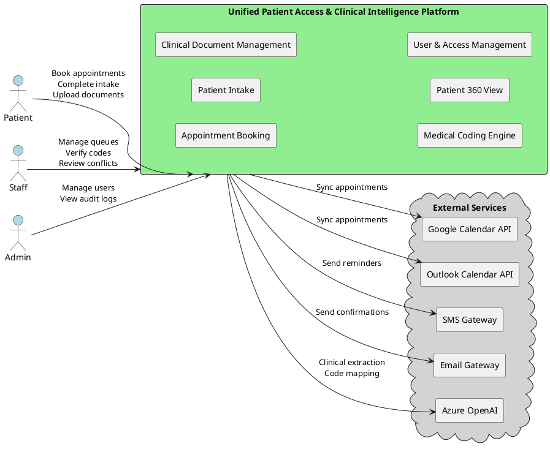
```plantuml
@startuml System Context
!define SYSTEM rectangle
!define EXTERNAL component
!define ACTOR actor

skinparam componentStyle rectangle
skinparam packageStyle rectangle
left to right direction

actor "Patient" as patient #LightBlue
actor "Staff" as staff #LightBlue
actor "Admin" as admin #LightBlue

rectangle "Unified Patient Access & Clinical Intelligence Platform" as system #LightGreen {
  [Appointment Booking]
  [Patient Intake]
  [Clinical Document Management]
  [Medical Coding Engine]
  [Patient 360 View]
  [User & Access Management]
}

cloud "External Services" #LightGray {
  component "Google Calendar API" as gcal
  component "Outlook Calendar API" as ocal
  component "SMS Gateway" as sms
  component "Email Gateway" as email
  component "Azure OpenAI" as ai
}

patient --> system : Book appointments\nComplete intake\nUpload documents
staff --> system : Manage queues\nVerify codes\nReview conflicts
admin --> system : Manage users\nView audit logs

system --> gcal : Sync appointments
system --> ocal : Sync appointments
system --> sms : Send reminders
system --> email : Send confirmations
system --> ai : Clinical extraction\nCode mapping
@enduml
```

**Key Interactions:**
- **Patients** self-service appointment booking, intake completion, and document upload
- **Staff** manage walk-ins, queues, arrivals, and verify AI-suggested medical codes
- **Admins** configure users, roles, and monitor compliance via audit logs
- **External Integrations** provide calendar sync, notifications, and AI processing

---

### Component Architecture Diagram

The component architecture breaks down the platform into distinct modules following Clean Architecture with CQRS patterns as specified in design.md.

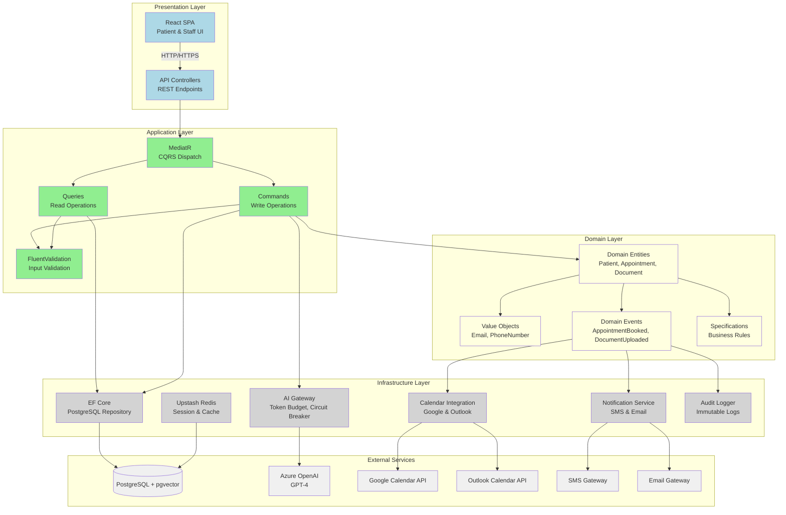
```mermaid
graph TB
    subgraph "Presentation Layer"
        ReactSPA[React SPA<br/>Patient & Staff UI]
        APIControllers[API Controllers<br/>REST Endpoints]
    end

    subgraph "Application Layer"
        Commands[Commands<br/>Write Operations]
        Queries[Queries<br/>Read Operations]
        Validators[FluentValidation<br/>Input Validation]
        MediatR[MediatR<br/>CQRS Dispatch]
    end

    subgraph "Domain Layer"
        Entities[Domain Entities<br/>Patient, Appointment, Document]
        ValueObjects[Value Objects<br/>Email, PhoneNumber]
        DomainEvents[Domain Events<br/>AppointmentBooked, DocumentUploaded]
        Specifications[Specifications<br/>Business Rules]
    end

    subgraph "Infrastructure Layer"
        EFCore[EF Core<br/>PostgreSQL Repository]
        RedisCache[Upstash Redis<br/>Session & Cache]
        AIGateway[AI Gateway<br/>Token Budget, Circuit Breaker]
        CalendarIntegration[Calendar Integration<br/>Google & Outlook]
        NotificationService[Notification Service<br/>SMS & Email]
        AuditLogger[Audit Logger<br/>Immutable Logs]
    end

    subgraph "External Services"
        PostgreSQL[(PostgreSQL + pgvector)]
        AzureOpenAI[Azure OpenAI<br/>GPT-4]
        GCalAPI[Google Calendar API]
        OutlookAPI[Outlook Calendar API]
        SMSGateway[SMS Gateway]
        EmailGateway[Email Gateway]
    end

    ReactSPA -->|HTTP/HTTPS| APIControllers
    APIControllers --> MediatR
    MediatR --> Commands
    MediatR --> Queries
    Commands --> Validators
    Queries --> Validators
    Commands --> Entities
    Queries --> EFCore
    Entities --> DomainEvents
    Entities --> ValueObjects
    Entities --> Specifications
    DomainEvents --> NotificationService
    DomainEvents --> CalendarIntegration
    DomainEvents --> AuditLogger
    Commands --> EFCore
    Commands --> AIGateway
    EFCore --> PostgreSQL
    RedisCache --> PostgreSQL
    AIGateway --> AzureOpenAI
    CalendarIntegration --> GCalAPI
    CalendarIntegration --> OutlookAPI
    NotificationService --> SMSGateway
    NotificationService --> EmailGateway

    classDef presentation fill:#add8e6
    classDef application fill:#90ee90
    classDef domain fill:#ffffe0
    classDef infrastructure fill:#d3d3d3
    classDef external fill:#f0f0f0

    class ReactSPA,APIControllers presentation
    class Commands,Queries,Validators,MediatR application
    class Entities,ValueObjects,DomainEvents,Specifications domain
    class EFCore,RedisCache,AIGateway,CalendarIntegration,NotificationService,AuditLogger infrastructure
    class PostgreSQL,AzureOpenAI,GCalAPI,OutlookAPI,SMSGateway,EmailGateway external
```

**Component Responsibilities:**
| Component | Responsibility | Pattern |
|-----------|----------------|---------|
| React SPA | Patient/Staff user interface | Presentation |
| API Controllers | REST endpoint routing | Presentation |
| Commands/Queries | CQRS operation handlers | Application |
| MediatR | Command/Query dispatch | Application |
| Domain Entities | Business logic encapsulation | Domain |
| EF Core Repository | Data persistence abstraction | Infrastructure |
| AI Gateway | LLM provider interface with guardrails | Infrastructure |
| Audit Logger | Immutable compliance logging | Infrastructure |

---

### Deployment Architecture Diagram

The deployment diagram shows the cloud landing zone architecture with hub-and-spoke networking for the free-tier constrained deployment.

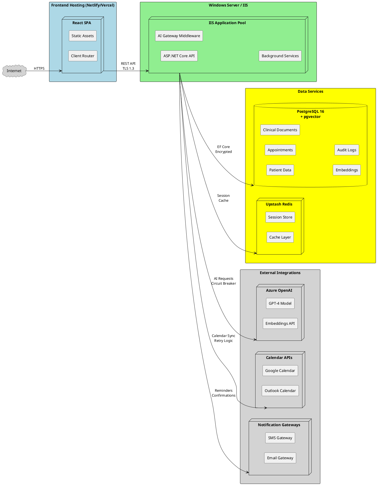
```plantuml
@startuml Deployment Architecture
!define RECTANGLE rectangle
!define DATABASE database
!define CLOUD cloud
!define NODE node

skinparam componentStyle rectangle
left to right direction

CLOUD "Internet" as internet #LightGray

RECTANGLE "Frontend Hosting (Netlify/Vercel)" as frontend #LightBlue {
  NODE "React SPA" as spa {
    [Static Assets]
    [Client Router]
  }
}

RECTANGLE "Windows Server / IIS" as backend #LightGreen {
  NODE "IIS Application Pool" as iis {
    [ASP.NET Core API]
    [AI Gateway Middleware]
    [Background Services]
  }
}

RECTANGLE "Data Services" as data #Yellow {
  DATABASE "PostgreSQL 16\n+ pgvector" as pgsql {
    [Patient Data]
    [Appointments]
    [Clinical Documents]
    [Embeddings]
    [Audit Logs]
  }
  
  NODE "Upstash Redis" as redis {
    [Session Store]
    [Cache Layer]
  }
}

RECTANGLE "External Integrations" as external #LightGray {
  NODE "Azure OpenAI" as aoai {
    [GPT-4 Model]
    [Embeddings API]
  }
  
  NODE "Calendar APIs" as calendars {
    [Google Calendar]
    [Outlook Calendar]
  }
  
  NODE "Notification Gateways" as notifications {
    [SMS Gateway]
    [Email Gateway]
  }
}

internet --> spa : HTTPS
spa --> iis : REST API\nTLS 1.3
iis --> pgsql : EF Core\nEncrypted
iis --> redis : Session\nCache
iis --> aoai : AI Requests\nCircuit Breaker
iis --> calendars : Calendar Sync\nRetry Logic
iis --> notifications : Reminders\nConfirmations
@enduml
```

#### Deployment Specifications

| Component | Specification | Source |
|-----------|---------------|--------|
| Frontend | Netlify/Vercel Free Tier, CDN-distributed | C-001, TR-010 |
| Backend | Windows Server IIS 10, ASP.NET Core 8.0 | C-002, TR-001, TR-004 |
| Database | PostgreSQL 16+ with pgvector extension | TR-003, DR-001-019 |
| Cache | Upstash Redis (managed, free tier) | TR-005, NFR-001 |
| AI | Azure OpenAI (GPT-4, HIPAA BAA) | AIR-001-006 |
| Security | TLS 1.3, AES-256 encryption at rest | NFR-008, NFR-009 |
| Monitoring | Serilog + Seq structured logging | TR-021, NFR-014 |

---

### Data Flow Diagram

The data flow diagram traces how patient data moves through the system from intake to clinical intelligence.

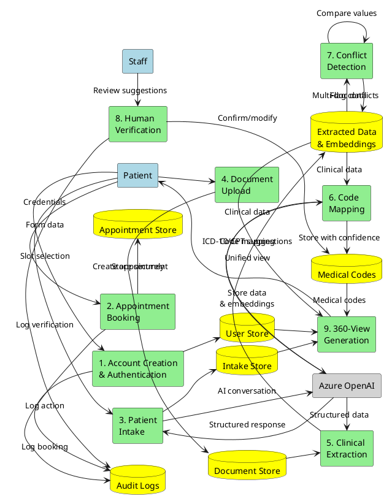
```plantuml
@startuml Data Flow
!define PROCESS rectangle
!define DATASTORE database
!define EXTERNAL component

skinparam componentStyle rectangle
left to right direction

EXTERNAL "Patient" as patient #LightBlue
EXTERNAL "Staff" as staff #LightBlue
EXTERNAL "Azure OpenAI" as ai #LightGray

PROCESS "1. Account Creation\n& Authentication" as auth #LightGreen
PROCESS "2. Appointment\nBooking" as booking #LightGreen
PROCESS "3. Patient\nIntake" as intake #LightGreen
PROCESS "4. Document\nUpload" as upload #LightGreen
PROCESS "5. Clinical\nExtraction" as extraction #LightGreen
PROCESS "6. Code\nMapping" as coding #LightGreen
PROCESS "7. Conflict\nDetection" as conflict #LightGreen
PROCESS "8. Human\nVerification" as verify #LightGreen
PROCESS "9. 360-View\nGeneration" as view360 #LightGreen

DATASTORE "User Store" as users #Yellow
DATASTORE "Appointment Store" as appts #Yellow
DATASTORE "Intake Store" as intakes #Yellow
DATASTORE "Document Store" as docs #Yellow
DATASTORE "Extracted Data\n& Embeddings" as extracted #Yellow
DATASTORE "Medical Codes" as codes #Yellow
DATASTORE "Audit Logs" as audit #Yellow

patient -> auth : Credentials
auth -> users : Store account
auth -> audit : Log action

patient -> booking : Slot selection
booking -> appts : Create appointment
booking -> audit : Log booking

patient -> intake : Form data
intake -> intakes : Store intake
intake --> ai : AI conversation
ai --> intake : Structured response

patient -> upload : PDF documents
upload -> docs : Store securely

docs -> extraction : Queue processing
extraction -> ai : Text extraction
ai -> extraction : Structured data
extraction -> extracted : Store data\n& embeddings

extracted -> coding : Clinical data
coding -> ai : Code mapping
ai -> coding : ICD-10/CPT suggestions
coding -> codes : Store with confidence

extracted -> conflict : Multi-doc data
conflict -> conflict : Compare values
conflict -> extracted : Flag conflicts

staff -> verify : Review suggestions
verify -> codes : Confirm/modify
verify -> audit : Log verification

users -> view360 : Demographics
intakes -> view360 : Intake data
extracted -> view360 : Clinical data
codes -> view360 : Medical codes
view360 -> patient : Unified view
@enduml
```

**Data Flow Stages:**
1. **Account & Auth**: Patient credentials stored with secure hashing
2. **Booking**: Appointment slots selected and reserved
3. **Intake**: Patient info collected via AI or manual form
4. **Upload**: Clinical documents stored with secure file references
5. **Extraction**: AI processes documents to structured data
6. **Coding**: Clinical data mapped to ICD-10/CPT codes
7. **Conflict Detection**: Multi-document data compared for inconsistencies
8. **Verification**: Staff reviews and confirms AI suggestions
9. **360-View**: Consolidated patient profile generated

---

### Logical Data Model (ERD)

The entity-relationship diagram represents the core domain entities from design.md with their attributes and relationships.

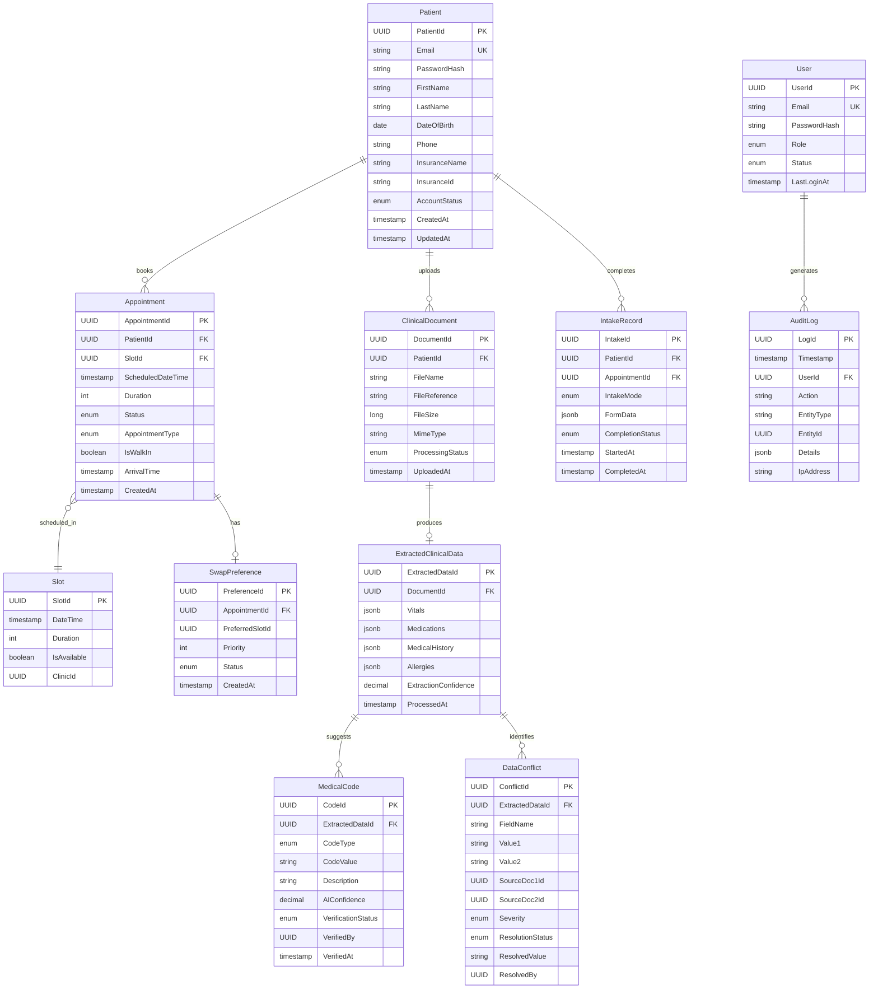
```mermaid
erDiagram
    Patient ||--o{ Appointment : books
    Patient ||--o{ ClinicalDocument : uploads
    Patient ||--o{ IntakeRecord : completes
    Appointment }o--|| Slot : scheduled_in
    Appointment ||--o| SwapPreference : has
    ClinicalDocument ||--o| ExtractedClinicalData : produces
    ExtractedClinicalData ||--o{ MedicalCode : suggests
    ExtractedClinicalData ||--o{ DataConflict : identifies
    User ||--o{ AuditLog : generates

    Patient {
        UUID PatientId PK
        string Email UK
        string PasswordHash
        string FirstName
        string LastName
        date DateOfBirth
        string Phone
        string InsuranceName
        string InsuranceId
        enum AccountStatus
        timestamp CreatedAt
        timestamp UpdatedAt
    }

    Appointment {
        UUID AppointmentId PK
        UUID PatientId FK
        UUID SlotId FK
        timestamp ScheduledDateTime
        int Duration
        enum Status
        enum AppointmentType
        boolean IsWalkIn
        timestamp ArrivalTime
        timestamp CreatedAt
    }

    Slot {
        UUID SlotId PK
        timestamp DateTime
        int Duration
        boolean IsAvailable
        UUID ClinicId
    }

    SwapPreference {
        UUID PreferenceId PK
        UUID AppointmentId FK
        UUID PreferredSlotId
        int Priority
        enum Status
        timestamp CreatedAt
    }

    ClinicalDocument {
        UUID DocumentId PK
        UUID PatientId FK
        string FileName
        string FileReference
        long FileSize
        string MimeType
        enum ProcessingStatus
        timestamp UploadedAt
    }

    ExtractedClinicalData {
        UUID ExtractedDataId PK
        UUID DocumentId FK
        jsonb Vitals
        jsonb Medications
        jsonb MedicalHistory
        jsonb Allergies
        decimal ExtractionConfidence
        timestamp ProcessedAt
    }

    MedicalCode {
        UUID CodeId PK
        UUID ExtractedDataId FK
        enum CodeType
        string CodeValue
        string Description
        decimal AIConfidence
        enum VerificationStatus
        UUID VerifiedBy
        timestamp VerifiedAt
    }

    DataConflict {
        UUID ConflictId PK
        UUID ExtractedDataId FK
        string FieldName
        string Value1
        string Value2
        UUID SourceDoc1Id
        UUID SourceDoc2Id
        enum Severity
        enum ResolutionStatus
        string ResolvedValue
        UUID ResolvedBy
    }

    IntakeRecord {
        UUID IntakeId PK
        UUID PatientId FK
        UUID AppointmentId FK
        enum IntakeMode
        jsonb FormData
        enum CompletionStatus
        timestamp StartedAt
        timestamp CompletedAt
    }

    User {
        UUID UserId PK
        string Email UK
        string PasswordHash
        enum Role
        enum Status
        timestamp LastLoginAt
    }

    AuditLog {
        UUID LogId PK
        timestamp Timestamp
        UUID UserId FK
        string Action
        string EntityType
        UUID EntityId
        jsonb Details
        string IpAddress
    }
```

**Entity Relationship Summary:**
| Relationship | Cardinality | Description |
|--------------|-------------|-------------|
| Patient → Appointment | 1:N | Patient books multiple appointments |
| Patient → ClinicalDocument | 1:N | Patient uploads multiple documents |
| Patient → IntakeRecord | 1:N | Patient completes intake per appointment |
| Appointment → Slot | N:1 | Appointment scheduled in one slot |
| Appointment → SwapPreference | 1:0..1 | Optional preferred slot swap |
| ClinicalDocument → ExtractedClinicalData | 1:0..1 | Document may have extracted data |
| ExtractedClinicalData → MedicalCode | 1:N | Extraction produces multiple code suggestions |
| ExtractedClinicalData → DataConflict | 1:N | Extraction may identify conflicts |
| User → AuditLog | 1:N | User actions logged immutably |

---

### AI Architecture Diagrams

Since design.md contains AIR-XXX requirements (AI Functional, Quality, Safety, Operational), the following diagrams document the AI integration architecture.

#### RAG Pipeline Diagram

The RAG (Retrieval-Augmented Generation) pipeline processes clinical documents for data extraction and code mapping.

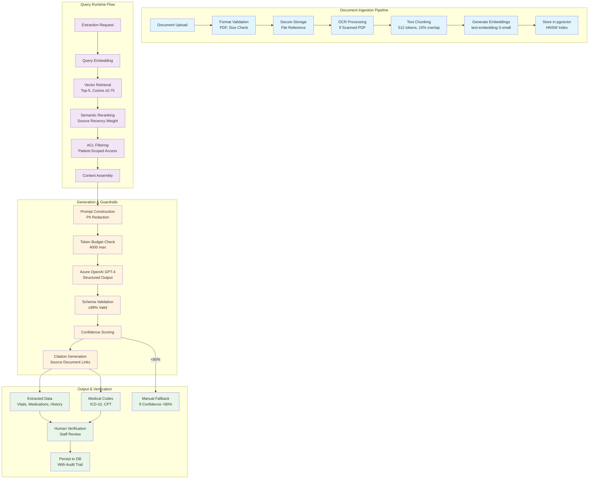
```mermaid
graph TB
    subgraph "Document Ingestion Pipeline"
        Upload[Document Upload]
        Validate[Format Validation<br/>PDF, Size Check]
        Store[Secure Storage<br/>File Reference]
        OCR[OCR Processing<br/>If Scanned PDF]
        Chunk[Text Chunking<br/>512 tokens, 10% overlap]
        Embed[Generate Embeddings<br/>text-embedding-3-small]
        Index[Store in pgvector<br/>HNSW Index]
    end

    subgraph "Query Runtime Flow"
        Request[Extraction Request]
        QueryEmbed[Query Embedding]
        Retrieve[Vector Retrieval<br/>Top-5, Cosine ≥0.75]
        Rerank[Semantic Reranking<br/>Source Recency Weight]
        ACL[ACL Filtering<br/>Patient-Scoped Access]
        Context[Context Assembly]
    end

    subgraph "Generation & Guardrails"
        Prompt[Prompt Construction<br/>PII Redaction]
        TokenBudget[Token Budget Check<br/>4000 max]
        LLM[Azure OpenAI GPT-4<br/>Structured Output]
        Validate2[Schema Validation<br/>≥99% Valid]
        Confidence[Confidence Scoring]
        Citation[Citation Generation<br/>Source Document Links]
    end

    subgraph "Output & Verification"
        Extract[Extracted Data<br/>Vitals, Medications, History]
        Codes[Medical Codes<br/>ICD-10, CPT]
        Fallback[Manual Fallback<br/>If Confidence <80%]
        Verify[Human Verification<br/>Staff Review]
        Persist[Persist to DB<br/>With Audit Trail]
    end

    Upload --> Validate
    Validate --> Store
    Store --> OCR
    OCR --> Chunk
    Chunk --> Embed
    Embed --> Index

    Request --> QueryEmbed
    QueryEmbed --> Retrieve
    Retrieve --> Rerank
    Rerank --> ACL
    ACL --> Context

    Context --> Prompt
    Prompt --> TokenBudget
    TokenBudget --> LLM
    LLM --> Validate2
    Validate2 --> Confidence
    Confidence --> Citation

    Citation --> Extract
    Citation --> Codes
    Confidence -->|<80%| Fallback
    Extract --> Verify
    Codes --> Verify
    Verify --> Persist

    classDef ingestion fill:#e1f5fe
    classDef query fill:#f3e5f5
    classDef generation fill:#fff3e0
    classDef output fill:#e8f5e9

    class Upload,Validate,Store,OCR,Chunk,Embed,Index ingestion
    class Request,QueryEmbed,Retrieve,Rerank,ACL,Context query
    class Prompt,TokenBudget,LLM,Validate2,Confidence,Citation generation
    class Extract,Codes,Fallback,Verify,Persist output
```

**RAG Pipeline Requirements Traceability:**
| Stage | Requirement | Specification |
|-------|-------------|---------------|
| Chunking | AIR-R01 | 512-token segments, 10% overlap |
| Retrieval | AIR-R02 | Top-5 chunks, cosine similarity ≥0.75 |
| Reranking | AIR-R03 | Semantic scoring with source recency |
| Vector Store | AIR-R04 | pgvector with HNSW indexing |
| Token Budget | AIR-O01 | 4000 tokens per extraction |
| Confidence | AIR-S04 | Fallback to manual if <80% |
| Output | AIR-Q04 | Schema validity ≥99% |

---

## Use Case Sequence Diagrams

> **Note**: Each sequence diagram details the dynamic message flow for its corresponding use case from [spec.md](spec.md). Use case diagrams remain in spec.md only; these are behavioral sequence specifications.

---

### UC-001: Book Standard Appointment

**Source**: [spec.md#UC-001](spec.md#UC-001)

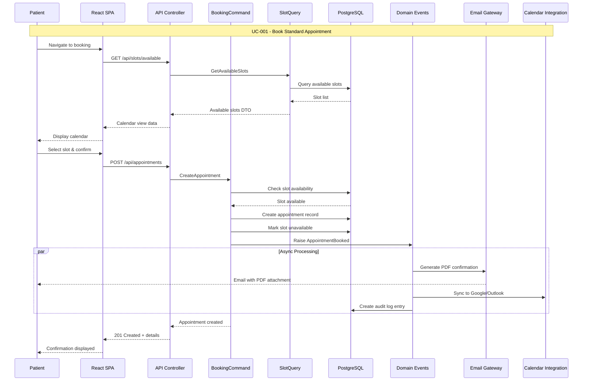
```mermaid
sequenceDiagram
    participant Patient
    participant ReactSPA as React SPA
    participant API as API Controller
    participant BookingCmd as BookingCommand
    participant SlotQuery as SlotQuery
    participant DB as PostgreSQL
    participant DomainEvent as Domain Events
    participant EmailSvc as Email Gateway
    participant CalendarSvc as Calendar Integration

    Note over Patient,CalendarSvc: UC-001 - Book Standard Appointment

    Patient->>ReactSPA: Navigate to booking
    ReactSPA->>API: GET /api/slots/available
    API->>SlotQuery: GetAvailableSlots
    SlotQuery->>DB: Query available slots
    DB-->>SlotQuery: Slot list
    SlotQuery-->>API: Available slots DTO
    API-->>ReactSPA: Calendar view data
    ReactSPA-->>Patient: Display calendar

    Patient->>ReactSPA: Select slot & confirm
    ReactSPA->>API: POST /api/appointments
    API->>BookingCmd: CreateAppointment
    BookingCmd->>DB: Check slot availability
    DB-->>BookingCmd: Slot available
    BookingCmd->>DB: Create appointment record
    BookingCmd->>DB: Mark slot unavailable
    BookingCmd->>DomainEvent: Raise AppointmentBooked
    
    par Async Processing
        DomainEvent->>EmailSvc: Generate PDF confirmation
        EmailSvc-->>Patient: Email with PDF attachment
        DomainEvent->>CalendarSvc: Sync to Google/Outlook
        DomainEvent->>DB: Create audit log entry
    end

    BookingCmd-->>API: Appointment created
    API-->>ReactSPA: 201 Created + details
    ReactSPA-->>Patient: Confirmation displayed
```

---

### UC-002: Request Preferred Slot Swap

**Source**: [spec.md#UC-002](spec.md#UC-002)

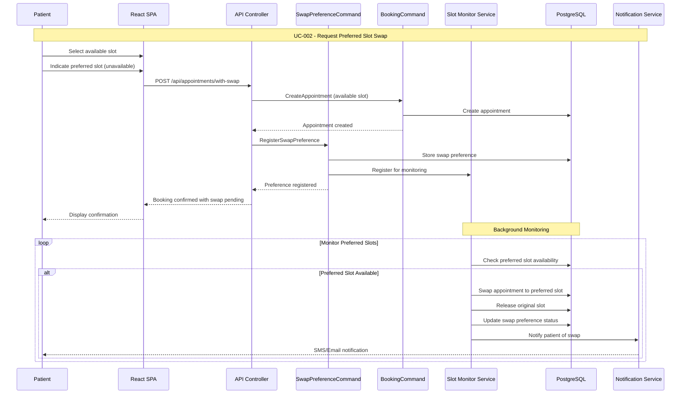
```mermaid
sequenceDiagram
    participant Patient
    participant ReactSPA as React SPA
    participant API as API Controller
    participant SwapCmd as SwapPreferenceCommand
    participant BookingCmd as BookingCommand
    participant SlotMonitor as Slot Monitor Service
    participant DB as PostgreSQL
    participant NotifySvc as Notification Service

    Note over Patient,NotifySvc: UC-002 - Request Preferred Slot Swap

    Patient->>ReactSPA: Select available slot
    Patient->>ReactSPA: Indicate preferred slot (unavailable)
    ReactSPA->>API: POST /api/appointments/with-swap
    API->>BookingCmd: CreateAppointment (available slot)
    BookingCmd->>DB: Create appointment
    BookingCmd-->>API: Appointment created
    
    API->>SwapCmd: RegisterSwapPreference
    SwapCmd->>DB: Store swap preference
    SwapCmd->>SlotMonitor: Register for monitoring
    SwapCmd-->>API: Preference registered

    API-->>ReactSPA: Booking confirmed with swap pending
    ReactSPA-->>Patient: Display confirmation

    Note over SlotMonitor,DB: Background Monitoring

    loop Monitor Preferred Slots
        SlotMonitor->>DB: Check preferred slot availability
        alt Preferred Slot Available
            SlotMonitor->>DB: Swap appointment to preferred slot
            SlotMonitor->>DB: Release original slot
            SlotMonitor->>DB: Update swap preference status
            SlotMonitor->>NotifySvc: Notify patient of swap
            NotifySvc-->>Patient: SMS/Email notification
        end
    end
```

---

### UC-003: Complete Patient Intake (AI Conversational)

**Source**: [spec.md#UC-003](spec.md#UC-003)

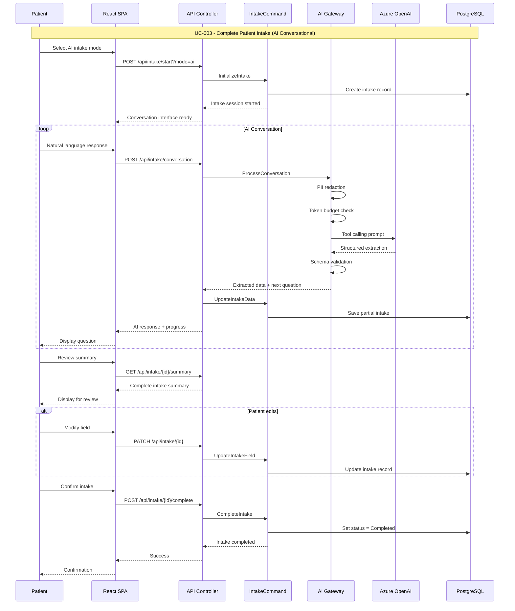
```mermaid
sequenceDiagram
    participant Patient
    participant ReactSPA as React SPA
    participant API as API Controller
    participant IntakeCmd as IntakeCommand
    participant AIGateway as AI Gateway
    participant AzureAI as Azure OpenAI
    participant DB as PostgreSQL

    Note over Patient,DB: UC-003 - Complete Patient Intake (AI Conversational)

    Patient->>ReactSPA: Select AI intake mode
    ReactSPA->>API: POST /api/intake/start?mode=ai
    API->>IntakeCmd: InitializeIntake
    IntakeCmd->>DB: Create intake record
    IntakeCmd-->>API: Intake session started
    API-->>ReactSPA: Conversation interface ready

    loop AI Conversation
        Patient->>ReactSPA: Natural language response
        ReactSPA->>API: POST /api/intake/conversation
        API->>AIGateway: ProcessConversation
        AIGateway->>AIGateway: PII redaction
        AIGateway->>AIGateway: Token budget check
        AIGateway->>AzureAI: Tool calling prompt
        AzureAI-->>AIGateway: Structured extraction
        AIGateway->>AIGateway: Schema validation
        AIGateway-->>API: Extracted data + next question
        API->>IntakeCmd: UpdateIntakeData
        IntakeCmd->>DB: Save partial intake
        API-->>ReactSPA: AI response + progress
        ReactSPA-->>Patient: Display question
    end

    Patient->>ReactSPA: Review summary
    ReactSPA->>API: GET /api/intake/{id}/summary
    API-->>ReactSPA: Complete intake summary
    ReactSPA-->>Patient: Display for review

    alt Patient edits
        Patient->>ReactSPA: Modify field
        ReactSPA->>API: PATCH /api/intake/{id}
        API->>IntakeCmd: UpdateIntakeField
        IntakeCmd->>DB: Update intake record
    end

    Patient->>ReactSPA: Confirm intake
    ReactSPA->>API: POST /api/intake/{id}/complete
    API->>IntakeCmd: CompleteIntake
    IntakeCmd->>DB: Set status = Completed
    IntakeCmd-->>API: Intake completed
    API-->>ReactSPA: Success
    ReactSPA-->>Patient: Confirmation
```

---

### UC-004: Complete Patient Intake (Manual Form)

**Source**: [spec.md#UC-004](spec.md#UC-004)

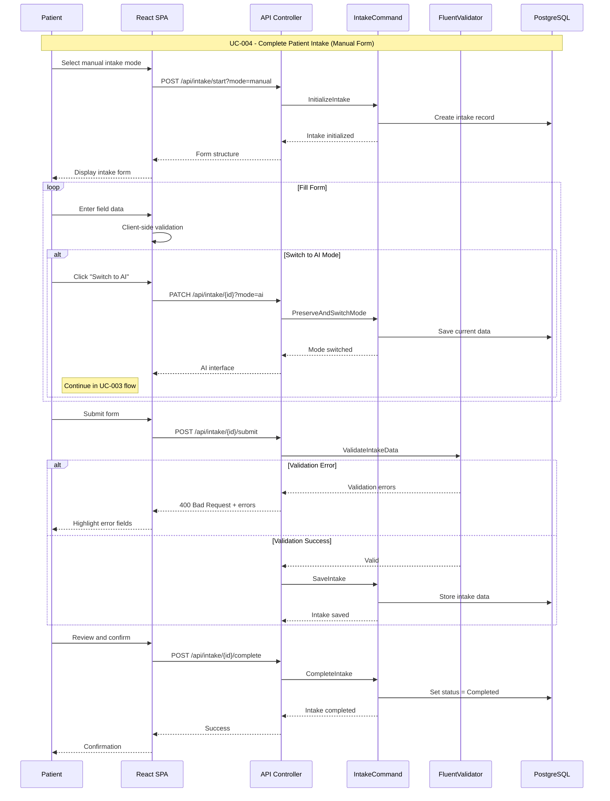
```mermaid
sequenceDiagram
    participant Patient
    participant ReactSPA as React SPA
    participant API as API Controller
    participant IntakeCmd as IntakeCommand
    participant Validator as FluentValidator
    participant DB as PostgreSQL

    Note over Patient,DB: UC-004 - Complete Patient Intake (Manual Form)

    Patient->>ReactSPA: Select manual intake mode
    ReactSPA->>API: POST /api/intake/start?mode=manual
    API->>IntakeCmd: InitializeIntake
    IntakeCmd->>DB: Create intake record
    IntakeCmd-->>API: Intake initialized
    API-->>ReactSPA: Form structure
    ReactSPA-->>Patient: Display intake form

    loop Fill Form
        Patient->>ReactSPA: Enter field data
        ReactSPA->>ReactSPA: Client-side validation
        
        alt Switch to AI Mode
            Patient->>ReactSPA: Click "Switch to AI"
            ReactSPA->>API: PATCH /api/intake/{id}?mode=ai
            API->>IntakeCmd: PreserveAndSwitchMode
            IntakeCmd->>DB: Save current data
            IntakeCmd-->>API: Mode switched
            API-->>ReactSPA: AI interface
            Note right of Patient: Continue in UC-003 flow
        end
    end

    Patient->>ReactSPA: Submit form
    ReactSPA->>API: POST /api/intake/{id}/submit
    API->>Validator: ValidateIntakeData
    
    alt Validation Error
        Validator-->>API: Validation errors
        API-->>ReactSPA: 400 Bad Request + errors
        ReactSPA-->>Patient: Highlight error fields
    else Validation Success
        Validator-->>API: Valid
        API->>IntakeCmd: SaveIntake
        IntakeCmd->>DB: Store intake data
        IntakeCmd-->>API: Intake saved
    end

    Patient->>ReactSPA: Review and confirm
    ReactSPA->>API: POST /api/intake/{id}/complete
    API->>IntakeCmd: CompleteIntake
    IntakeCmd->>DB: Set status = Completed
    IntakeCmd-->>API: Intake completed
    API-->>ReactSPA: Success
    ReactSPA-->>Patient: Confirmation
```

---

### UC-005: Upload Clinical Documents

**Source**: [spec.md#UC-005](spec.md#UC-005)

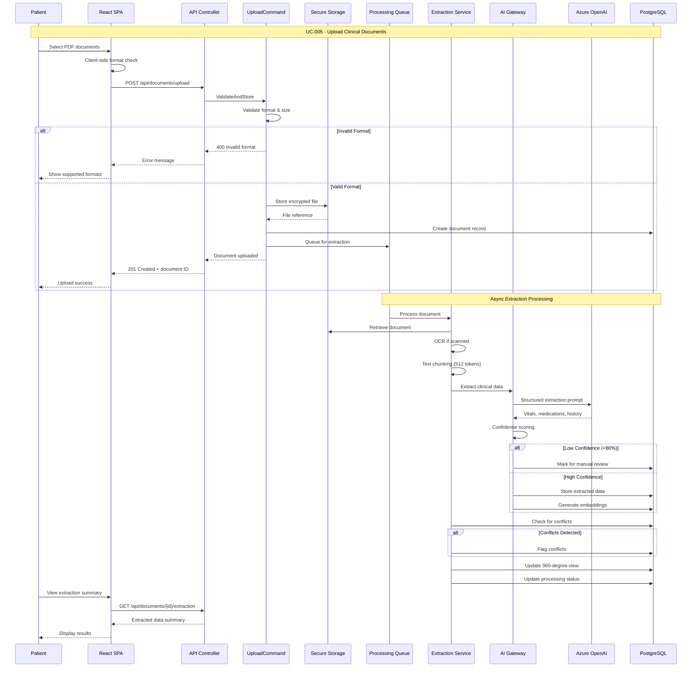
```mermaid
sequenceDiagram
    participant Patient
    participant ReactSPA as React SPA
    participant API as API Controller
    participant UploadCmd as UploadCommand
    participant Storage as Secure Storage
    participant Queue as Processing Queue
    participant Extractor as Extraction Service
    participant AIGateway as AI Gateway
    participant AzureAI as Azure OpenAI
    participant DB as PostgreSQL

    Note over Patient,DB: UC-005 - Upload Clinical Documents

    Patient->>ReactSPA: Select PDF documents
    ReactSPA->>ReactSPA: Client-side format check
    ReactSPA->>API: POST /api/documents/upload
    API->>UploadCmd: ValidateAndStore
    UploadCmd->>UploadCmd: Validate format & size
    
    alt Invalid Format
        UploadCmd-->>API: 400 Invalid format
        API-->>ReactSPA: Error message
        ReactSPA-->>Patient: Show supported formats
    else Valid Format
        UploadCmd->>Storage: Store encrypted file
        Storage-->>UploadCmd: File reference
        UploadCmd->>DB: Create document record
        UploadCmd->>Queue: Queue for extraction
        UploadCmd-->>API: Document uploaded
        API-->>ReactSPA: 201 Created + document ID
        ReactSPA-->>Patient: Upload success
    end

    Note over Queue,DB: Async Extraction Processing

    Queue->>Extractor: Process document
    Extractor->>Storage: Retrieve document
    Extractor->>Extractor: OCR if scanned
    Extractor->>Extractor: Text chunking (512 tokens)
    Extractor->>AIGateway: Extract clinical data
    AIGateway->>AzureAI: Structured extraction prompt
    AzureAI-->>AIGateway: Vitals, medications, history
    AIGateway->>AIGateway: Confidence scoring
    
    alt Low Confidence (<80%)
        AIGateway->>DB: Mark for manual review
    else High Confidence
        AIGateway->>DB: Store extracted data
        AIGateway->>DB: Generate embeddings
    end

    Extractor->>DB: Check for conflicts
    alt Conflicts Detected
        Extractor->>DB: Flag conflicts
    end
    
    Extractor->>DB: Update 360-degree view
    Extractor->>DB: Update processing status

    Patient->>ReactSPA: View extraction summary
    ReactSPA->>API: GET /api/documents/{id}/extraction
    API-->>ReactSPA: Extracted data summary
    ReactSPA-->>Patient: Display results
```

---

### UC-006: View 360-Degree Patient Profile

**Source**: [spec.md#UC-006](spec.md#UC-006)

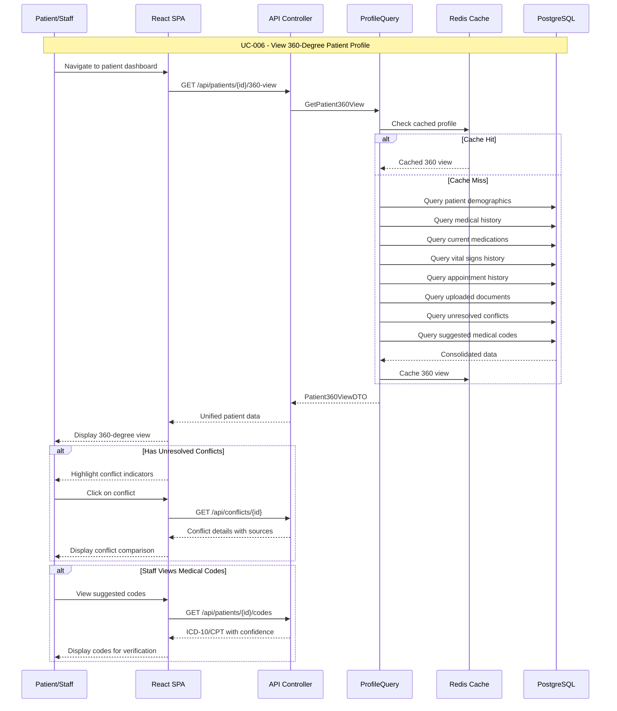
```mermaid
sequenceDiagram
    participant User as Patient/Staff
    participant ReactSPA as React SPA
    participant API as API Controller
    participant ProfileQuery as ProfileQuery
    participant Cache as Redis Cache
    participant DB as PostgreSQL

    Note over User,DB: UC-006 - View 360-Degree Patient Profile

    User->>ReactSPA: Navigate to patient dashboard
    ReactSPA->>API: GET /api/patients/{id}/360-view
    API->>ProfileQuery: GetPatient360View
    
    ProfileQuery->>Cache: Check cached profile
    alt Cache Hit
        Cache-->>ProfileQuery: Cached 360 view
    else Cache Miss
        ProfileQuery->>DB: Query patient demographics
        ProfileQuery->>DB: Query medical history
        ProfileQuery->>DB: Query current medications
        ProfileQuery->>DB: Query vital signs history
        ProfileQuery->>DB: Query appointment history
        ProfileQuery->>DB: Query uploaded documents
        ProfileQuery->>DB: Query unresolved conflicts
        ProfileQuery->>DB: Query suggested medical codes
        DB-->>ProfileQuery: Consolidated data
        ProfileQuery->>Cache: Cache 360 view
    end
    
    ProfileQuery-->>API: Patient360ViewDTO
    API-->>ReactSPA: Unified patient data
    ReactSPA-->>User: Display 360-degree view

    alt Has Unresolved Conflicts
        ReactSPA-->>User: Highlight conflict indicators
        User->>ReactSPA: Click on conflict
        ReactSPA->>API: GET /api/conflicts/{id}
        API-->>ReactSPA: Conflict details with sources
        ReactSPA-->>User: Display conflict comparison
    end

    alt Staff Views Medical Codes
        User->>ReactSPA: View suggested codes
        ReactSPA->>API: GET /api/patients/{id}/codes
        API-->>ReactSPA: ICD-10/CPT with confidence
        ReactSPA-->>User: Display codes for verification
    end
```

---

### UC-007: Handle Walk-in Booking

**Source**: [spec.md#UC-007](spec.md#UC-007)

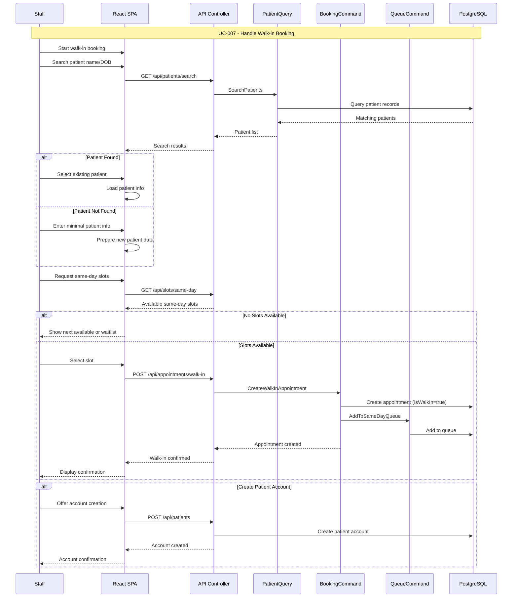
```mermaid
sequenceDiagram
    participant Staff
    participant ReactSPA as React SPA
    participant API as API Controller
    participant PatientQuery as PatientQuery
    participant BookingCmd as BookingCommand
    participant QueueCmd as QueueCommand
    participant DB as PostgreSQL

    Note over Staff,DB: UC-007 - Handle Walk-in Booking

    Staff->>ReactSPA: Start walk-in booking
    Staff->>ReactSPA: Search patient name/DOB
    ReactSPA->>API: GET /api/patients/search
    API->>PatientQuery: SearchPatients
    PatientQuery->>DB: Query patient records
    DB-->>PatientQuery: Matching patients
    PatientQuery-->>API: Patient list
    API-->>ReactSPA: Search results
    
    alt Patient Found
        Staff->>ReactSPA: Select existing patient
        ReactSPA->>ReactSPA: Load patient info
    else Patient Not Found
        Staff->>ReactSPA: Enter minimal patient info
        ReactSPA->>ReactSPA: Prepare new patient data
    end

    Staff->>ReactSPA: Request same-day slots
    ReactSPA->>API: GET /api/slots/same-day
    API-->>ReactSPA: Available same-day slots
    
    alt No Slots Available
        ReactSPA-->>Staff: Show next available or waitlist
    else Slots Available
        Staff->>ReactSPA: Select slot
        ReactSPA->>API: POST /api/appointments/walk-in
        API->>BookingCmd: CreateWalkInAppointment
        BookingCmd->>DB: Create appointment (IsWalkIn=true)
        BookingCmd->>QueueCmd: AddToSameDayQueue
        QueueCmd->>DB: Add to queue
        BookingCmd-->>API: Appointment created
        API-->>ReactSPA: Walk-in confirmed
        ReactSPA-->>Staff: Display confirmation
    end

    alt Create Patient Account
        Staff->>ReactSPA: Offer account creation
        ReactSPA->>API: POST /api/patients
        API->>DB: Create patient account
        API-->>ReactSPA: Account created
        ReactSPA-->>Staff: Account confirmation
    end
```

---

### UC-008: Manage Same-Day Queue

**Source**: [spec.md#UC-008](spec.md#UC-008)

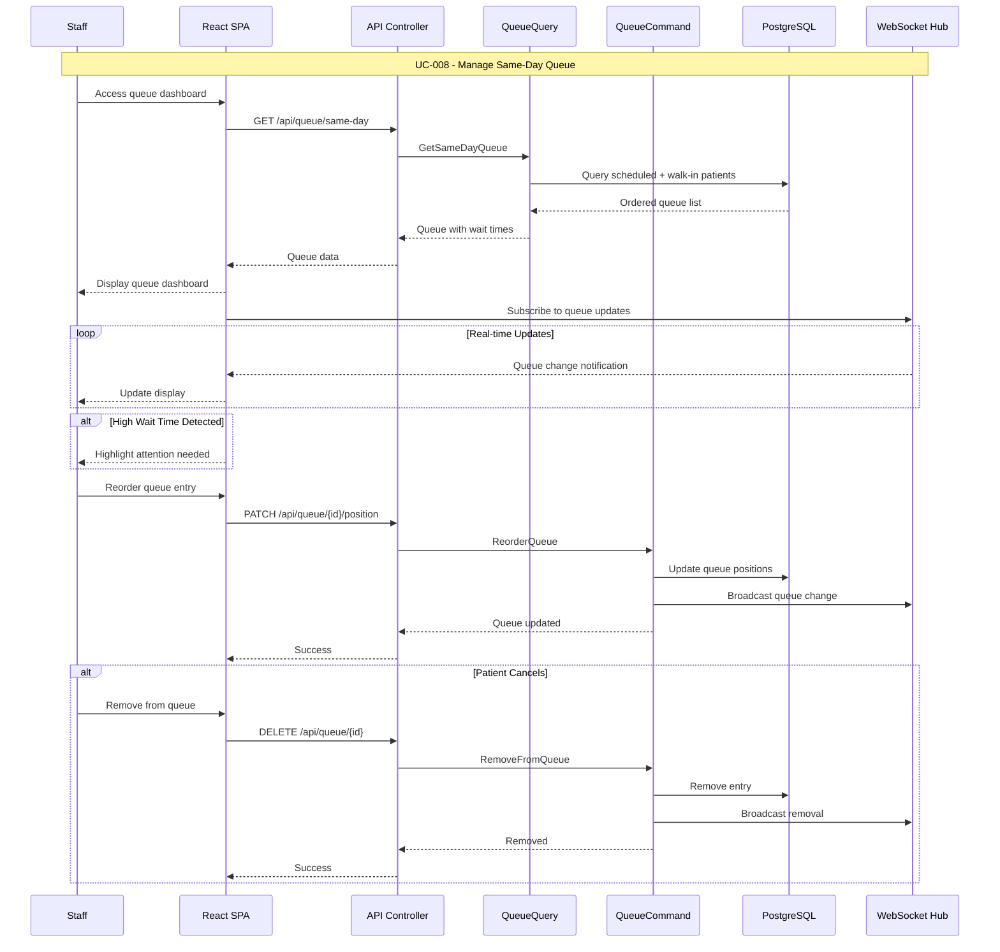
```mermaid
sequenceDiagram
    participant Staff
    participant ReactSPA as React SPA
    participant API as API Controller
    participant QueueQuery as QueueQuery
    participant QueueCmd as QueueCommand
    participant DB as PostgreSQL
    participant WebSocket as WebSocket Hub

    Note over Staff,WebSocket: UC-008 - Manage Same-Day Queue

    Staff->>ReactSPA: Access queue dashboard
    ReactSPA->>API: GET /api/queue/same-day
    API->>QueueQuery: GetSameDayQueue
    QueueQuery->>DB: Query scheduled + walk-in patients
    DB-->>QueueQuery: Ordered queue list
    QueueQuery-->>API: Queue with wait times
    API-->>ReactSPA: Queue data
    ReactSPA-->>Staff: Display queue dashboard

    ReactSPA->>WebSocket: Subscribe to queue updates
    
    loop Real-time Updates
        WebSocket-->>ReactSPA: Queue change notification
        ReactSPA-->>Staff: Update display
    end

    alt High Wait Time Detected
        ReactSPA-->>Staff: Highlight attention needed
    end

    Staff->>ReactSPA: Reorder queue entry
    ReactSPA->>API: PATCH /api/queue/{id}/position
    API->>QueueCmd: ReorderQueue
    QueueCmd->>DB: Update queue positions
    QueueCmd->>WebSocket: Broadcast queue change
    QueueCmd-->>API: Queue updated
    API-->>ReactSPA: Success

    alt Patient Cancels
        Staff->>ReactSPA: Remove from queue
        ReactSPA->>API: DELETE /api/queue/{id}
        API->>QueueCmd: RemoveFromQueue
        QueueCmd->>DB: Remove entry
        QueueCmd->>WebSocket: Broadcast removal
        QueueCmd-->>API: Removed
        API-->>ReactSPA: Success
    end
```

---

### UC-009: Mark Patient Arrival

**Source**: [spec.md#UC-009](spec.md#UC-009)

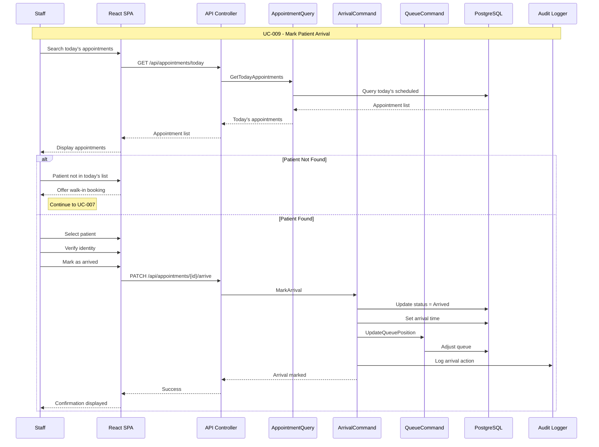
```mermaid
sequenceDiagram
    participant Staff
    participant ReactSPA as React SPA
    participant API as API Controller
    participant ApptQuery as AppointmentQuery
    participant ArrivalCmd as ArrivalCommand
    participant QueueCmd as QueueCommand
    participant DB as PostgreSQL
    participant AuditLog as Audit Logger

    Note over Staff,AuditLog: UC-009 - Mark Patient Arrival

    Staff->>ReactSPA: Search today's appointments
    ReactSPA->>API: GET /api/appointments/today
    API->>ApptQuery: GetTodayAppointments
    ApptQuery->>DB: Query today's scheduled
    DB-->>ApptQuery: Appointment list
    ApptQuery-->>API: Today's appointments
    API-->>ReactSPA: Appointment list
    ReactSPA-->>Staff: Display appointments

    alt Patient Not Found
        Staff->>ReactSPA: Patient not in today's list
        ReactSPA-->>Staff: Offer walk-in booking
        Note right of Staff: Continue to UC-007
    else Patient Found
        Staff->>ReactSPA: Select patient
        Staff->>ReactSPA: Verify identity
        Staff->>ReactSPA: Mark as arrived
        ReactSPA->>API: PATCH /api/appointments/{id}/arrive
        API->>ArrivalCmd: MarkArrival
        ArrivalCmd->>DB: Update status = Arrived
        ArrivalCmd->>DB: Set arrival time
        ArrivalCmd->>QueueCmd: UpdateQueuePosition
        QueueCmd->>DB: Adjust queue
        ArrivalCmd->>AuditLog: Log arrival action
        ArrivalCmd-->>API: Arrival marked
        API-->>ReactSPA: Success
        ReactSPA-->>Staff: Confirmation displayed
    end
```

---

### UC-010: Perform Insurance Pre-Check

**Source**: [spec.md#UC-010](spec.md#UC-010)

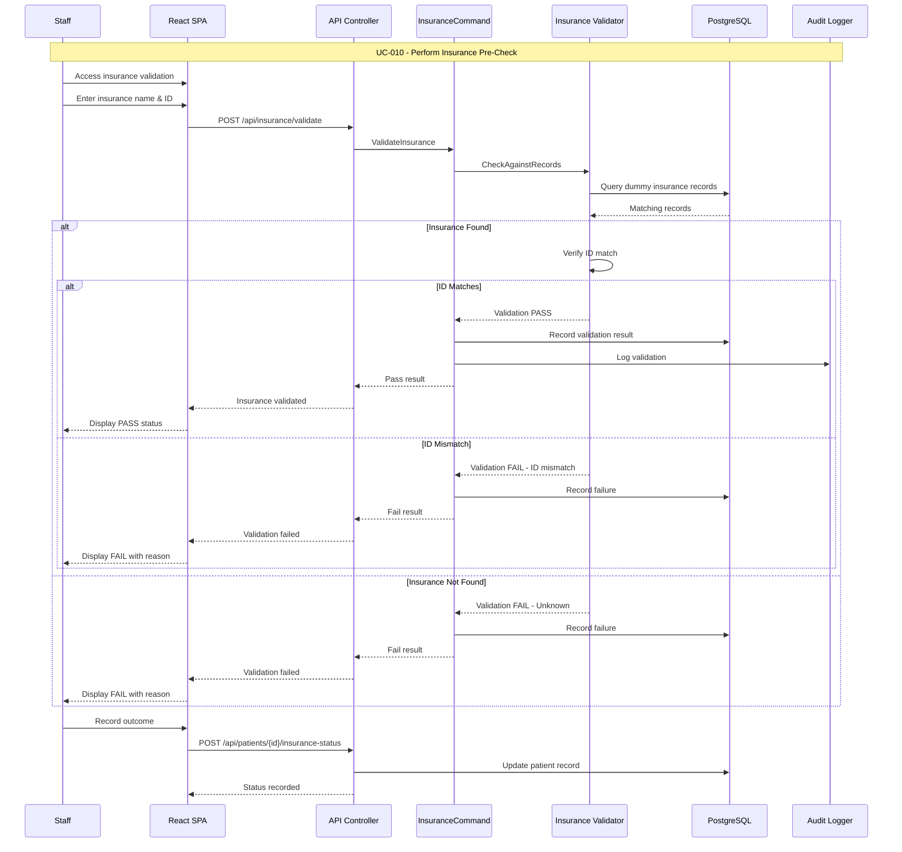
```mermaid
sequenceDiagram
    participant Staff
    participant ReactSPA as React SPA
    participant API as API Controller
    participant InsuranceCmd as InsuranceCommand
    participant Validator as Insurance Validator
    participant DB as PostgreSQL
    participant AuditLog as Audit Logger

    Note over Staff,AuditLog: UC-010 - Perform Insurance Pre-Check

    Staff->>ReactSPA: Access insurance validation
    Staff->>ReactSPA: Enter insurance name & ID
    ReactSPA->>API: POST /api/insurance/validate
    API->>InsuranceCmd: ValidateInsurance
    InsuranceCmd->>Validator: CheckAgainstRecords
    Validator->>DB: Query dummy insurance records
    DB-->>Validator: Matching records
    
    alt Insurance Found
        Validator->>Validator: Verify ID match
        alt ID Matches
            Validator-->>InsuranceCmd: Validation PASS
            InsuranceCmd->>DB: Record validation result
            InsuranceCmd->>AuditLog: Log validation
            InsuranceCmd-->>API: Pass result
            API-->>ReactSPA: Insurance validated
            ReactSPA-->>Staff: Display PASS status
        else ID Mismatch
            Validator-->>InsuranceCmd: Validation FAIL - ID mismatch
            InsuranceCmd->>DB: Record failure
            InsuranceCmd-->>API: Fail result
            API-->>ReactSPA: Validation failed
            ReactSPA-->>Staff: Display FAIL with reason
        end
    else Insurance Not Found
        Validator-->>InsuranceCmd: Validation FAIL - Unknown
        InsuranceCmd->>DB: Record failure
        InsuranceCmd-->>API: Fail result
        API-->>ReactSPA: Validation failed
        ReactSPA-->>Staff: Display FAIL with reason
    end

    Staff->>ReactSPA: Record outcome
    ReactSPA->>API: POST /api/patients/{id}/insurance-status
    API->>DB: Update patient record
    API-->>ReactSPA: Status recorded
```

---

### UC-011: Review Clinical Data Conflicts

**Source**: [spec.md#UC-011](spec.md#UC-011)

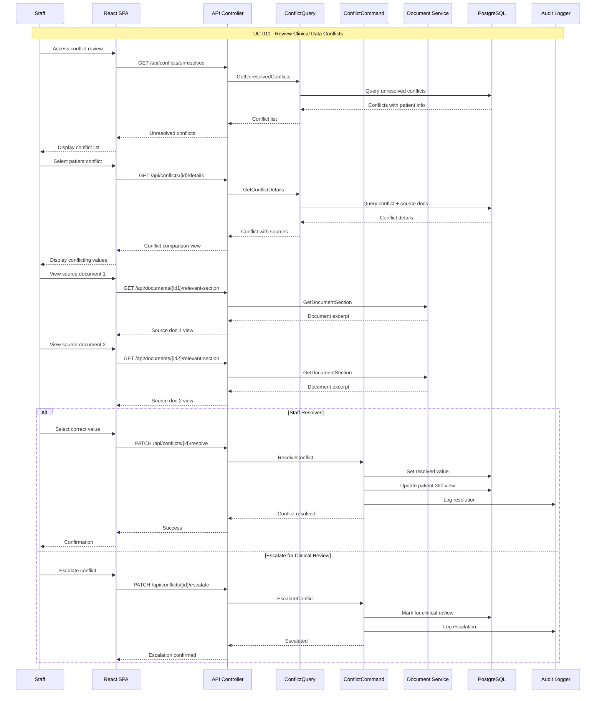
```mermaid
sequenceDiagram
    participant Staff
    participant ReactSPA as React SPA
    participant API as API Controller
    participant ConflictQuery as ConflictQuery
    participant ConflictCmd as ConflictCommand
    participant DocService as Document Service
    participant DB as PostgreSQL
    participant AuditLog as Audit Logger

    Note over Staff,AuditLog: UC-011 - Review Clinical Data Conflicts

    Staff->>ReactSPA: Access conflict review
    ReactSPA->>API: GET /api/conflicts/unresolved
    API->>ConflictQuery: GetUnresolvedConflicts
    ConflictQuery->>DB: Query unresolved conflicts
    DB-->>ConflictQuery: Conflicts with patient info
    ConflictQuery-->>API: Conflict list
    API-->>ReactSPA: Unresolved conflicts
    ReactSPA-->>Staff: Display conflict list

    Staff->>ReactSPA: Select patient conflict
    ReactSPA->>API: GET /api/conflicts/{id}/details
    API->>ConflictQuery: GetConflictDetails
    ConflictQuery->>DB: Query conflict + source docs
    DB-->>ConflictQuery: Conflict details
    ConflictQuery-->>API: Conflict with sources
    API-->>ReactSPA: Conflict comparison view
    ReactSPA-->>Staff: Display conflicting values

    Staff->>ReactSPA: View source document 1
    ReactSPA->>API: GET /api/documents/{id1}/relevant-section
    API->>DocService: GetDocumentSection
    DocService-->>API: Document excerpt
    API-->>ReactSPA: Source doc 1 view

    Staff->>ReactSPA: View source document 2
    ReactSPA->>API: GET /api/documents/{id2}/relevant-section
    API->>DocService: GetDocumentSection
    DocService-->>API: Document excerpt
    API-->>ReactSPA: Source doc 2 view

    alt Staff Resolves
        Staff->>ReactSPA: Select correct value
        ReactSPA->>API: PATCH /api/conflicts/{id}/resolve
        API->>ConflictCmd: ResolveConflict
        ConflictCmd->>DB: Set resolved value
        ConflictCmd->>DB: Update patient 360 view
        ConflictCmd->>AuditLog: Log resolution
        ConflictCmd-->>API: Conflict resolved
        API-->>ReactSPA: Success
        ReactSPA-->>Staff: Confirmation
    else Escalate for Clinical Review
        Staff->>ReactSPA: Escalate conflict
        ReactSPA->>API: PATCH /api/conflicts/{id}/escalate
        API->>ConflictCmd: EscalateConflict
        ConflictCmd->>DB: Mark for clinical review
        ConflictCmd->>AuditLog: Log escalation
        ConflictCmd-->>API: Escalated
        API-->>ReactSPA: Escalation confirmed
    end
```

---

### UC-012: Verify Medical Codes

**Source**: [spec.md#UC-012](spec.md#UC-012)

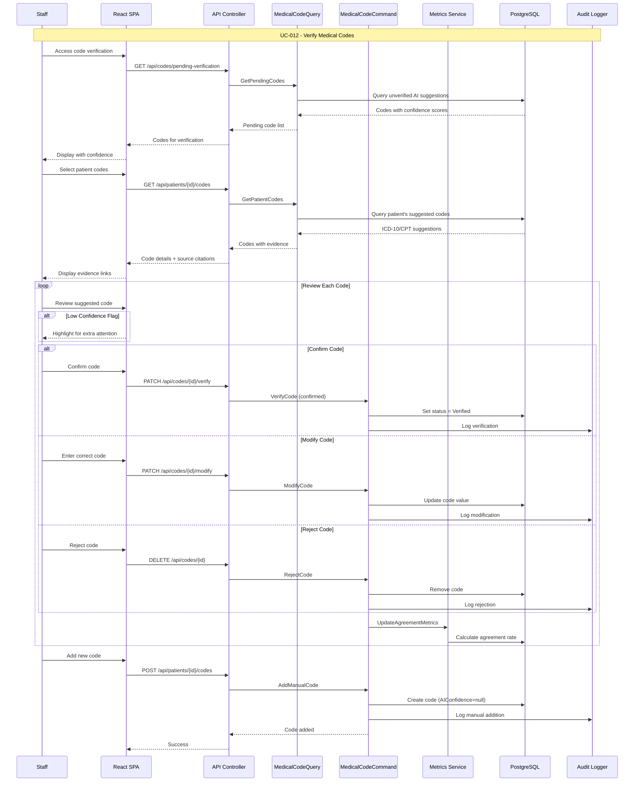
```mermaid
sequenceDiagram
    participant Staff
    participant ReactSPA as React SPA
    participant API as API Controller
    participant CodeQuery as MedicalCodeQuery
    participant CodeCmd as MedicalCodeCommand
    participant MetricsService as Metrics Service
    participant DB as PostgreSQL
    participant AuditLog as Audit Logger

    Note over Staff,AuditLog: UC-012 - Verify Medical Codes

    Staff->>ReactSPA: Access code verification
    ReactSPA->>API: GET /api/codes/pending-verification
    API->>CodeQuery: GetPendingCodes
    CodeQuery->>DB: Query unverified AI suggestions
    DB-->>CodeQuery: Codes with confidence scores
    CodeQuery-->>API: Pending code list
    API-->>ReactSPA: Codes for verification
    ReactSPA-->>Staff: Display with confidence

    Staff->>ReactSPA: Select patient codes
    ReactSPA->>API: GET /api/patients/{id}/codes
    API->>CodeQuery: GetPatientCodes
    CodeQuery->>DB: Query patient's suggested codes
    DB-->>CodeQuery: ICD-10/CPT suggestions
    CodeQuery-->>API: Codes with evidence
    API-->>ReactSPA: Code details + source citations
    ReactSPA-->>Staff: Display evidence links

    loop Review Each Code
        Staff->>ReactSPA: Review suggested code
        
        alt Low Confidence Flag
            ReactSPA-->>Staff: Highlight for extra attention
        end

        alt Confirm Code
            Staff->>ReactSPA: Confirm code
            ReactSPA->>API: PATCH /api/codes/{id}/verify
            API->>CodeCmd: VerifyCode (confirmed)
            CodeCmd->>DB: Set status = Verified
            CodeCmd->>AuditLog: Log verification
        else Modify Code
            Staff->>ReactSPA: Enter correct code
            ReactSPA->>API: PATCH /api/codes/{id}/modify
            API->>CodeCmd: ModifyCode
            CodeCmd->>DB: Update code value
            CodeCmd->>AuditLog: Log modification
        else Reject Code
            Staff->>ReactSPA: Reject code
            ReactSPA->>API: DELETE /api/codes/{id}
            API->>CodeCmd: RejectCode
            CodeCmd->>DB: Remove code
            CodeCmd->>AuditLog: Log rejection
        end

        CodeCmd->>MetricsService: UpdateAgreementMetrics
        MetricsService->>DB: Calculate agreement rate
    end

    Staff->>ReactSPA: Add new code
    ReactSPA->>API: POST /api/patients/{id}/codes
    API->>CodeCmd: AddManualCode
    CodeCmd->>DB: Create code (AIConfidence=null)
    CodeCmd->>AuditLog: Log manual addition
    CodeCmd-->>API: Code added
    API-->>ReactSPA: Success
```

---

### UC-013: Manage User Accounts

**Source**: [spec.md#UC-013](spec.md#UC-013)

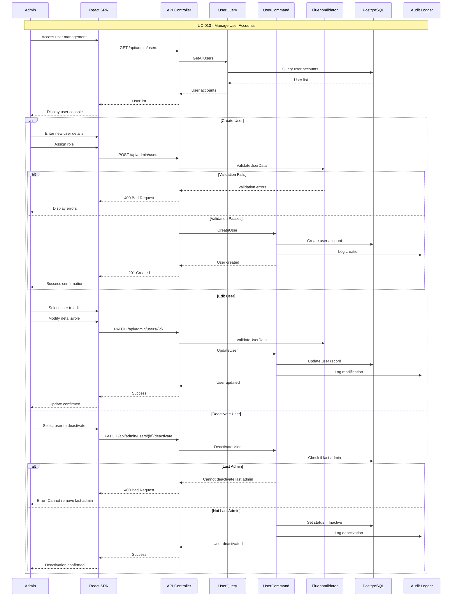
```mermaid
sequenceDiagram
    participant Admin
    participant ReactSPA as React SPA
    participant API as API Controller
    participant UserQuery as UserQuery
    participant UserCmd as UserCommand
    participant Validator as FluentValidator
    participant DB as PostgreSQL
    participant AuditLog as Audit Logger

    Note over Admin,AuditLog: UC-013 - Manage User Accounts

    Admin->>ReactSPA: Access user management
    ReactSPA->>API: GET /api/admin/users
    API->>UserQuery: GetAllUsers
    UserQuery->>DB: Query user accounts
    DB-->>UserQuery: User list
    UserQuery-->>API: User accounts
    API-->>ReactSPA: User list
    ReactSPA-->>Admin: Display user console

    alt Create User
        Admin->>ReactSPA: Enter new user details
        Admin->>ReactSPA: Assign role
        ReactSPA->>API: POST /api/admin/users
        API->>Validator: ValidateUserData
        alt Validation Fails
            Validator-->>API: Validation errors
            API-->>ReactSPA: 400 Bad Request
            ReactSPA-->>Admin: Display errors
        else Validation Passes
            API->>UserCmd: CreateUser
            UserCmd->>DB: Create user account
            UserCmd->>AuditLog: Log creation
            UserCmd-->>API: User created
            API-->>ReactSPA: 201 Created
            ReactSPA-->>Admin: Success confirmation
        end
    else Edit User
        Admin->>ReactSPA: Select user to edit
        Admin->>ReactSPA: Modify details/role
        ReactSPA->>API: PATCH /api/admin/users/{id}
        API->>Validator: ValidateUserData
        API->>UserCmd: UpdateUser
        UserCmd->>DB: Update user record
        UserCmd->>AuditLog: Log modification
        UserCmd-->>API: User updated
        API-->>ReactSPA: Success
        ReactSPA-->>Admin: Update confirmed
    else Deactivate User
        Admin->>ReactSPA: Select user to deactivate
        ReactSPA->>API: PATCH /api/admin/users/{id}/deactivate
        API->>UserCmd: DeactivateUser
        UserCmd->>DB: Check if last admin
        alt Last Admin
            UserCmd-->>API: Cannot deactivate last admin
            API-->>ReactSPA: 400 Bad Request
            ReactSPA-->>Admin: Error: Cannot remove last admin
        else Not Last Admin
            UserCmd->>DB: Set status = Inactive
            UserCmd->>AuditLog: Log deactivation
            UserCmd-->>API: User deactivated
            API-->>ReactSPA: Success
            ReactSPA-->>Admin: Deactivation confirmed
        end
    end
```

---

### UC-014: Send Appointment Reminders

**Source**: [spec.md#UC-014](spec.md#UC-014)

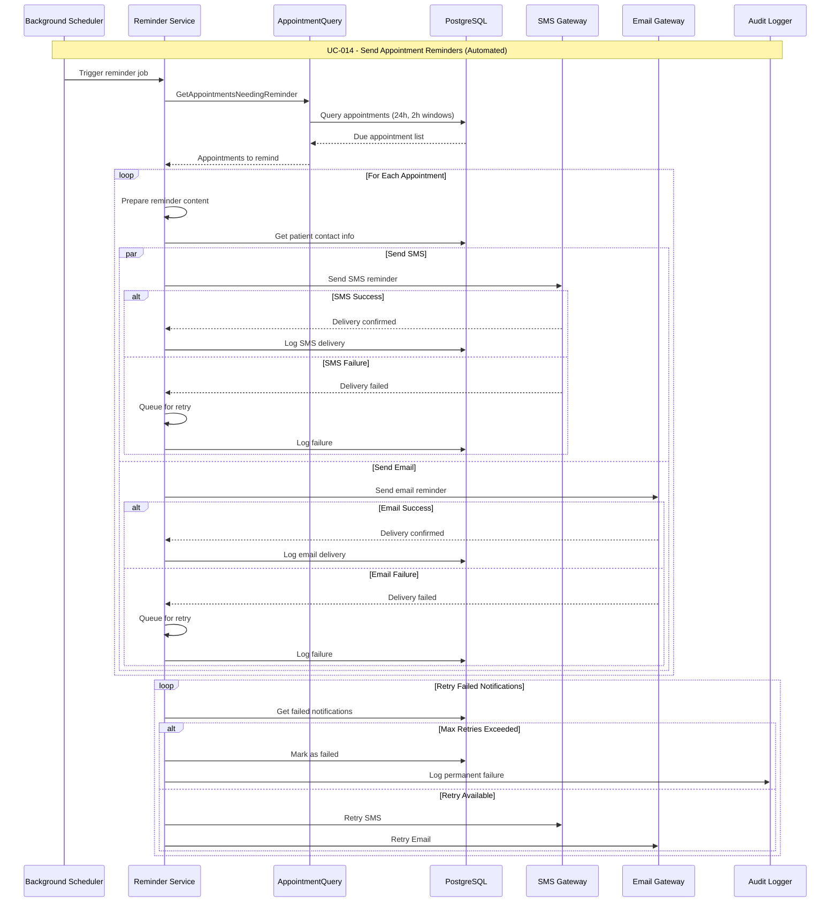
```mermaid
sequenceDiagram
    participant Scheduler as Background Scheduler
    participant ReminderService as Reminder Service
    participant ApptQuery as AppointmentQuery
    participant DB as PostgreSQL
    participant SMSGateway as SMS Gateway
    participant EmailGateway as Email Gateway
    participant AuditLog as Audit Logger

    Note over Scheduler,AuditLog: UC-014 - Send Appointment Reminders (Automated)

    Scheduler->>ReminderService: Trigger reminder job
    ReminderService->>ApptQuery: GetAppointmentsNeedingReminder
    ApptQuery->>DB: Query appointments (24h, 2h windows)
    DB-->>ApptQuery: Due appointment list
    ApptQuery-->>ReminderService: Appointments to remind

    loop For Each Appointment
        ReminderService->>ReminderService: Prepare reminder content
        ReminderService->>DB: Get patient contact info
        
        par Send SMS
            ReminderService->>SMSGateway: Send SMS reminder
            alt SMS Success
                SMSGateway-->>ReminderService: Delivery confirmed
                ReminderService->>DB: Log SMS delivery
            else SMS Failure
                SMSGateway-->>ReminderService: Delivery failed
                ReminderService->>ReminderService: Queue for retry
                ReminderService->>DB: Log failure
            end
        and Send Email
            ReminderService->>EmailGateway: Send email reminder
            alt Email Success
                EmailGateway-->>ReminderService: Delivery confirmed
                ReminderService->>DB: Log email delivery
            else Email Failure
                EmailGateway-->>ReminderService: Delivery failed
                ReminderService->>ReminderService: Queue for retry
                ReminderService->>DB: Log failure
            end
        end
    end

    loop Retry Failed Notifications
        ReminderService->>DB: Get failed notifications
        alt Max Retries Exceeded
            ReminderService->>DB: Mark as failed
            ReminderService->>AuditLog: Log permanent failure
        else Retry Available
            ReminderService->>SMSGateway: Retry SMS
            ReminderService->>EmailGateway: Retry Email
        end
    end
```

---

### UC-015: Extract Clinical Document Data

**Source**: [spec.md#UC-015](spec.md#UC-015)

```mermaid
sequenceDiagram
    participant Queue as Processing Queue
    participant Extractor as Extraction Service
    participant Storage as Secure Storage
    participant AIGateway as AI Gateway
    participant AzureAI as Azure OpenAI
    participant VectorStore as pgvector
    participant ConflictDetector as Conflict Detector
    participant DB as PostgreSQL
    participant AuditLog as Audit Logger

    Note over Queue,AuditLog: UC-015 - Extract Clinical Document Data (Automated)

    Queue->>Extractor: Document ready for processing
    Extractor->>Storage: Retrieve document
    Storage-->>Extractor: PDF content

    Extractor->>Extractor: Detect if scanned
    alt Scanned Document
        Extractor->>Extractor: Perform OCR
    end
    Extractor->>Extractor: Extract text

    Extractor->>Extractor: Chunk text (512 tokens, 10% overlap)
    
    loop For Each Chunk
        Extractor->>AIGateway: Generate embedding
        AIGateway->>AzureAI: text-embedding-3-small
        AzureAI-->>AIGateway: Embedding vector
        AIGateway->>VectorStore: Store with HNSW index
    end

    Extractor->>AIGateway: Extract clinical entities
    AIGateway->>AIGateway: Construct prompt with PII redaction
    AIGateway->>AIGateway: Check token budget (4000 max)
    AIGateway->>AzureAI: Structured extraction request
    AzureAI-->>AIGateway: Vitals, medications, history JSON
    AIGateway->>AIGateway: Schema validation
    
    alt Schema Invalid
        AIGateway->>DB: Log extraction error
        AIGateway->>DB: Mark for manual review
    else Schema Valid
        AIGateway->>AIGateway: Calculate confidence score
        
        alt Low Confidence (<80%)
            AIGateway->>DB: Store with manual review flag
            AIGateway->>AuditLog: Log low confidence
        else High Confidence
            AIGateway->>DB: Store extracted data
        end
    end

    Extractor->>ConflictDetector: Check for conflicts
    ConflictDetector->>DB: Get existing patient data
    ConflictDetector->>ConflictDetector: Compare values
    
    loop For Each Field
        alt Conflict Detected
            ConflictDetector->>DB: Create DataConflict record
            alt Critical Conflict (medications)
                ConflictDetector->>DB: Set severity = Critical
            end
        end
    end

    Extractor->>DB: Update 360-degree view
    Extractor->>DB: Set processing status = Complete
    Extractor->>AuditLog: Log extraction completion
```

---

## Document Summary

This design model document provides comprehensive UML visual models for the Unified Patient Access & Clinical Intelligence Platform, including:

**Architectural Views:**
- System Context Diagram: Platform boundary and external integrations
- Component Architecture: Clean Architecture with CQRS pattern breakdown
- Deployment Architecture: Free-tier infrastructure topology
- Data Flow Diagram: End-to-end patient data lifecycle
- Logical Data Model (ERD): 11 core entities with relationships
- RAG Pipeline Diagram: AI document processing flow

**Sequence Diagrams** (15 total):
| UC-ID | Use Case Name | Primary Actor |
|-------|---------------|---------------|
| UC-001 | Book Standard Appointment | Patient |
| UC-002 | Request Preferred Slot Swap | Patient |
| UC-003 | Complete Patient Intake (AI) | Patient |
| UC-004 | Complete Patient Intake (Manual) | Patient |
| UC-005 | Upload Clinical Documents | Patient |
| UC-006 | View 360-Degree Patient Profile | Patient/Staff |
| UC-007 | Handle Walk-in Booking | Staff |
| UC-008 | Manage Same-Day Queue | Staff |
| UC-009 | Mark Patient Arrival | Staff |
| UC-010 | Perform Insurance Pre-Check | Staff |
| UC-011 | Review Clinical Data Conflicts | Staff |
| UC-012 | Verify Medical Codes | Staff |
| UC-013 | Manage User Accounts | Admin |
| UC-014 | Send Appointment Reminders | System |
| UC-015 | Extract Clinical Document Data | System |

**Traceability:**
- All diagrams align with design.md architectural decisions
- ERD entities match design.md Core Entities
- Sequence diagrams reference source UC-XXX from spec.md
- AI architecture diagrams trace to AIR-XXX requirements
