# Design Modelling

## UML Models Overview

This document provides comprehensive Unified Modeling Language (UML) visual representations of the Unified Patient Access & Clinical Intelligence Platform architecture. The diagrams translate requirements from [spec.md](.propel/context/docs/spec.md) and architectural decisions from [design.md](.propel/context/docs/design.md) into structured visual models that facilitate stakeholder communication, guide implementation, and serve as living documentation.

**Purpose:**
- **System Context Diagram**: Illustrates the system boundary, external actors (patients, staff, admins), and third-party integrations (calendar APIs, email/SMS gateways)
- **Component Architecture Diagram**: Details internal module structure following layered backend and vertical slice frontend patterns
- **Deployment Architecture Diagram**: Maps free-tier cloud infrastructure components (Vercel, Render, Supabase) required by FR-035
- **Data Flow Diagram**: Visualizes data movement from patient intake through AI extraction to clinical data consolidation
- **Logical Data Model (ERD)**: Represents core entities from design.md with relationships, cardinality, and key constraints
- **Sequence Diagrams (UC-001 through UC-010)**: Capture dynamic message flows for each use case specified in spec.md

**Navigation Guide:**
- Architectural views precede behavioral diagrams
- Each sequence diagram links to its source use case specification
- PlantUML diagrams are used for context, deployment, and data flow views per UML standards
- Mermaid diagrams are used for component architectures, ERDs, and sequence diagrams for web-native rendering

## Architectural Views

### System Context Diagram

This diagram shows the Unified Patient Access & Clinical Intelligence Platform as a single system with clear boundaries, illustrating its interactions with external users (Patient, Staff, Admin) and third-party services (Calendar APIs, Email/SMS Gateways, AI Model Providers). The system's primary function is to bridge appointment scheduling with AI-powered clinical data management while maintaining HIPAA compliance.

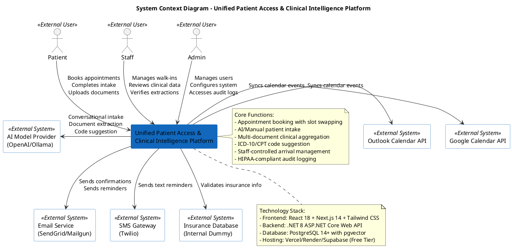

### Component Architecture Diagram

This diagram decomposes the system into major components following a hybrid architectural pattern: layered architecture for the backend (API → Business Services → Data Repositories) and vertical slice pattern for the frontend (feature-isolated modules). Each component is annotated with its primary responsibilities and key technologies.

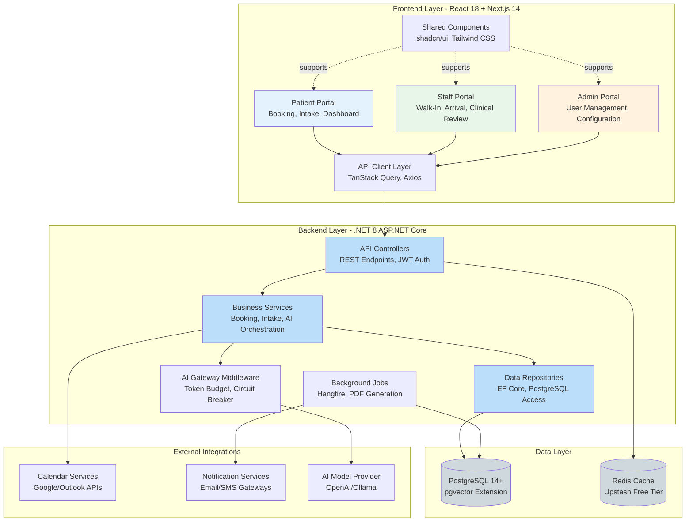

**Component Responsibilities:**

| Component | Responsibilities | Key Technologies |
|-----------|-----------------|------------------|
| **Patient Portal** | Appointment booking, AI/manual intake, document upload, dashboard | React hooks, TanStack Query, Next.js SSR |
| **Staff Portal** | Walk-in management, arrival tracking, clinical data review, code verification | React Context, optimistic UI updates |
| **Admin Portal** | User account CRUD, role assignment, audit log access, system configuration | Protected routes, RBAC enforcement |
| **API Controllers** | HTTP request routing, JWT validation, input validation, rate limiting | ASP.NET Core Minimal APIs, FluentValidation |
| **Business Services** | Core logic: booking conflicts, intake processing, AI extraction orchestration, audit logging | Dependency injection, async/await |
| **Data Repositories** | Database CRUD operations, query optimization, EF Core entity mapping | Repository pattern, Unit of Work |
| **Background Jobs** | Async PDF generation, email/SMS sending, embedding generation, waitlist processing | Hangfire dashboard, retry policies |
| **AI Gateway Middleware** | Prompt logging (AIR-S03), token budgets (AIR-O01), circuit breakers (AIR-O02), caching (AIR-O04) | Polly resilience, custom middleware |

### Deployment Architecture Diagram

This diagram visualizes the free-tier cloud landing zone architecture spanning three primary zones: Frontend (Vercel), Backend (Render), and Data (Supabase). The architecture emphasizes HIPAA-compliant data flow with TLS encryption, stateless API design for horizontal scalability, and external integrations via secure API gateways.

```plantuml
@startuml
!define AzurePuml https://raw.githubusercontent.com/plantuml-stdlib/Azure-PlantUML/release/2-2/dist
!includeurl AzurePuml/AzureCommon.puml
!includeurl AzurePuml/Compute/AzureFunction.puml
!includeurl AzurePuml/Databases/AzureCosmosDb.puml
!includeurl AzurePuml/Web/AzureWebApp.puml

skinparam backgroundColor #FFFFFF
skinparam RectangleBorderColor #333333
skinparam ArrowColor #1976D2

title Deployment Architecture - Free-Tier Cloud Infrastructure

package "Client Zone" {
    [Web Browser] as browser
    [Mobile Browser] as mobile
}

cloud "Vercel Free Tier CDN" as vercel {
    [Next.js Frontend\n(Patient/Staff/Admin)\nSSR + ISR] as frontend
    note right of frontend
      - 100GB bandwidth/month
      - Serverless functions
      - Automatic HTTPS
    end note
}

cloud "Render Free Tier" as render {
    [.NET 8 API Container\n(Docker)\n500MB RAM, 0.1 CPU] as api
    [Hangfire Background Jobs\n(In-Process)] as jobs
    note right of api
      - Auto-restart on failure
      - Health check monitoring
      - Logs to stdout
    end note
}

cloud "Supabase Free Tier" as supabase {
    database "PostgreSQL 14+\n(pgvector enabled)\n500MB storage" as db
    storage "Blob Storage\n(Encrypted PDFs)\n1GB storage" as blobs
    note right of db
      - 7-day PITR backup
      - Connection pooling
      - Row-level security
    end note
}

cloud "Upstash Redis\nFree Tier" as upstash {
    [Redis Cache\n10K commands/day] as redis
}

cloud "External Services" as external {
    [Google Calendar API] as google
    [Outlook Calendar API] as outlook
    [SendGrid/Mailgun\nEmail API] as email
    [Twilio SMS API] as sms
    [OpenAI/Ollama\nAI Models] as aimodel
}

browser --> frontend : HTTPS (TLS 1.2+)
mobile --> frontend : HTTPS (TLS 1.2+)
frontend --> api : REST API (HTTPS)\nJWT Bearer Token
api --> db : EF Core\n(Encrypted Connection)
api --> redis : Session Cache\n(Encrypted Connection)
api --> blobs : PDF Upload/Download\n(Server-Side Encryption)
jobs --> email : Async Notifications
jobs --> sms : Async Reminders
api --> google : OAuth 2.0
api --> outlook : OAuth 2.0
api --> aimodel : Model Inference\n(Token Budget Enforced)

note bottom of vercel
  **Frontend Deployment**
  - ISR for static pages
  - SSR for dynamic dashboards
  - Automatic invalidation on deploy
end note

note bottom of render
  **Backend Deployment**
  - Docker multi-stage build
  - EF Core migrations on startup
  - Health checks: /health/live, /health/ready
end note

note bottom of supabase
  **Data Layer**
  - pgvector for embeddings (AIR-R02)
  - Immutable audit log table (DR-005)
  - AES-256 at-rest encryption (NFR-007)
end note

@enduml
```

**Infrastructure Components:**

| Component | Service | Specification | Free-Tier Limits | HIPAA Compliance |
|-----------|---------|---------------|------------------|------------------|
| **Frontend** | Vercel | Next.js serverless, CDN edge caching | 100GB bandwidth, unlimited deployments | TLS 1.2+, CSP headers |
| **Backend** | Render | Docker container, 500MB RAM, 0.1 CPU | 750 hours/month, auto-sleep after 15min inactivity | Environment variable secrets, TLS enforced |
| **Database** | Supabase PostgreSQL | 500MB storage, unlimited API requests | 2 projects, 7-day backups | BAA available, encryption at rest/transit |
| **Cache** | Upstash Redis | 10K commands/day, 256MB memory | Shared infrastructure | TLS connections, no PHI stored |
| **Blob Storage** | Supabase Storage | 1GB total, server-side encryption | No egress limits | Encrypted file paths (Decision 8) |

### Data Flow Diagram

This diagram illustrates the end-to-end data pipeline from patient intake/document upload through AI-powered extraction, consolidation, and medical coding. It highlights data sources (user inputs, PDFs), transformation processes (AI extraction, conflict detection), and data stores (PostgreSQL tables, pgvector embeddings).

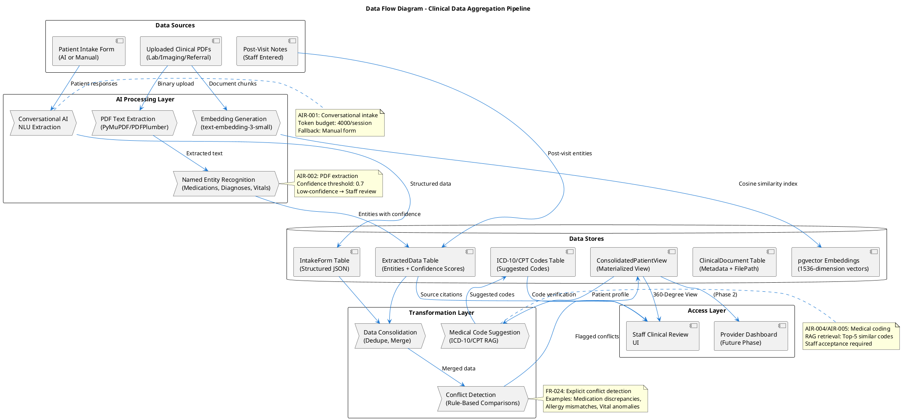

**Data Flow Key Points:**

1. **Intake Flow**: Patient completes AI conversational or manual form → NLU extracts structured JSON → Stored in IntakeForm table
2. **Document Flow**: PDF uploaded → Text extraction → NER identifies entities → Stored in ExtractedData with confidence scores → Embeddings generated for vector search
3. **Consolidation Flow**: IntakeForm + ExtractedData + PostVisitNotes → Deduplication & merging → Conflict detection → Materialized view refresh
4. **Coding Flow**: ConsolidatedPatientView queries pgvector for similar ICD-10/CPT codes → Ranked suggestions stored → Staff reviews and accepts/rejects
5. **Retrieval Flow**: Staff UI fetches ConsolidatedPatientView → Displays source citations → Links to original PDF pages

### Logical Data Model (ERD)

This entity-relationship diagram represents the core database schema derived from design.md Domain Entities section. It shows relationships, cardinality, key attributes, and HIPAA-critical constraints (audit logging, encryption, optimistic concurrency).

```mermaid
erDiagram
    Patient ||--o{ Appointment : books
    Patient ||--o{ ClinicalDocument : uploads
    Patient ||--|| IntakeForm : completes
    Patient ||--o{ AuditLog : "generates logs"
    
    Staff ||--o{ AuditLog : "generates logs"
    Staff ||--o{ ExtractedData : verifies
    
    Admin ||--o{ AuditLog : "generates logs"
    
    Appointment ||--o| PreferredSlotSwapRequest : "may have"
    Appointment ||--o{ Reminder : receives
    Appointment }o--|| AppointmentSlot : "books slot"
    
    ClinicalDocument ||--o{ ExtractedData : "contains extractions"
    
    ConsolidatedPatientView ||--|| Patient : "aggregates data for"

    Patient {
        uuid patientID PK
        string email UK "UNIQUE, NOT NULL"
        string firstName
        string lastName
        date dateOfBirth
        string phone
        string passwordHash "bcrypt hashed"
        enum accountStatus "Active/Inactive"
        timestamp createdAt
        timestamp updatedAt
    }

    Staff {
        uuid staffID PK
        string email UK "UNIQUE, NOT NULL"
        string name
        enum specialization "FrontDesk/CallCenter/ClinicalReview"
        string employeeID
        date hireDate
        enum accountStatus "Active/Inactive"
        timestamp createdAt
    }

    Admin {
        uuid adminID PK
        string email UK "UNIQUE, NOT NULL"
        string name
        jsonb privileges "UserManagement, SystemConfig, AuditLogAccess"
        timestamp createdAt
    }

    Appointment {
        uuid appointmentID PK
        uuid patientID FK
        uuid providerID FK
        timestamp slotDateTime
        int durationMinutes
        enum status "Scheduled/Arrived/Completed/Cancelled/NoShow"
        enum bookingSource "Online/WalkIn/Staff"
        uuid preferredSlotSwapRequestID FK "NULLABLE"
        binary rowVersion "Optimistic concurrency control"
        timestamp bookedAt
        timestamp updatedAt
    }

    AppointmentSlot {
        uuid slotID PK
        uuid providerID FK
        timestamp startDateTime
        timestamp endDateTime
        boolean isAvailable
        enum slotType "Regular/WalkIn/Emergency"
        timestamp createdAt
    }

    ClinicalDocument {
        uuid documentID PK
        uuid patientID FK
        enum documentType "Lab/Imaging/Referral/PostVisitNote"
        timestamp uploadedAt
        uuid uploadedByUserID FK
        string filePath "Encrypted blob URL"
        int fileSizeBytes
        vector embeddingVector "pgvector[1536]"
        enum processingStatus "Pending/Completed/Failed"
    }

    ExtractedData {
        uuid extractedDataID PK
        uuid documentID FK
        enum dataType "Vital/Medication/Diagnosis/Allergy/Procedure/LabValue"
        jsonb value "Structured schema per type"
        float confidenceScore "0.0 to 1.0"
        timestamp extractedAt
        uuid verifiedByStaffID FK "NULLABLE"
        timestamp verifiedAt "NULLABLE"
        int sourceDocumentPageNumber
    }

    IntakeForm {
        uuid intakeFormID PK
        uuid patientID FK
        uuid appointmentID FK
        enum intakeMethod "AIConversational/ManualForm"
        timestamp completedAt
        timestamp lastEditedAt
        jsonb demographics "Name, DOB, Address, Insurance"
        jsonb medicalHistory "Conditions, Surgeries, FamilyHistory"
        jsonb currentMedications "Name, Dosage, Frequency"
        jsonb allergies "Substance, Reaction, Severity"
        text reasonForVisit
        jsonb editHistory "Array of edits with timestamps"
    }

    ConsolidatedPatientView {
        uuid patientID PK-FK
        jsonb medications "Merged list with sources"
        jsonb allergies "Merged list with sources"
        jsonb diagnoses "ICD-10 codes with sources"
        jsonb vitals "Latest readings with timestamps"
        jsonb conflictFlags "Array of detected conflicts"
        timestamp lastRefreshedAt
    }

    PreferredSlotSwapRequest {
        uuid swapRequestID PK
        uuid appointmentID FK "UNIQUE constraint"
        timestamp preferredSlotDateTime
        timestamp requestedAt
        enum status "Pending/Swapped/Expired/Cancelled"
        timestamp swappedAt "NULLABLE"
    }

    Reminder {
        uuid reminderID PK
        uuid appointmentID FK
        enum reminderType "Email/SMS"
        timestamp scheduledFor
        timestamp sentAt "NULLABLE"
        enum deliveryStatus "Pending/Sent/Failed/Bounced"
        boolean confirmationReceived
        string confirmationMethod "Reply/Link"
    }

    AuditLog {
        uuid auditLogID PK
        uuid userID FK "Polymorphic: Patient/Staff/Admin"
        enum userRole "Patient/Staff/Admin"
        enum action "Create/Read/Update/Delete/Login/Logout"
        string entityType "Appointment, ClinicalDocument, etc."
        uuid entityID
        timestamp timestamp
        string ipAddress
        string userAgent
        jsonb changeDetails "Before/After values"
    }
```

**ERD Constraints & Indexes:**

| Entity | Constraints | Indexes | HIPAA Notes |
|--------|-------------|---------|-------------|
| **Patient** | `email` UNIQUE, `passwordHash` NOT NULL | `idx_patient_email`, `idx_patient_dob` | Soft delete with `IsDeleted` flag (DR-009) |
| **Appointment** | `rowVersion` for optimistic concurrency, FK cascade to Patient | `idx_appointment_datetime`, `idx_appointment_status` | Immutable after completion (status only) |
| **ClinicalDocument** | `filePath` encrypted, `embeddingVector` using pgvector GIST index | `idx_document_patient`, `idx_embedding_cosine` | Server-side encryption (NFR-007) |
| **ExtractedData** | `confidenceScore` CHECK (>= 0.0 AND <= 1.0), FK to ClinicalDocument | `idx_extracted_confidence`, `idx_extracted_verified` | Low-confidence (<0.7) flagged for review |
| **AuditLog** | Append-only (DB trigger prevents UPDATE/DELETE), 7-year retention | `idx_audit_timestamp`, `idx_audit_userid` | HIPAA § 164.308(a)(1)(ii)(D) compliance |

## Use Case Sequence Diagrams

> **Note**: The following sequence diagrams detail the dynamic message flows for each use case (UC-001 through UC-010) defined in [spec.md](.propel/context/docs/spec.md). Each diagram maps success scenario steps to interactions between actors, system components, and external services.

### UC-001: Patient Books Appointment with Available Slot
**Source**: [spec.md#UC-001](.propel/context/docs/spec.md#UC-001)

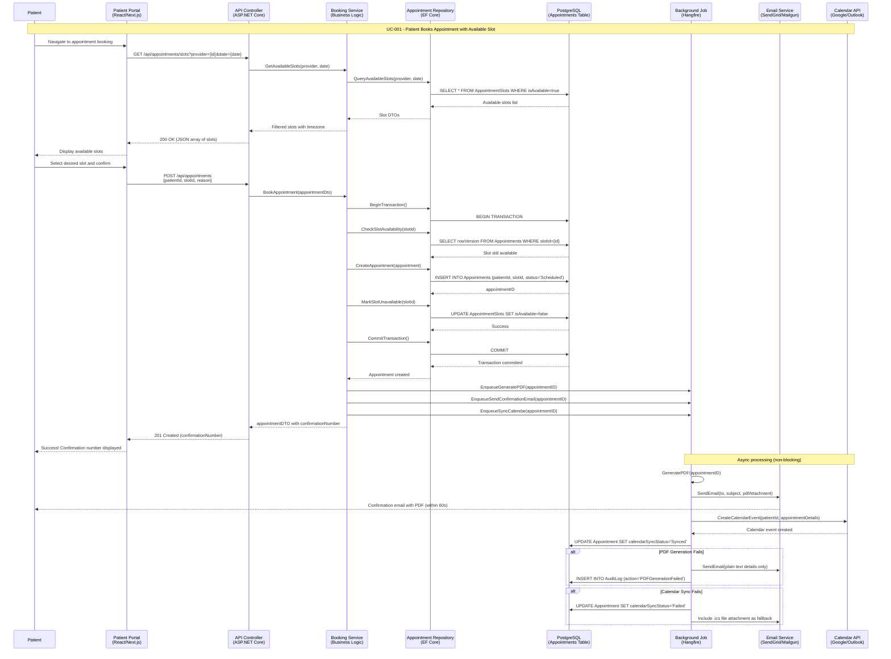

### UC-002: Patient Books with Preferred Slot Swap
**Source**: [spec.md#UC-002](.propel/context/docs/spec.md#UC-002)

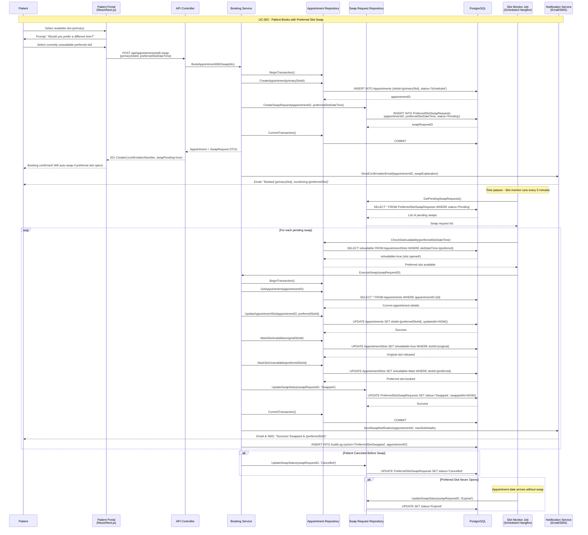

### UC-003: Patient Completes AI Conversational Intake
**Source**: [spec.md#UC-003](.propel/context/docs/spec.md#UC-003)

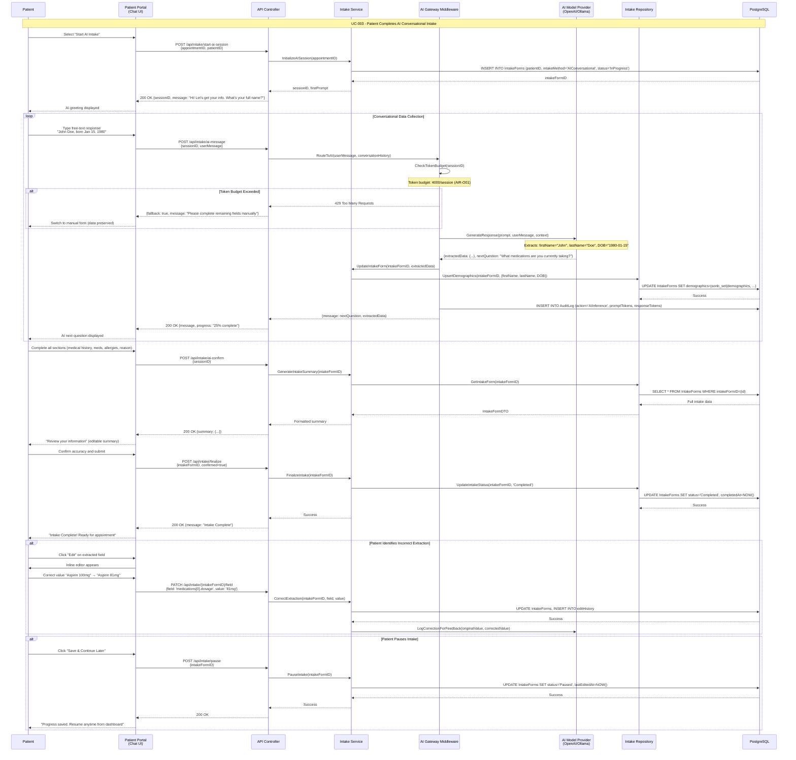

### UC-004: Patient Completes Manual Form Intake
**Source**: [spec.md#UC-004](.propel/context/docs/spec.md#UC-004)

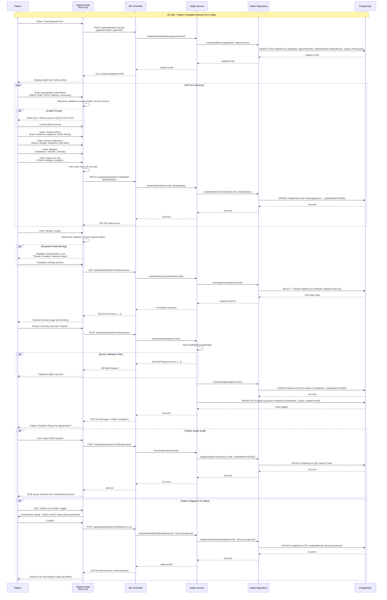

### UC-005: Staff Processes Walk-In Appointment
**Source**: [spec.md#UC-005](.propel/context/docs/spec.md#UC-005)

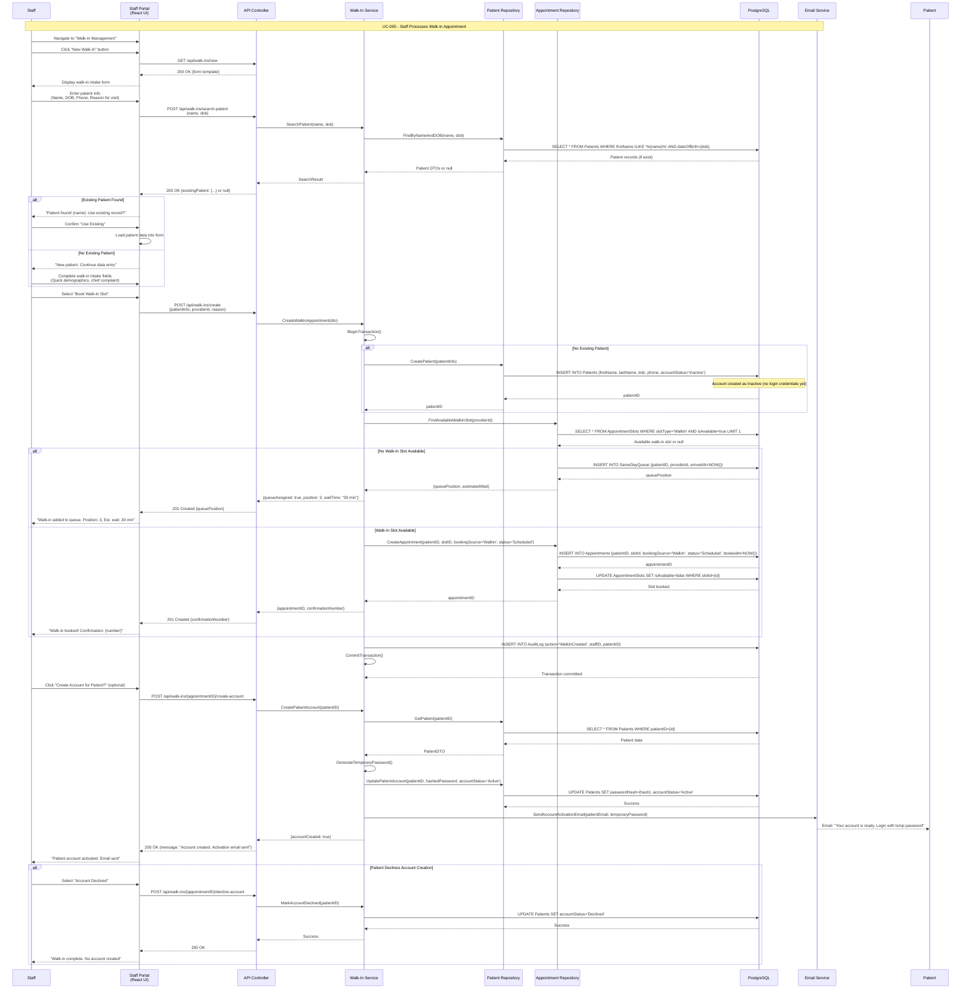

### UC-006: Staff Marks Patient as Arrived
**Source**: [spec.md#UC-006](.propel/context/docs/spec.md#UC-006)

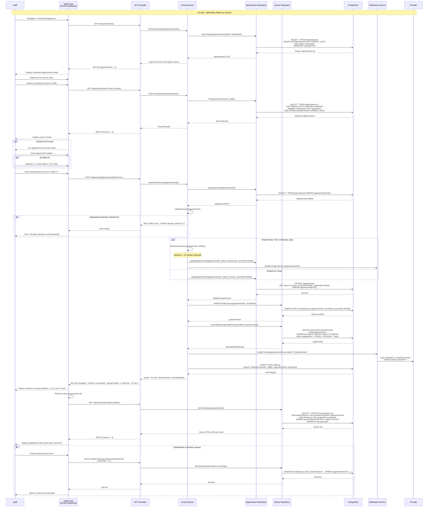

### UC-007: Staff Validates Patient Insurance
**Source**: [spec.md#UC-007](.propel/context/docs/spec.md#UC-007)

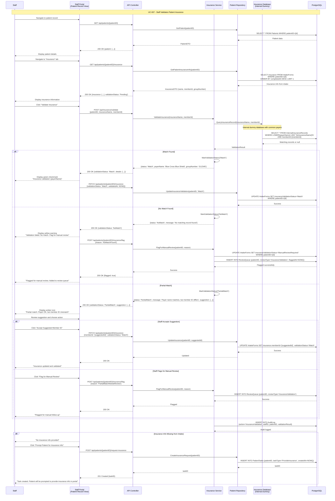

### UC-008: Staff Reviews 360-Degree Patient View
**Source**: [spec.md#UC-008](.propel/context/docs/spec.md#UC-008)

```mermaid
sequenceDiagram
    participant Staff
    participant StaffPortal as Staff Portal<br/>(Clinical Review)
    participant API as API Controller
    participant ClinicalService as Clinical Data Service
    participant ConsolidatedViewRepo as Consolidated View Repository
    participant ExtractedDataRepo as Extracted Data Repository
    participant Database as PostgreSQL
    participant BlobStorage as Blob Storage<br/>(Supabase)

    Note over Staff,BlobStorage: UC-008 - Staff Reviews 360-Degree Patient View

    Staff->>StaffPortal: Navigate to clinical data prep for appointment
    StaffPortal->>API: GET /api/clinical/patients/{patientID}/360-view
    API->>ClinicalService: Get360DegreePatientView(patientID)
    
    ClinicalService->>ConsolidatedViewRepo: GetConsolidatedView(patientID)
    ConsolidatedViewRepo->>Database: SELECT * FROM ConsolidatedPatientView WHERE patientID={id}
    Database-->>ConsolidatedViewRepo: ConsolidatedView data
    ConsolidatedViewRepo-->>ClinicalService: ViewDTO (medications, allergies, diagnoses, vitals, conflicts)
    
    ClinicalService->>ExtractedDataRepo: GetExtractionSources(patientID)
    ExtractedDataRepo->>Database: SELECT ed.*, cd.documentType, cd.uploadedAt<br/>FROM ExtractedData ed<br/>JOIN ClinicalDocuments cd ON ed.documentID=cd.documentID<br/>WHERE cd.patientID={patientID}<br/>ORDER BY ed.extractedAt DESC
    Database-->>ExtractedDataRepo: Extractions with sources
    ExtractedDataRepo-->>ClinicalService: SourceAttributions
    
    ClinicalService->>ClinicalService: AnnotateWithConfidenceScores(viewDTO, sourceAttributions)
    ClinicalService-->>API: 360ViewDTO with confidence and sources
    API-->>StaffPortal: 200 OK {consolidatedView: {...}, conflicts: [...], sourceMap: {...}}
    
    StaffPortal-->>Staff: Display 360-Degree Patient View<br/>- Timeline view of patient history<br/>- Medications with sources<br/>- Allergies with sources<br/>- Diagnoses with ICD-10 codes<br/>- Recent vitals
    
    alt Conflicts Detected
        StaffPortal-->>Staff: Red warning banner:<br/>"3 conflicts require review before appointment"
        Staff->>StaffPortal: Click "Review Conflicts"
        
        loop For each conflict
            StaffPortal-->>Staff: Display conflict details:<br/>"Document A (Lab Report, 2025-12-01): No allergies<br/>Document B (Referral Note, 2026-01-15): Penicillin allergy"
            
            Staff->>StaffPortal: Click "View Source Document A"
            StaffPortal->>API: GET /api/clinical/documents/{documentID}
            API->>ClinicalService: GetDocumentMetadata(documentID)
            ClinicalService->>Database: SELECT * FROM ClinicalDocuments WHERE documentID={id}
            Database-->>ClinicalService: Document metadata
            ClinicalService-->>API: {filePath, documentType, uploadedAt}
            API-->>StaffPortal: 200 OK {metadata: {...}}
            
            StaffPortal->>API: GET /api/clinical/documents/{documentID}/view
            API->>ClinicalService: GetSignedBlobURL(documentID)
            ClinicalService->>Database: SELECT filePath FROM ClinicalDocuments WHERE documentID={id}
            Database-->>ClinicalService: Encrypted file path
            ClinicalService->>ClinicalService: DecryptFilePath(encryptedPath)
            ClinicalService->>BlobStorage: GenerateSignedURL(filePath, expiresIn=300)
            BlobStorage-->>ClinicalService: Signed URL (5-min expiry)
            ClinicalService-->>API: Signed URL
            API-->>StaffPortal: 200 OK {signedURL: '...'}
            StaffPortal->>StaffPortal: Open PDF in new tab
            StaffPortal-->>Staff: PDF opens at relevant page (page 3)
            
            Staff->>Staff: Review source document and determine correct value
            Staff->>StaffPortal: Select conflict resolution:<br/>"Document B is correct: Penicillin allergy"
            StaffPortal->>API: POST /api/clinical/conflicts/{conflictID}/resolve<br/>{resolution: 'UseDocumentB', notes: 'Lab report outdated'}
            API->>ClinicalService: ResolveConflict(conflictID, resolution)
            
            ClinicalService->>Database: UPDATE ConsolidatedPatientView<br/>SET allergies=jsonb_set(allergies, '{0}', '{"substance": "Penicillin", ...}'),<br/>conflictFlags=jsonb_remove(conflictFlags, '{0}'),<br/>lastRefreshedAt=NOW()
            Database-->>ClinicalService: Conflict resolved
            
            ClinicalService->>Database: INSERT INTO AuditLog<br/>(action='ConflictResolved', staffID, patientID, conflictDetails, resolution)
            Database-->>ClinicalService: Audit logged
            
            ClinicalService-->>API: {conflictResolved: true}
            API-->>StaffPortal: 200 OK {message: "Conflict resolved"}
            StaffPortal-->>Staff: Conflict removed from warning list
        end
        
        Staff->>StaffPortal: All conflicts resolved
        StaffPortal->>API: POST /api/clinical/patients/{patientID}/acknowledge-conflicts
        API->>ClinicalService: AcknowledgeConflictReview(patientID, staffID)
        ClinicalService->>Database: UPDATE Appointments SET conflictsAcknowledged=true<br/>WHERE patientID={patientID} AND DATE(slotDateTime)=CURRENT_DATE
        Database-->>ClinicalService: Success
        ClinicalService-->>API: Success
        API-->>StaffPortal: 200 OK
        StaffPortal-->>Staff: "Conflicts resolved. Patient ready for provider"
    end
    
    alt Low-Confidence Extraction Requires Verification
        StaffPortal-->>Staff: Yellow highlight on medication:<br/>"Aspirin 81mg (Confidence: 65%) - Verify"
        Staff->>StaffPortal: Click "Verify"
        
        StaffPortal->>API: GET /api/clinical/extracted-data/{extractedDataID}
        API->>ExtractedDataRepo: GetExtractedData(extractedDataID)
        ExtractedDataRepo->>Database: SELECT * FROM ExtractedData WHERE extractedDataID={id}
        Database-->>ExtractedDataRepo: ExtractedData details
        ExtractedDataRepo-->>API: ExtractedDataDTO
        API-->>StaffPortal: 200 OK {data: {...}, sourceDocument: {...}}
        
        StaffPortal-->>Staff: Display extraction with source:<br/>"Extracted: Aspirin 81mg<br/>Source: Lab Report, Page 2, Line 15"
        Staff->>StaffPortal: Click "View Source"
        StaffPortal->>BlobStorage: Open PDF at page 2 (same flow as above)
        
        Staff->>Staff: Verify extraction against source
        alt Extraction Correct
            Staff->>StaffPortal: Click "Verified - Correct"
            StaffPortal->>API: POST /api/clinical/extracted-data/{extractedDataID}/verify<br/>{verified: true}
            API->>ExtractedDataRepo: VerifyExtraction(extractedDataID, staffID)
            ExtractedDataRepo->>Database: UPDATE ExtractedData<br/>SET verifiedByStaffID={staffID}, verifiedAt=NOW()
            Database-->>ExtractedDataRepo: Success
            ExtractedDataRepo-->>API: Success
            API-->>StaffPortal: 200 OK
            StaffPortal-->>Staff: Green checkmark: "Verified"
        else Extraction Incorrect
            Staff->>StaffPortal: Click "Correct Extraction"
            StaffPortal->>Staff: Inline editor appears
            Staff->>StaffPortal: Correct value: "Aspirin 100mg"
            StaffPortal->>API: POST /api/clinical/extracted-data/{extractedDataID}/correct<br/>{correctedValue: '100mg'}
            API->>ExtractedDataRepo: CorrectExtraction(extractedDataID, correctedValue, staffID)
            ExtractedDataRepo->>Database: UPDATE ExtractedData<br/>SET value.dosage='100mg', verifiedByStaffID={staffID}, verifiedAt=NOW()
            ExtractedDataRepo->>Database: INSERT INTO AuditLog (action='ExtractionCorrected', staffID, originalValue, correctedValue)
            Database-->>ExtractedDataRepo: Correction saved
            ExtractedDataRepo-->>API: Success
            API-->>StaffPortal: 200 OK
            StaffPortal-->>Staff: "Correction saved. AI feedback logged"
        end
    end
    
    alt No Uploaded Documents
        StaffPortal-->>Staff: "360-Degree View shows intake form data only<br/>No uploaded clinical documents found"
        Staff->>StaffPortal: Note in appointment: "Request patient upload prior medical records"
    end
    
    Staff->>StaffPortal: Review complete, click "Mark Ready for Provider"
    StaffPortal->>API: POST /api/clinical/patients/{patientID}/mark-ready
    API->>ClinicalService: MarkPatientReadyForProvider(patientID, staffID)
    ClinicalService->>Database: UPDATE Appointments SET clinicalDataReviewedBy={staffID}, reviewedAt=NOW()<br/>WHERE patientID={patientID} AND DATE(slotDateTime)=CURRENT_DATE
    Database-->>ClinicalService: Success
    ClinicalService->>Database: INSERT INTO AuditLog (action='ClinicalDataReviewed', staffID, patientID, reviewDurationMinutes)
    Database-->>ClinicalService: Audit logged
    ClinicalService-->>API: Success
    API-->>StaffPortal: 200 OK {message: "Patient ready for provider"}
    StaffPortal-->>Staff: "Clinical data prep complete. Est. time saved: 18 minutes"
```

### UC-009: Admin Manages User Accounts
**Source**: [spec.md#UC-009](.propel/context/docs/spec.md#UC-009)

```mermaid
sequenceDiagram
    participant Admin
    participant AdminPortal as Admin Portal<br/>(User Management UI)
    participant API as API Controller
    participant AdminService as Admin Service
    participant UserRepo as User Repository
    participant Database as PostgreSQL
    participant EmailService as Email Service
    participant NewUser as New User (Staff)

    Note over Admin,NewUser: UC-009 - Admin Manages User Accounts

    rect rgb(230, 245, 255)
    Note over Admin,NewUser: Scenario: Create New User
    
    Admin->>AdminPortal: Navigate to "User Management"
    AdminPortal->>API: GET /api/admin/users
    API->>AdminService: GetAllUsers()
    AdminService->>UserRepo: QueryUsers(includeInactive=false)
    UserRepo->>Database: SELECT * FROM Users WHERE accountStatus='Active' ORDER BY createdAt DESC
    Database-->>UserRepo: User list
    UserRepo-->>AdminService: UserDTOs
    AdminService-->>API: User list
    API-->>AdminPortal: 200 OK {users: [...]}
    AdminPortal-->>Admin: Display user table (Patient, Staff, Admin columns)
    
    Admin->>AdminPortal: Click "Create New User"
    AdminPortal->>Admin: Display user creation form
    Admin->>AdminPortal: Fill form:<br/>- Email: staff@clinic.com<br/>- Name: Jane Smith<br/>- Role: Staff<br/>- Specialization: ClinicalReview
    Admin->>AdminPortal: Click "Create User"
    
    AdminPortal->>API: POST /api/admin/users<br/>{email, name, role, specialization}
    API->>AdminService: CreateUser(userDto)
    
    AdminService->>UserRepo: CheckEmailUniqueness(email)
    UserRepo->>Database: SELECT COUNT(*) FROM Users WHERE email='{email}'
    Database-->>UserRepo: count
    
    alt Email Already Exists
        UserRepo-->>AdminService: EmailExists=true
        AdminService-->>API: 409 Conflict {error: "User with this email already exists"}
        API-->>AdminPortal: 409 Conflict
        AdminPortal-->>Admin: Error: "Email already in use"
    else Email Unique
        AdminService->>AdminService: GenerateTemporaryPassword()
        AdminService->>AdminService: HashPassword(tempPassword)
        
        AdminService->>UserRepo: CreateStaffUser(email, name, hashedPassword, role, specialization)
        UserRepo->>Database: INSERT INTO Staff<br/>(email, name, passwordHash, role='Staff', specialization='ClinicalReview', accountStatus='Active', createdAt=NOW())
        Database-->>UserRepo: staffID
        UserRepo-->>AdminService: User created
        
        AdminService->>UserRepo: AssignRolePermissions(staffID, role='Staff')
        UserRepo->>Database: INSERT INTO UserPermissions (userID, permission) VALUES<br/>('{staffID}', 'ManageWalkIns'),<br/>('{staffID}', 'ReviewClinicalData'),<br/>('{staffID}', 'VerifyExtractions')
        Database-->>UserRepo: Permissions assigned
        
        AdminService->>EmailService: SendActivationEmail(email, tempPassword, activationLink)
        EmailService-->>NewUser: Email: "Account created. Temp password: {pass}. Change on first login"
        
        AdminService->>Database: INSERT INTO AuditLog (action='UserCreated', adminID, newUserID, role)
        Database-->>AdminService: Audit logged
        
        AdminService-->>API: {userID, accountStatus: 'Active', emailSent: true}
        API-->>AdminPortal: 201 Created {userID}
        AdminPortal-->>Admin: "User created! Activation email sent to staff@clinic.com"
        
        AdminPortal->>API: GET /api/admin/users (refresh list)
        API-->>AdminPortal: 200 OK {users: [...]}
        AdminPortal-->>Admin: New user appears in table
    end
    end
    
    rect rgb(255, 245, 230)
    Note over Admin,NewUser: Scenario: Deactivate User
    
    Admin->>AdminPortal: Select user from table
    Admin->>AdminPortal: Click "Deactivate" button
    AdminPortal->>Admin: Confirmation dialog: "Deactivate {userName}? Active sessions will be terminated"
    Admin->>AdminPortal: Confirm
    
    AdminPortal->>API: POST /api/admin/users/{userID}/deactivate
    API->>AdminService: DeactivateUser(userID)
    
    AdminService->>UserRepo: UpdateAccountStatus(userID, 'Inactive')
    UserRepo->>Database: UPDATE Users SET accountStatus='Inactive', deactivatedAt=NOW() WHERE userID={id}
    Database-->>UserRepo: Success
    
    AdminService->>UserRepo: InvalidateActiveSessions(userID)
    UserRepo->>Database: DELETE FROM ActiveSessions WHERE userID={userID}
    Database-->>UserRepo: Sessions cleared
    
    AdminService->>Database: INSERT INTO AuditLog (action='UserDeactivated', adminID, deactivatedUserID)
    Database-->>AdminService: Audit logged
    
    AdminService-->>API: {deactivated: true}
    API-->>AdminPortal: 200 OK {message: "User deactivated"}
    AdminPortal-->>Admin: User status changed to "Inactive" in table
    
    alt User Tries to Login After Deactivation
        NewUser->>API: POST /api/auth/login {email, password}
        API->>AdminService: Authenticate(email, password)
        AdminService->>UserRepo: GetUserByEmail(email)
        UserRepo->>Database: SELECT * FROM Users WHERE email={email}
        Database-->>UserRepo: User data (accountStatus='Inactive')
        UserRepo-->>AdminService: UserDTO
        AdminService-->>API: 403 Forbidden {error: "Account deactivated. Contact administrator"}
        API-->>NewUser: 403 Forbidden
    end
    end
    
    rect rgb(245, 255, 230)
    Note over Admin,NewUser: Scenario: Reset Password
    
    Admin->>AdminPortal: Select user from table
    Admin->>AdminPortal: Click "Reset Password"
    AdminPortal->>Admin: Confirmation: "Send password reset email to {userEmail}?"
    Admin->>AdminPortal: Confirm
    
    AdminPortal->>API: POST /api/admin/users/{userID}/reset-password
    API->>AdminService: ResetUserPassword(userID)
    
    AdminService->>AdminService: GeneratePasswordResetToken()
    AdminService->>UserRepo: StoreResetToken(userID, token, expiresAt=NOW()+1hour)
    UserRepo->>Database: UPDATE Users SET passwordResetToken={token}, resetTokenExpiresAt=NOW() + INTERVAL '1 hour'<br/>WHERE userID={userID}
    Database-->>UserRepo: Success
    
    AdminService->>EmailService: SendPasswordResetEmail(userEmail, resetToken, resetLink)
    EmailService-->>NewUser: Email: "Password reset requested. Click link to reset (expires in 1 hour)"
    
    alt Email Bounces
        EmailService-->>AdminService: EmailBouncedEvent
        AdminService->>Database: INSERT INTO AuditLog (action='PasswordResetEmailBounced', adminID, userID)
        AdminService-->>API: {emailSent: false, bounced: true}
        API-->>AdminPortal: 200 OK {warning: "Email bounced. Provide password manually"}
        AdminPortal-->>Admin: Warning: "Email failed. Generate temp password manually?"
        
        Admin->>AdminPortal: Click "Generate Manual Password"
        AdminPortal->>API: POST /api/admin/users/{userID}/manual-reset
        API->>AdminService: GenerateManualPassword(userID)
        AdminService->>AdminService: GenerateTempPassword()
        AdminService->>AdminService: HashPassword(tempPassword)
        AdminService->>UserRepo: UpdatePassword(userID, hashedPassword)
        UserRepo->>Database: UPDATE Users SET passwordHash={hashedPassword}
        Database-->>UserRepo: Success
        AdminService-->>API: {tempPassword: '...'}
        API-->>AdminPortal: 200 OK {tempPassword: '...'}
        AdminPortal-->>Admin: Display temp password securely:<br/>"Temp password: {pass}. Communicate to user securely"
    else Email Sent Successfully
        AdminService->>Database: INSERT INTO AuditLog (action='PasswordResetInitiated', adminID, userID)
        AdminService-->>API: {emailSent: true}
        API-->>AdminPortal: 200 OK {message: "Reset email sent"}
        AdminPortal-->>Admin: "Reset email sent to {userEmail}"
    end
    end
```

### UC-010: System Automatically Swaps Preferred Slot When Available
**Source**: [spec.md#UC-010](.propel/context/docs/spec.md#UC-010)

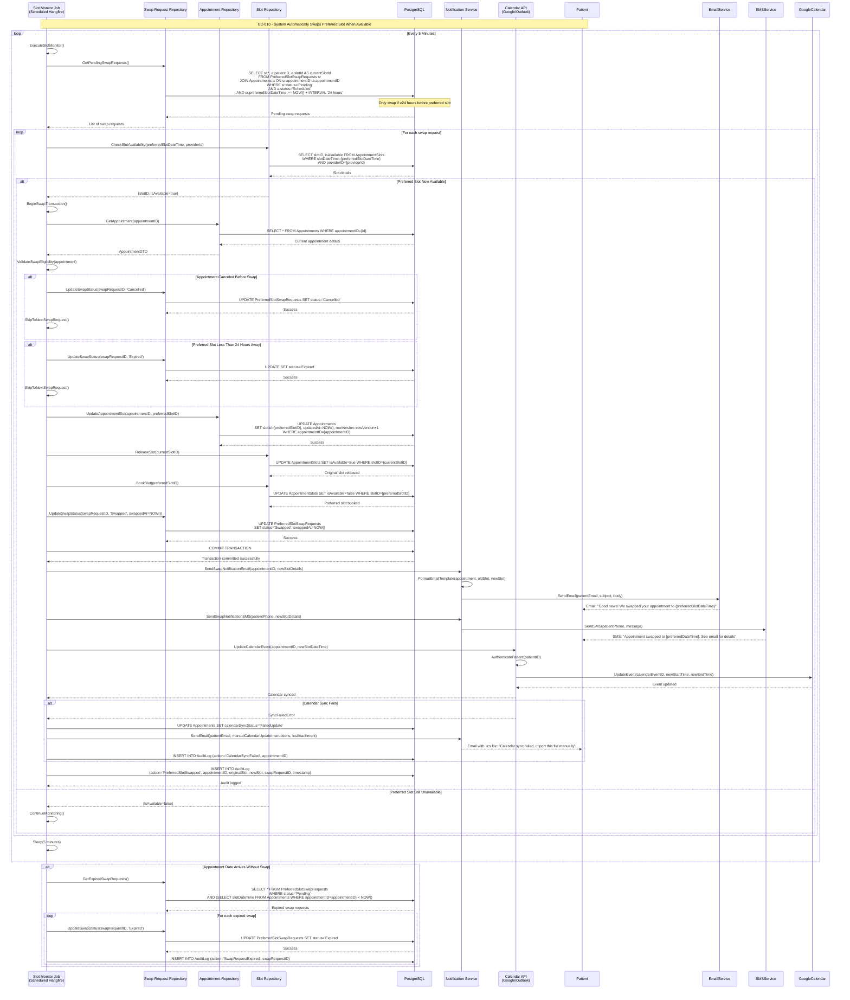

