# Design Modelling

## UML Models Overview

This document provides comprehensive UML visual models and diagrams for the **Unified Patient Access & Clinical Intelligence Platform**. These diagrams translate the requirements specified in [spec.md](spec.md) and architectural decisions documented in [design.md](design.md) into visual representations that facilitate understanding of system structure, behavior, and data flows.

**Document Navigation:**
- **Architectural Views**: System context, component architecture, deployment, data flow, and entity relationships
- **AI Architecture**: RAG pipeline and AI-enabled workflows (conditional on AIR-XXX requirements)
- **Sequence Diagrams**: One diagram per use case (UC-001 through UC-016), detailing actor-system interactions

**Source References:**
| Document | Purpose |
|----------|---------|
| [spec.md](spec.md) | Use case specifications (UC-001 to UC-016), functional requirements (FR-XXX) |
| [design.md](design.md) | Architecture decisions (AD-XXX), domain entities, technology stack, AI requirements (AIR-XXX) |

---

## Architectural Views

### System Context Diagram

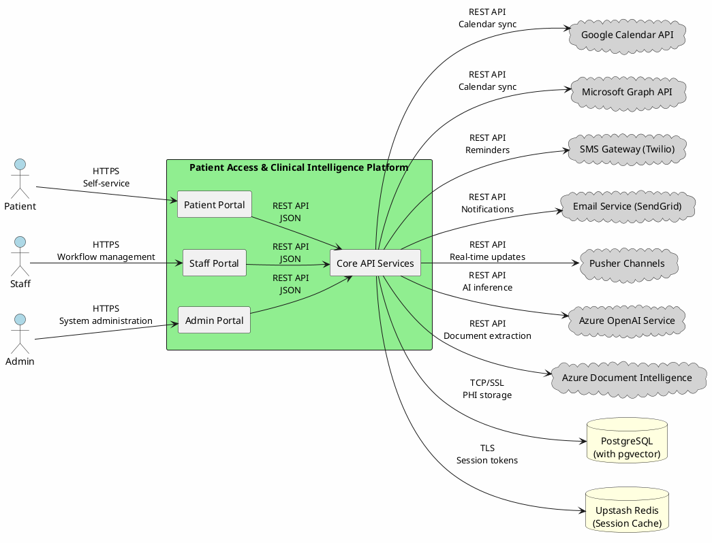
```plantuml
@startuml System Context Diagram
!define RECTANGLE class

skinparam backgroundColor #FEFEFE
skinparam componentStyle rectangle
skinparam defaultTextAlignment center
skinparam packageStyle rectangle

left to right direction

' Actors (Blue)
actor "Patient" as patient #LightBlue
actor "Staff" as staff #LightBlue
actor "Admin" as admin #LightBlue

' Core System (Green)
rectangle "Patient Access & Clinical Intelligence Platform" as platform #LightGreen {
  component "Patient Portal" as pp
  component "Staff Portal" as sp
  component "Admin Portal" as ap
  component "Core API Services" as api
}

' External Systems (Gray)
cloud "Google Calendar API" as gcal #LightGray
cloud "Microsoft Graph API" as outlook #LightGray
cloud "SMS Gateway (Twilio)" as sms #LightGray
cloud "Email Service (SendGrid)" as email #LightGray
cloud "Pusher Channels" as pusher #LightGray
cloud "Azure OpenAI Service" as openai #LightGray
cloud "Azure Document Intelligence" as docintel #LightGray

' Data Stores (Yellow)
database "PostgreSQL\n(with pgvector)" as db #LightYellow
database "Upstash Redis\n(Session Cache)" as redis #LightYellow

' Actor Connections
patient --> pp : HTTPS\nSelf-service
staff --> sp : HTTPS\nWorkflow management
admin --> ap : HTTPS\nSystem administration

' Portal to API
pp --> api : REST API\nJSON
sp --> api : REST API\nJSON
ap --> api : REST API\nJSON

' API to External Services
api --> gcal : REST API\nCalendar sync
api --> outlook : REST API\nCalendar sync
api --> sms : REST API\nReminders
api --> email : REST API\nNotifications
api --> pusher : REST API\nReal-time updates
api --> openai : REST API\nAI inference
api --> docintel : REST API\nDocument extraction

' API to Data Stores
api --> db : TCP/SSL\nPHI storage
api --> redis : TLS\nSession tokens

@enduml
```

---

### Component Architecture Diagram

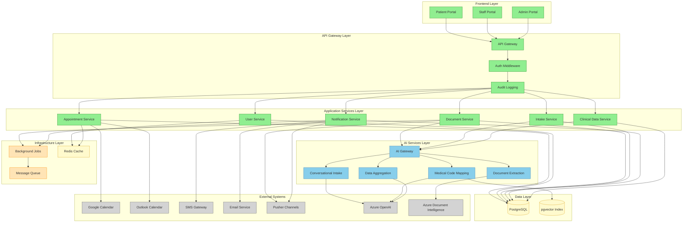
```mermaid
graph TB
    subgraph "Frontend Layer"
        PP[Patient Portal]:::core
        SP[Staff Portal]:::core
        AP[Admin Portal]:::core
    end

    subgraph "API Gateway Layer"
        GW[API Gateway]:::core
        AUTH[Auth Middleware]:::core
        AUDIT[Audit Logging]:::core
    end

    subgraph "Application Services Layer"
        AS[Appointment Service]:::core
        US[User Service]:::core
        DS[Document Service]:::core
        IS[Intake Service]:::core
        NS[Notification Service]:::core
        CS[Clinical Data Service]:::core
    end

    subgraph "AI Services Layer"
        AIG[AI Gateway]:::ai
        CONV[Conversational Intake]:::ai
        DOC[Document Extraction]:::ai
        CODE[Medical Code Mapping]:::ai
        AGG[Data Aggregation]:::ai
    end

    subgraph "Infrastructure Layer"
        BG[Background Jobs]:::tooling
        QUEUE[Message Queue]:::tooling
        CACHE[Redis Cache]:::data
    end

    subgraph "Data Layer"
        PG[(PostgreSQL)]:::data
        VEC[(pgvector Index)]:::data
    end

    subgraph "External Systems"
        GCAL[Google Calendar]:::external
        MSFT[Outlook Calendar]:::external
        SMS[SMS Gateway]:::external
        EMAIL[Email Service]:::external
        PUSHER[Pusher Channels]:::external
        AOAI[Azure OpenAI]:::external
        ADOC[Azure Document Intelligence]:::external
    end

    PP --> GW
    SP --> GW
    AP --> GW

    GW --> AUTH
    AUTH --> AUDIT
    AUDIT --> AS
    AUDIT --> US
    AUDIT --> DS
    AUDIT --> IS
    AUDIT --> NS
    AUDIT --> CS

    AS --> PG
    US --> PG
    DS --> PG
    IS --> PG
    NS --> PG
    CS --> PG

    DS --> AIG
    IS --> AIG
    CS --> AIG

    AIG --> CONV
    AIG --> DOC
    AIG --> CODE
    AIG --> AGG

    CONV --> AOAI
    DOC --> ADOC
    CODE --> VEC
    CODE --> AOAI
    AGG --> AOAI

    NS --> SMS
    NS --> EMAIL
    AS --> GCAL
    AS --> MSFT

    DS --> PUSHER
    NS --> PUSHER

    DS --> BG
    NS --> BG
    BG --> QUEUE

    US --> CACHE
    AS --> CACHE

    classDef core fill:#90EE90,stroke:#228B22
    classDef ai fill:#87CEEB,stroke:#4682B4
    classDef data fill:#FFFACD,stroke:#DAA520
    classDef external fill:#D3D3D3,stroke:#696969
    classDef tooling fill:#FFE4B5,stroke:#FF8C00
```

---

### Deployment Architecture Diagram

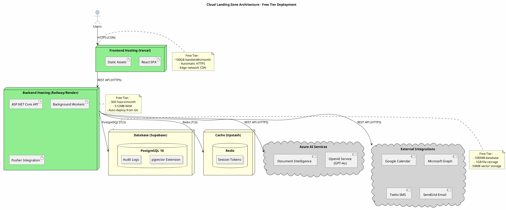
```plantuml
@startuml Deployment Architecture
!define RECTANGLE class

skinparam backgroundColor #FEFEFE
skinparam nodeStyle rectangle
skinparam defaultTextAlignment center

title Cloud Landing Zone Architecture - Free Tier Deployment

' Define nodes with deployment targets
node "Frontend Hosting (Vercel)" as vercel #LightGreen {
    artifact "React SPA" as spa
    artifact "Static Assets" as assets
}

node "Backend Hosting (Railway/Render)" as railway #LightGreen {
    artifact "ASP.NET Core API" as api
    artifact "Background Workers" as workers
    artifact "Pusher Integration" as pusher
}

node "Database (Supabase)" as supabase #LightYellow {
    database "PostgreSQL 16" as pg {
        collections "pgvector Extension" as vec
        collections "Audit Logs" as audit
    }
}

node "Cache (Upstash)" as upstash #LightYellow {
    database "Redis" as redis {
        collections "Session Tokens" as session
    }
}

cloud "Azure AI Services" as azure #LightGray {
    component "OpenAI Service\n(GPT-4o)" as aoai
    component "Document Intelligence" as adi
}

cloud "External Integrations" as external #LightGray {
    component "Google Calendar" as gcal
    component "Microsoft Graph" as msgraph
    component "Twilio SMS" as twilio
    component "SendGrid Email" as sendgrid
}

actor "Users" as users #LightBlue

' Connections
users --> vercel : HTTPS (CDN)
vercel --> railway : REST API (HTTPS)
railway --> supabase : PostgreSQL (TLS)
railway --> upstash : Redis (TLS)
railway --> azure : REST API (HTTPS)
railway --> external : REST API (HTTPS)

note right of vercel
  Free Tier:
  - 100GB bandwidth/month
  - Automatic HTTPS
  - Edge network CDN
end note

note right of railway
  Free Tier:
  - 500 hours/month
  - 512MB RAM
  - Auto-deploy from Git
end note

note right of supabase
  Free Tier:
  - 500MB database
  - 1GB file storage
  - 50MB vector storage
end note

@enduml
```

#### Enhanced Deployment Details

| Component | Specification | Source |
|-----------|---------------|--------|
| Frontend CDN | Vercel Edge Network, automatic HTTPS, 100GB/month bandwidth | TR-006 |
| Compute | Railway/Render free tier, 512MB RAM, container-based | TR-006, NFR-008 |
| Database | Supabase PostgreSQL 16 with pgvector 0.5+, 500MB storage | TR-003, DR-010 |
| Session Cache | Upstash Redis, 10K requests/day free tier | TR-004, NFR-005 |
| Real-time | Pusher Channels (free tier - 200K messages/day) | TR-022, NFR-018 |
| AI Services | Azure OpenAI (GPT-4o) with HIPAA BAA | TR-015, AIR-S01 |
| Document Processing | Azure AI Document Intelligence 4.0 | TR-016, AIR-002 |
| Monitoring | Application Insights (free tier), Seq (self-hosted) | NFR-007, NFR-011 |

---

### Data Flow Diagram

```plantuml
@startuml Data Flow Diagram
!define RECTANGLE class

skinparam backgroundColor #FEFEFE
skinparam defaultTextAlignment center

title Clinical Data Processing Pipeline

' External Entities (Blue)
actor "Patient" as patient #LightBlue
actor "Staff" as staff #LightBlue

' Processes (Green rectangles)
rectangle "1.0\nDocument Upload" as p1 #LightGreen
rectangle "2.0\nAI Extraction" as p2 #LightGreen
rectangle "3.0\nData Aggregation" as p3 #LightGreen
rectangle "4.0\nConflict Detection" as p4 #LightGreen
rectangle "5.0\nStaff Verification" as p5 #LightGreen
rectangle "6.0\n360-View Generation" as p6 #LightGreen

' Data Stores (Yellow)
database "D1: Clinical Documents" as d1 #LightYellow
database "D2: Extracted Data" as d2 #LightYellow
database "D3: Patient Profile" as d3 #LightYellow
database "D4: Audit Log" as d4 #LightYellow

' External Systems (Gray)
cloud "Azure Document\nIntelligence" as adi #LightGray
cloud "Azure OpenAI" as aoai #LightGray

' Data Flows
patient -> p1 : PDF Upload
p1 -> d1 : Store Document
p1 -> p2 : Document Reference
p2 -> adi : Extract Request
adi -> p2 : Structured Data
p2 -> d2 : Store Extracted Data\n(with confidence scores)
p2 -> p3 : Extracted Data
p3 -> aoai : Aggregation Query
aoai -> p3 : Consolidated Data
p3 -> p4 : Aggregated Profile
p4 -> aoai : Conflict Analysis
aoai -> p4 : Identified Conflicts
p4 -> d3 : Store Profile\n(with conflicts flagged)
p4 -> staff : Conflict Alerts
staff -> p5 : Verification Decision
p5 -> d2 : Update Verification Status
p5 -> d4 : Log Verification Action
p5 -> p6 : Verified Data
p6 -> d3 : Update Patient Profile
d3 -> patient : 360-Degree View\n(Read-only)
d3 -> staff : 360-Degree View\n(Verification context)

@enduml
```

---

### Logical Data Model (ERD)

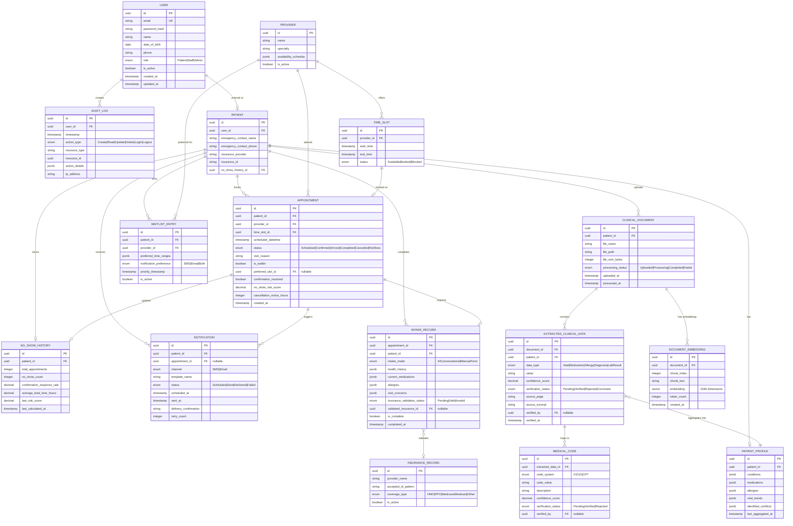
```mermaid
erDiagram
    USER ||--o{ AUDIT_LOG : creates
    USER ||--o| PATIENT : "extends to"
    
    PATIENT ||--o{ APPOINTMENT : books
    PATIENT ||--o{ CLINICAL_DOCUMENT : uploads
    PATIENT ||--o{ WAITLIST_ENTRY : joins
    PATIENT ||--o| PATIENT_PROFILE : has
    PATIENT ||--o| NO_SHOW_HISTORY : tracks
    PATIENT ||--o{ NOTIFICATION : receives
    PATIENT ||--o{ INTAKE_RECORD : completes
    
    PROVIDER ||--o{ TIME_SLOT : offers
    PROVIDER ||--o{ APPOINTMENT : attends
    PROVIDER ||--o{ WAITLIST_ENTRY : "preferred for"
    
    TIME_SLOT ||--o| APPOINTMENT : "booked as"
    
    APPOINTMENT ||--o| INTAKE_RECORD : "requires"
    APPOINTMENT ||--o{ NOTIFICATION : triggers
    APPOINTMENT ||--o| NO_SHOW_HISTORY : "updates"
    
    CLINICAL_DOCUMENT ||--o{ EXTRACTED_CLINICAL_DATA : contains
    CLINICAL_DOCUMENT ||--o{ DOCUMENT_EMBEDDING : "has embeddings"
    
    EXTRACTED_CLINICAL_DATA ||--o{ MEDICAL_CODE : "maps to"
    EXTRACTED_CLINICAL_DATA }o--|| PATIENT_PROFILE : "aggregates into"
    
    INTAKE_RECORD }o--o| INSURANCE_RECORD : validates

    USER {
        uuid id PK
        string email UK
        string password_hash
        string name
        date date_of_birth
        string phone
        enum role "Patient|Staff|Admin"
        boolean is_active
        timestamp created_at
        timestamp updated_at
    }

    PATIENT {
        uuid id PK
        uuid user_id FK
        string emergency_contact_name
        string emergency_contact_phone
        string insurance_provider
        string insurance_id
        uuid no_show_history_id FK
    }

    PROVIDER {
        uuid id PK
        string name
        string specialty
        jsonb availability_schedule
        boolean is_active
    }

    TIME_SLOT {
        uuid id PK
        uuid provider_id FK
        timestamp start_time
        timestamp end_time
        enum status "Available|Booked|Blocked"
    }

    APPOINTMENT {
        uuid id PK
        uuid patient_id FK
        uuid provider_id FK
        uuid time_slot_id FK
        timestamp scheduled_datetime
        enum status "Scheduled|Confirmed|Arrived|Completed|Cancelled|NoShow"
        string visit_reason
        boolean is_walkin
        uuid preferred_slot_id FK "nullable"
        boolean confirmation_received
        decimal no_show_risk_score
        integer cancellation_notice_hours
        timestamp created_at
    }

    WAITLIST_ENTRY {
        uuid id PK
        uuid patient_id FK
        uuid provider_id FK
        jsonb preferred_time_ranges
        enum notification_preference "SMS|Email|Both"
        timestamp priority_timestamp
        boolean is_active
    }

    CLINICAL_DOCUMENT {
        uuid id PK
        uuid patient_id FK
        string file_name
        string file_path
        integer file_size_bytes
        enum processing_status "Uploaded|Processing|Completed|Failed"
        timestamp uploaded_at
        timestamp processed_at
    }

    DOCUMENT_EMBEDDING {
        uuid id PK
        uuid document_id FK
        integer chunk_index
        string chunk_text
        vector embedding "1536 dimensions"
        integer token_count
        timestamp created_at
    }

    EXTRACTED_CLINICAL_DATA {
        uuid id PK
        uuid document_id FK
        uuid patient_id FK
        enum data_type "Vital|Medication|Allergy|Diagnosis|LabResult"
        string value
        decimal confidence_score
        enum verification_status "Pending|Verified|Rejected|Corrected"
        string source_page
        string source_excerpt
        uuid verified_by FK "nullable"
        timestamp verified_at
    }

    PATIENT_PROFILE {
        uuid id PK
        uuid patient_id FK
        jsonb conditions
        jsonb medications
        jsonb allergies
        jsonb vital_trends
        jsonb identified_conflicts
        timestamp last_aggregated_at
    }

    INTAKE_RECORD {
        uuid id PK
        uuid appointment_id FK
        uuid patient_id FK
        enum intake_mode "AIConversational|ManualForm"
        jsonb health_history
        jsonb current_medications
        jsonb allergies
        jsonb visit_concerns
        enum insurance_validation_status "Pending|Valid|Invalid"
        uuid validated_insurance_id FK "nullable"
        boolean is_complete
        timestamp completed_at
    }

    MEDICAL_CODE {
        uuid id PK
        uuid extracted_data_id FK
        enum code_system "ICD10|CPT"
        string code_value
        string description
        decimal confidence_score
        enum verification_status "Pending|Verified|Rejected"
        uuid verified_by FK "nullable"
    }

    AUDIT_LOG {
        uuid id PK
        uuid user_id FK
        timestamp timestamp
        enum action_type "Create|Read|Update|Delete|Login|Logout"
        string resource_type
        uuid resource_id
        jsonb action_details
        string ip_address
    }

    NOTIFICATION {
        uuid id PK
        uuid patient_id FK
        uuid appointment_id FK "nullable"
        enum channel "SMS|Email"
        string template_name
        enum status "Scheduled|Sent|Delivered|Failed"
        timestamp scheduled_at
        timestamp sent_at
        string delivery_confirmation
        integer retry_count
    }

    INSURANCE_RECORD {
        uuid id PK
        string provider_name
        string accepted_id_pattern
        enum coverage_type "HMO|PPO|Medicare|Medicaid|Other"
        boolean is_active
    }

    NO_SHOW_HISTORY {
        uuid id PK
        uuid patient_id FK
        integer total_appointments
        integer no_show_count
        decimal confirmation_response_rate
        decimal average_lead_time_hours
        decimal last_risk_score
        timestamp last_calculated_at
    }
```

---

## AI Architecture Diagrams

> **Note**: AI Architecture diagrams are included because design.md contains AIR-XXX requirements (AIR-001 through AIR-R04).

### RAG Pipeline Architecture

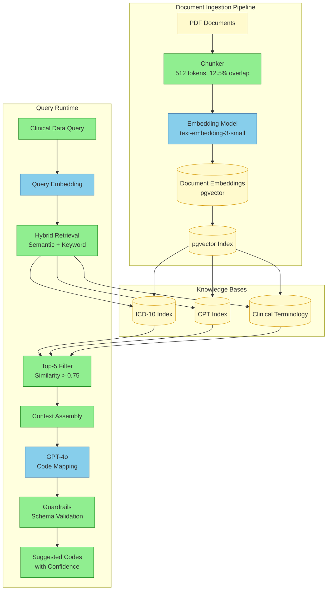
```mermaid
graph TB
    subgraph "Document Ingestion Pipeline"
        PDF[PDF Documents]:::data
        CHUNK[Chunker<br/>512 tokens, 12.5% overlap]:::core
        EMBED1[Embedding Model<br/>text-embedding-3-small]:::ai
        DOCEMB[(Document Embeddings<br/>pgvector)]:::data
        VEC[(pgvector Index)]:::data
    end

    subgraph "Knowledge Bases"
        ICD[(ICD-10 Index)]:::data
        CPT[(CPT Index)]:::data
        TERM[(Clinical Terminology)]:::data
    end

    subgraph "Query Runtime"
        QUERY[Clinical Data Query]:::core
        EMBED2[Query Embedding]:::ai
        HYBRID[Hybrid Retrieval<br/>Semantic + Keyword]:::core
        RERANK[Top-5 Filter<br/>Similarity > 0.75]:::core
        CTX[Context Assembly]:::core
        LLM[GPT-4o<br/>Code Mapping]:::ai
        GUARD[Guardrails<br/>Schema Validation]:::core
        OUT[Suggested Codes<br/>with Confidence]:::core
    end

    PDF --> CHUNK
    CHUNK --> EMBED1
    EMBED1 --> DOCEMB
    DOCEMB --> VEC
    VEC --> ICD
    VEC --> CPT
    VEC --> TERM

    QUERY --> EMBED2
    EMBED2 --> HYBRID
    HYBRID --> ICD
    HYBRID --> CPT
    HYBRID --> TERM
    ICD --> RERANK
    CPT --> RERANK
    TERM --> RERANK
    RERANK --> CTX
    CTX --> LLM
    LLM --> GUARD
    GUARD --> OUT

    classDef core fill:#90EE90,stroke:#228B22
    classDef ai fill:#87CEEB,stroke:#4682B4
    classDef data fill:#FFFACD,stroke:#DAA520
```

### AI Document Extraction Sequence

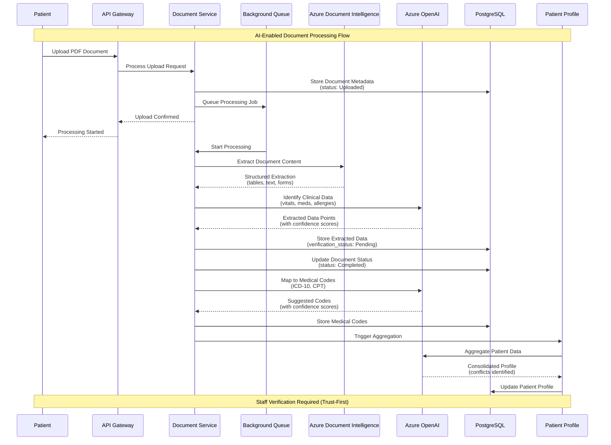
```mermaid
sequenceDiagram
    participant Patient
    participant API as API Gateway
    participant DS as Document Service
    participant Queue as Background Queue
    participant ADI as Azure Document Intelligence
    participant AOAI as Azure OpenAI
    participant DB as PostgreSQL
    participant Profile as Patient Profile

    Note over Patient,Profile: AI-Enabled Document Processing Flow

    Patient->>API: Upload PDF Document
    API->>DS: Process Upload Request
    DS->>DB: Store Document Metadata<br/>(status: Uploaded)
    DS->>Queue: Queue Processing Job
    DS-->>API: Upload Confirmed
    API-->>Patient: Processing Started

    Queue->>DS: Start Processing
    DS->>ADI: Extract Document Content
    ADI-->>DS: Structured Extraction<br/>(tables, text, forms)
    
    DS->>AOAI: Identify Clinical Data<br/>(vitals, meds, allergies)
    AOAI-->>DS: Extracted Data Points<br/>(with confidence scores)
    
    DS->>DB: Store Extracted Data<br/>(verification_status: Pending)
    DS->>DB: Update Document Status<br/>(status: Completed)
    
    DS->>AOAI: Map to Medical Codes<br/>(ICD-10, CPT)
    AOAI-->>DS: Suggested Codes<br/>(with confidence scores)
    DS->>DB: Store Medical Codes
    
    DS->>Profile: Trigger Aggregation
    Profile->>AOAI: Aggregate Patient Data
    AOAI-->>Profile: Consolidated Profile<br/>(conflicts identified)
    Profile->>DB: Update Patient Profile

    Note over Patient,Profile: Staff Verification Required (Trust-First)
```

---

## Use Case Sequence Diagrams

### UC-001: Patient Registration
**Source**: [spec.md#UC-001](spec.md#UC-001)

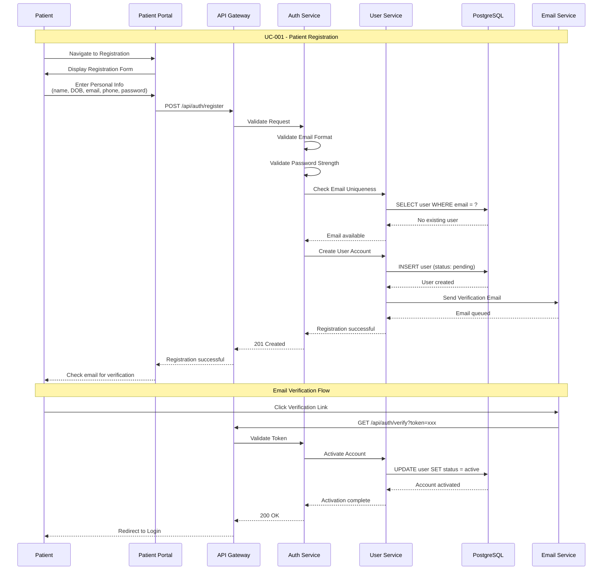
```mermaid
sequenceDiagram
    participant Patient
    participant UI as Patient Portal
    participant API as API Gateway
    participant Auth as Auth Service
    participant US as User Service
    participant DB as PostgreSQL
    participant Email as Email Service

    Note over Patient,Email: UC-001 - Patient Registration

    Patient->>UI: Navigate to Registration
    UI->>Patient: Display Registration Form
    Patient->>UI: Enter Personal Info<br/>(name, DOB, email, phone, password)
    UI->>API: POST /api/auth/register
    API->>Auth: Validate Request
    Auth->>Auth: Validate Email Format
    Auth->>Auth: Validate Password Strength
    Auth->>US: Check Email Uniqueness
    US->>DB: SELECT user WHERE email = ?
    DB-->>US: No existing user
    US-->>Auth: Email available
    Auth->>US: Create User Account
    US->>DB: INSERT user (status: pending)
    DB-->>US: User created
    US->>Email: Send Verification Email
    Email-->>US: Email queued
    US-->>Auth: Registration successful
    Auth-->>API: 201 Created
    API-->>UI: Registration successful
    UI-->>Patient: Check email for verification

    Note over Patient,Email: Email Verification Flow
    Patient->>Email: Click Verification Link
    Email->>API: GET /api/auth/verify?token=xxx
    API->>Auth: Validate Token
    Auth->>US: Activate Account
    US->>DB: UPDATE user SET status = active
    DB-->>US: Account activated
    US-->>Auth: Activation complete
    Auth-->>API: 200 OK
    API-->>Patient: Redirect to Login
```

---

### UC-002: Patient Login
**Source**: [spec.md#UC-002](spec.md#UC-002)

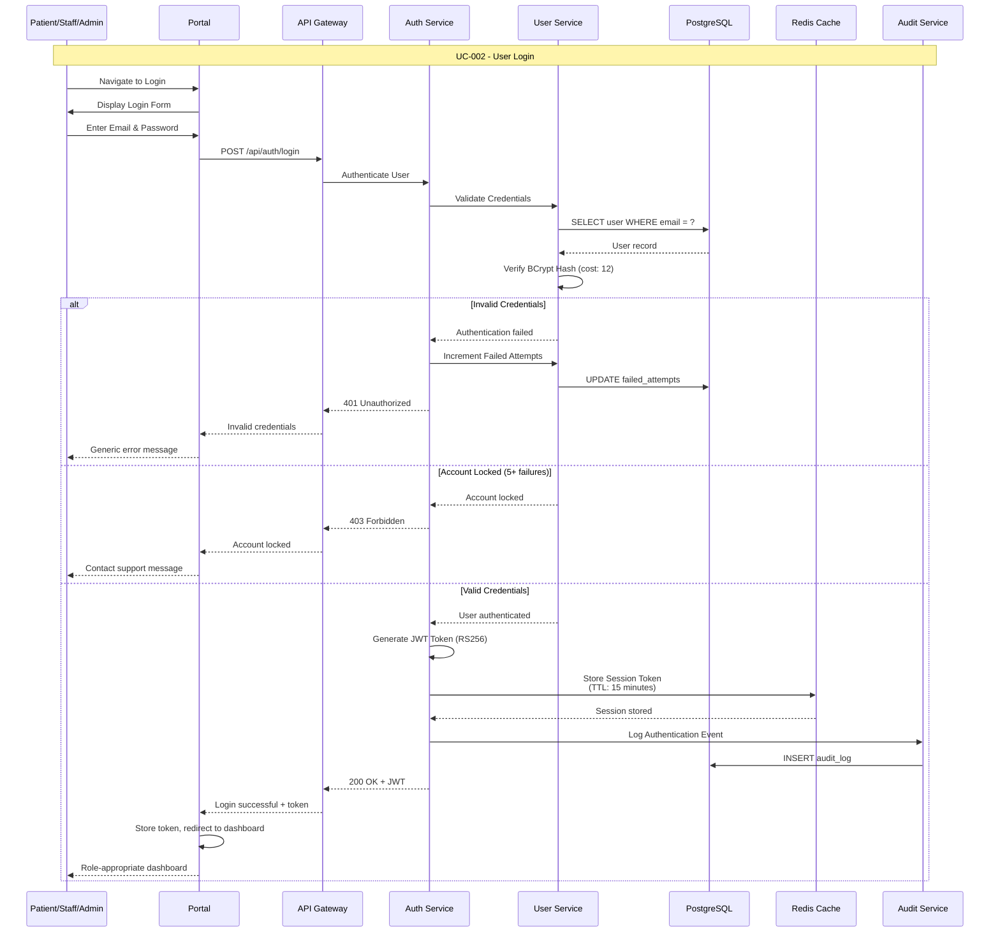
```mermaid
sequenceDiagram
    participant User as Patient/Staff/Admin
    participant UI as Portal
    participant API as API Gateway
    participant Auth as Auth Service
    participant US as User Service
    participant DB as PostgreSQL
    participant Cache as Redis Cache
    participant Audit as Audit Service

    Note over User,Audit: UC-002 - User Login

    User->>UI: Navigate to Login
    UI->>User: Display Login Form
    User->>UI: Enter Email & Password
    UI->>API: POST /api/auth/login
    API->>Auth: Authenticate User
    Auth->>US: Validate Credentials
    US->>DB: SELECT user WHERE email = ?
    DB-->>US: User record
    US->>US: Verify BCrypt Hash (cost: 12)
    
    alt Invalid Credentials
        US-->>Auth: Authentication failed
        Auth->>US: Increment Failed Attempts
        US->>DB: UPDATE failed_attempts
        Auth-->>API: 401 Unauthorized
        API-->>UI: Invalid credentials
        UI-->>User: Generic error message
    else Account Locked (5+ failures)
        US-->>Auth: Account locked
        Auth-->>API: 403 Forbidden
        API-->>UI: Account locked
        UI-->>User: Contact support message
    else Valid Credentials
        US-->>Auth: User authenticated
        Auth->>Auth: Generate JWT Token (RS256)
        Auth->>Cache: Store Session Token<br/>(TTL: 15 minutes)
        Cache-->>Auth: Session stored
        Auth->>Audit: Log Authentication Event
        Audit->>DB: INSERT audit_log
        Auth-->>API: 200 OK + JWT
        API-->>UI: Login successful + token
        UI->>UI: Store token, redirect to dashboard
        UI-->>User: Role-appropriate dashboard
    end
```

---

### UC-003: Book Appointment
**Source**: [spec.md#UC-003](spec.md#UC-003)

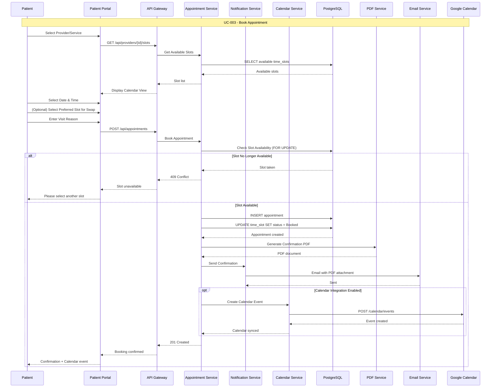
```mermaid
sequenceDiagram
    participant Patient
    participant UI as Patient Portal
    participant API as API Gateway
    participant AS as Appointment Service
    participant NS as Notification Service
    participant CS as Calendar Service
    participant DB as PostgreSQL
    participant PDF as PDF Service
    participant Email as Email Service
    participant GCal as Google Calendar

    Note over Patient,GCal: UC-003 - Book Appointment

    Patient->>UI: Select Provider/Service
    UI->>API: GET /api/providers/{id}/slots
    API->>AS: Get Available Slots
    AS->>DB: SELECT available time_slots
    DB-->>AS: Available slots
    AS-->>API: Slot list
    API-->>UI: Display Calendar View
    
    Patient->>UI: Select Date & Time
    Patient->>UI: (Optional) Select Preferred Slot for Swap
    Patient->>UI: Enter Visit Reason
    UI->>API: POST /api/appointments
    API->>AS: Book Appointment
    
    AS->>DB: Check Slot Availability (FOR UPDATE)
    
    alt Slot No Longer Available
        DB-->>AS: Slot taken
        AS-->>API: 409 Conflict
        API-->>UI: Slot unavailable
        UI-->>Patient: Please select another slot
    else Slot Available
        AS->>DB: INSERT appointment
        AS->>DB: UPDATE time_slot SET status = Booked
        DB-->>AS: Appointment created
        
        AS->>PDF: Generate Confirmation PDF
        PDF-->>AS: PDF document
        
        AS->>NS: Send Confirmation
        NS->>Email: Email with PDF attachment
        Email-->>NS: Sent
        
        opt Calendar Integration Enabled
            AS->>CS: Create Calendar Event
            CS->>GCal: POST /calendar/events
            GCal-->>CS: Event created
            CS-->>AS: Calendar synced
        end
        
        AS-->>API: 201 Created
        API-->>UI: Booking confirmed
        UI-->>Patient: Confirmation + Calendar event
    end
```

---

### UC-004: Join Waitlist
**Source**: [spec.md#UC-004](spec.md#UC-004)

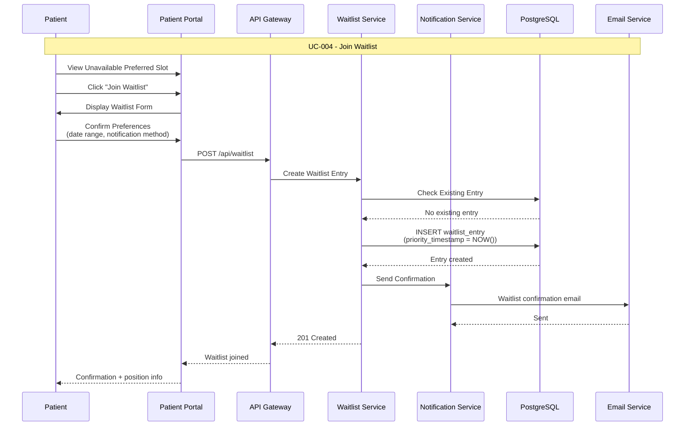
```mermaid
sequenceDiagram
    participant Patient
    participant UI as Patient Portal
    participant API as API Gateway
    participant WS as Waitlist Service
    participant NS as Notification Service
    participant DB as PostgreSQL
    participant Email as Email Service

    Note over Patient,Email: UC-004 - Join Waitlist

    Patient->>UI: View Unavailable Preferred Slot
    Patient->>UI: Click "Join Waitlist"
    UI->>Patient: Display Waitlist Form
    Patient->>UI: Confirm Preferences<br/>(date range, notification method)
    UI->>API: POST /api/waitlist
    API->>WS: Create Waitlist Entry
    
    WS->>DB: Check Existing Entry
    DB-->>WS: No existing entry
    
    WS->>DB: INSERT waitlist_entry<br/>(priority_timestamp = NOW())
    DB-->>WS: Entry created
    
    WS->>NS: Send Confirmation
    NS->>Email: Waitlist confirmation email
    Email-->>NS: Sent
    
    WS-->>API: 201 Created
    API-->>UI: Waitlist joined
    UI-->>Patient: Confirmation + position info
```

---

### UC-005: Dynamic Slot Swap
**Source**: [spec.md#UC-005](spec.md#UC-005)

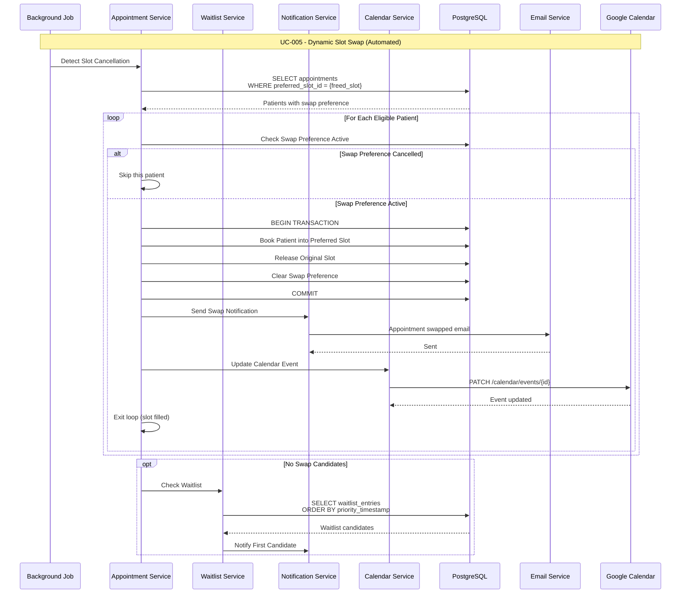
```mermaid
sequenceDiagram
    participant System as Background Job
    participant AS as Appointment Service
    participant WS as Waitlist Service
    participant NS as Notification Service
    participant CS as Calendar Service
    participant DB as PostgreSQL
    participant Email as Email Service
    participant GCal as Google Calendar

    Note over System,GCal: UC-005 - Dynamic Slot Swap (Automated)

    System->>AS: Detect Slot Cancellation
    AS->>DB: SELECT appointments<br/>WHERE preferred_slot_id = {freed_slot}
    DB-->>AS: Patients with swap preference
    
    loop For Each Eligible Patient
        AS->>DB: Check Swap Preference Active
        
        alt Swap Preference Cancelled
            AS->>AS: Skip this patient
        else Swap Preference Active
            AS->>DB: BEGIN TRANSACTION
            AS->>DB: Book Patient into Preferred Slot
            AS->>DB: Release Original Slot
            AS->>DB: Clear Swap Preference
            AS->>DB: COMMIT
            
            AS->>NS: Send Swap Notification
            NS->>Email: Appointment swapped email
            Email-->>NS: Sent
            
            AS->>CS: Update Calendar Event
            CS->>GCal: PATCH /calendar/events/{id}
            GCal-->>CS: Event updated
            
            AS->>AS: Exit loop (slot filled)
        end
    end
    
    opt No Swap Candidates
        AS->>WS: Check Waitlist
        WS->>DB: SELECT waitlist_entries<br/>ORDER BY priority_timestamp
        DB-->>WS: Waitlist candidates
        WS->>NS: Notify First Candidate
    end
```

---

### UC-006: Cancel/Reschedule Appointment
**Source**: [spec.md#UC-006](spec.md#UC-006)

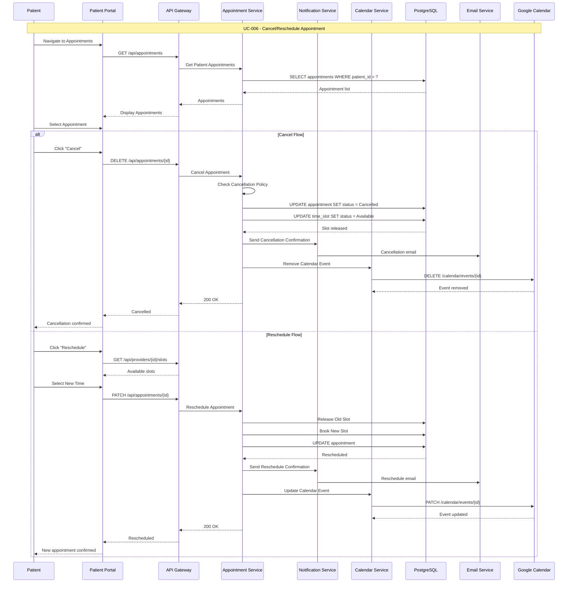
```mermaid
sequenceDiagram
    participant Patient
    participant UI as Patient Portal
    participant API as API Gateway
    participant AS as Appointment Service
    participant NS as Notification Service
    participant CS as Calendar Service
    participant DB as PostgreSQL
    participant Email as Email Service
    participant GCal as Google Calendar

    Note over Patient,GCal: UC-006 - Cancel/Reschedule Appointment

    Patient->>UI: Navigate to Appointments
    UI->>API: GET /api/appointments
    API->>AS: Get Patient Appointments
    AS->>DB: SELECT appointments WHERE patient_id = ?
    DB-->>AS: Appointment list
    AS-->>API: Appointments
    API-->>UI: Display Appointments
    
    Patient->>UI: Select Appointment
    
    alt Cancel Flow
        Patient->>UI: Click "Cancel"
        UI->>API: DELETE /api/appointments/{id}
        API->>AS: Cancel Appointment
        AS->>AS: Check Cancellation Policy
        AS->>DB: UPDATE appointment SET status = Cancelled
        AS->>DB: UPDATE time_slot SET status = Available
        DB-->>AS: Slot released
        
        AS->>NS: Send Cancellation Confirmation
        NS->>Email: Cancellation email
        
        AS->>CS: Remove Calendar Event
        CS->>GCal: DELETE /calendar/events/{id}
        GCal-->>CS: Event removed
        
        AS-->>API: 200 OK
        API-->>UI: Cancelled
        UI-->>Patient: Cancellation confirmed
        
    else Reschedule Flow
        Patient->>UI: Click "Reschedule"
        UI->>API: GET /api/providers/{id}/slots
        API-->>UI: Available slots
        Patient->>UI: Select New Time
        UI->>API: PATCH /api/appointments/{id}
        API->>AS: Reschedule Appointment
        AS->>DB: Release Old Slot
        AS->>DB: Book New Slot
        AS->>DB: UPDATE appointment
        DB-->>AS: Rescheduled
        
        AS->>NS: Send Reschedule Confirmation
        NS->>Email: Reschedule email
        
        AS->>CS: Update Calendar Event
        CS->>GCal: PATCH /calendar/events/{id}
        GCal-->>CS: Event updated
        
        AS-->>API: 200 OK
        API-->>UI: Rescheduled
        UI-->>Patient: New appointment confirmed
    end
```

---

### UC-007: Complete Patient Intake (AI Conversational)
**Source**: [spec.md#UC-007](spec.md#UC-007)

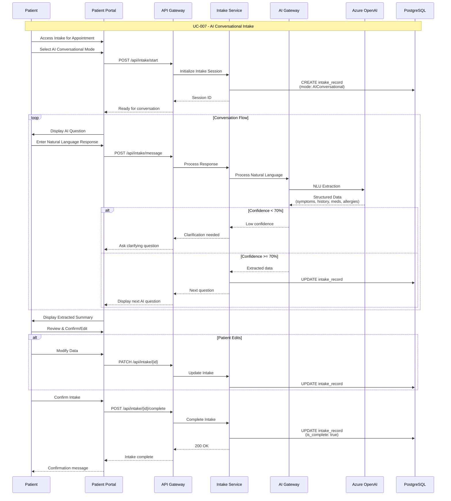
```mermaid
sequenceDiagram
    participant Patient
    participant UI as Patient Portal
    participant API as API Gateway
    participant IS as Intake Service
    participant AI as AI Gateway
    participant AOAI as Azure OpenAI
    participant DB as PostgreSQL

    Note over Patient,DB: UC-007 - AI Conversational Intake

    Patient->>UI: Access Intake for Appointment
    Patient->>UI: Select AI Conversational Mode
    UI->>API: POST /api/intake/start
    API->>IS: Initialize Intake Session
    IS->>DB: CREATE intake_record<br/>(mode: AIConversational)
    IS-->>API: Session ID
    API-->>UI: Ready for conversation

    loop Conversation Flow
        UI->>Patient: Display AI Question
        Patient->>UI: Enter Natural Language Response
        UI->>API: POST /api/intake/message
        API->>IS: Process Response
        IS->>AI: Process Natural Language
        AI->>AOAI: NLU Extraction
        AOAI-->>AI: Structured Data<br/>(symptoms, history, meds, allergies)
        
        alt Confidence < 70%
            AI-->>IS: Low confidence
            IS-->>API: Clarification needed
            API-->>UI: Ask clarifying question
        else Confidence >= 70%
            AI-->>IS: Extracted data
            IS->>DB: UPDATE intake_record
            IS-->>API: Next question
            API-->>UI: Display next AI question
        end
    end

    UI->>Patient: Display Extracted Summary
    Patient->>UI: Review & Confirm/Edit
    
    alt Patient Edits
        Patient->>UI: Modify Data
        UI->>API: PATCH /api/intake/{id}
        API->>IS: Update Intake
        IS->>DB: UPDATE intake_record
    end
    
    Patient->>UI: Confirm Intake
    UI->>API: POST /api/intake/{id}/complete
    API->>IS: Complete Intake
    IS->>DB: UPDATE intake_record<br/>(is_complete: true)
    IS-->>API: 200 OK
    API-->>UI: Intake complete
    UI-->>Patient: Confirmation message
```

---

### UC-008: Complete Patient Intake (Manual Form)
**Source**: [spec.md#UC-008](spec.md#UC-008)

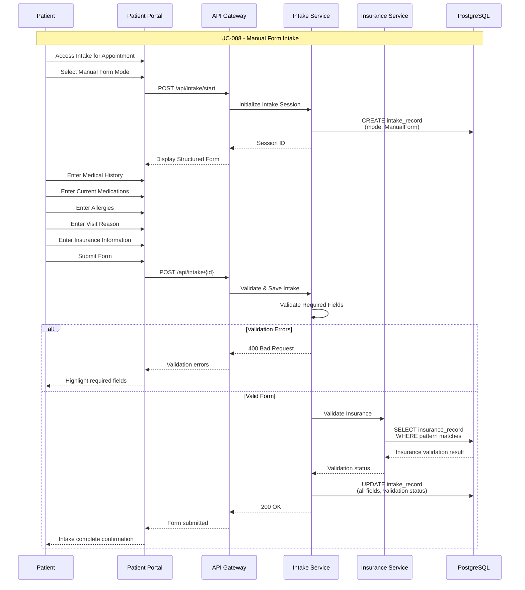
```mermaid
sequenceDiagram
    participant Patient
    participant UI as Patient Portal
    participant API as API Gateway
    participant IS as Intake Service
    participant INS as Insurance Service
    participant DB as PostgreSQL

    Note over Patient,DB: UC-008 - Manual Form Intake

    Patient->>UI: Access Intake for Appointment
    Patient->>UI: Select Manual Form Mode
    UI->>API: POST /api/intake/start
    API->>IS: Initialize Intake Session
    IS->>DB: CREATE intake_record<br/>(mode: ManualForm)
    IS-->>API: Session ID
    API-->>UI: Display Structured Form

    Patient->>UI: Enter Medical History
    Patient->>UI: Enter Current Medications
    Patient->>UI: Enter Allergies
    Patient->>UI: Enter Visit Reason
    Patient->>UI: Enter Insurance Information

    Patient->>UI: Submit Form
    UI->>API: POST /api/intake/{id}
    API->>IS: Validate & Save Intake
    IS->>IS: Validate Required Fields
    
    alt Validation Errors
        IS-->>API: 400 Bad Request
        API-->>UI: Validation errors
        UI-->>Patient: Highlight required fields
    else Valid Form
        IS->>INS: Validate Insurance
        INS->>DB: SELECT insurance_record<br/>WHERE pattern matches
        DB-->>INS: Insurance validation result
        INS-->>IS: Validation status
        
        IS->>DB: UPDATE intake_record<br/>(all fields, validation status)
        IS-->>API: 200 OK
        API-->>UI: Form submitted
        UI-->>Patient: Intake complete confirmation
    end
```

---

### UC-009: Upload Clinical Documents
**Source**: [spec.md#UC-009](spec.md#UC-009)

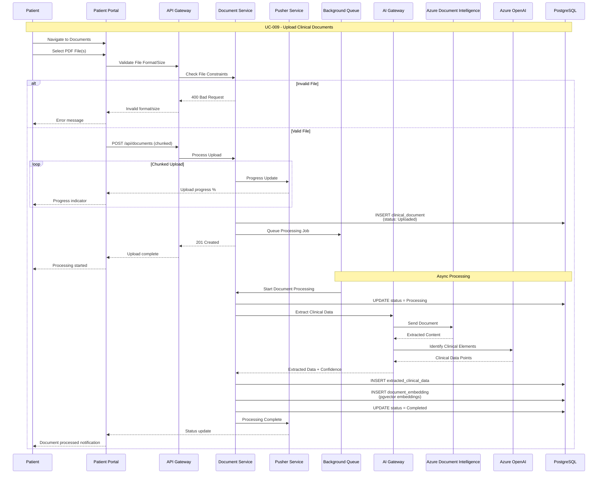
```mermaid
sequenceDiagram
    participant Patient
    participant UI as Patient Portal
    participant API as API Gateway
    participant DS as Document Service
    participant Pusher as Pusher Service
    participant Queue as Background Queue
    participant AI as AI Gateway
    participant ADI as Azure Document Intelligence
    participant AOAI as Azure OpenAI
    participant DB as PostgreSQL

    Note over Patient,DB: UC-009 - Upload Clinical Documents

    Patient->>UI: Navigate to Documents
    Patient->>UI: Select PDF File(s)
    UI->>API: Validate File Format/Size
    API->>DS: Check File Constraints
    
    alt Invalid File
        DS-->>API: 400 Bad Request
        API-->>UI: Invalid format/size
        UI-->>Patient: Error message
    else Valid File
        UI->>API: POST /api/documents (chunked)
        API->>DS: Process Upload
        
        loop Chunked Upload
            DS->>Pusher: Progress Update
            Pusher-->>UI: Upload progress %
            UI-->>Patient: Progress indicator
        end
        
        DS->>DB: INSERT clinical_document<br/>(status: Uploaded)
        DS->>Queue: Queue Processing Job
        DS-->>API: 201 Created
        API-->>UI: Upload complete
        UI-->>Patient: Processing started
        
        Note over Queue,DB: Async Processing
        
        Queue->>DS: Start Document Processing
        DS->>DB: UPDATE status = Processing
        DS->>AI: Extract Clinical Data
        AI->>ADI: Send Document
        ADI-->>AI: Extracted Content
        AI->>AOAI: Identify Clinical Elements
        AOAI-->>AI: Clinical Data Points
        AI-->>DS: Extracted Data + Confidence
        
        DS->>DB: INSERT extracted_clinical_data
        DS->>DB: INSERT document_embedding<br/>(pgvector embeddings)
        DS->>DB: UPDATE status = Completed
        
        DS->>Pusher: Processing Complete
        Pusher-->>UI: Status update
        UI-->>Patient: Document processed notification
    end
```

---

### UC-010: View 360-Degree Patient View
**Source**: [spec.md#UC-010](spec.md#UC-010)

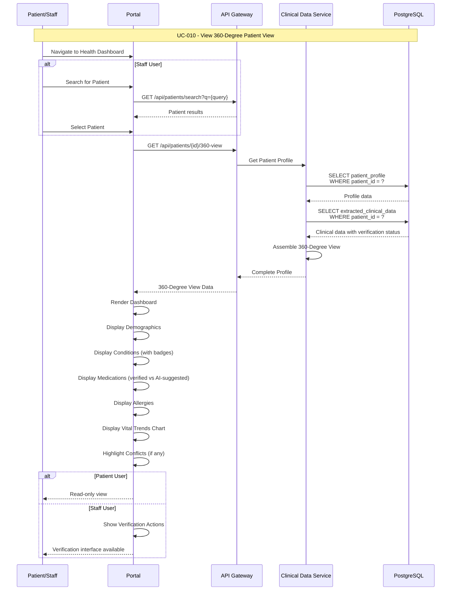
```mermaid
sequenceDiagram
    participant User as Patient/Staff
    participant UI as Portal
    participant API as API Gateway
    participant CS as Clinical Data Service
    participant DB as PostgreSQL

    Note over User,DB: UC-010 - View 360-Degree Patient View

    User->>UI: Navigate to Health Dashboard
    
    alt Staff User
        User->>UI: Search for Patient
        UI->>API: GET /api/patients/search?q={query}
        API-->>UI: Patient results
        User->>UI: Select Patient
    end
    
    UI->>API: GET /api/patients/{id}/360-view
    API->>CS: Get Patient Profile
    CS->>DB: SELECT patient_profile<br/>WHERE patient_id = ?
    DB-->>CS: Profile data
    
    CS->>DB: SELECT extracted_clinical_data<br/>WHERE patient_id = ?
    DB-->>CS: Clinical data with verification status
    
    CS->>CS: Assemble 360-Degree View
    CS-->>API: Complete Profile
    API-->>UI: 360-Degree View Data

    UI->>UI: Render Dashboard
    UI->>UI: Display Demographics
    UI->>UI: Display Conditions (with badges)
    UI->>UI: Display Medications (verified vs AI-suggested)
    UI->>UI: Display Allergies
    UI->>UI: Display Vital Trends Chart
    UI->>UI: Highlight Conflicts (if any)
    
    alt Patient User
        UI-->>User: Read-only view
    else Staff User
        UI->>UI: Show Verification Actions
        UI-->>User: Verification interface available
    end
```

---

### UC-011: Staff Walk-in Booking
**Source**: [spec.md#UC-011](spec.md#UC-011)

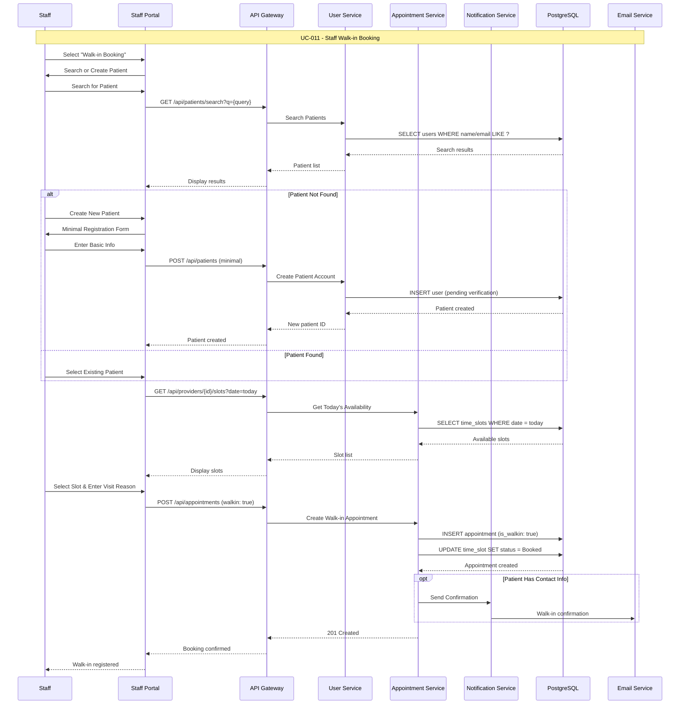
```mermaid
sequenceDiagram
    participant Staff
    participant UI as Staff Portal
    participant API as API Gateway
    participant US as User Service
    participant AS as Appointment Service
    participant NS as Notification Service
    participant DB as PostgreSQL
    participant Email as Email Service

    Note over Staff,Email: UC-011 - Staff Walk-in Booking

    Staff->>UI: Select "Walk-in Booking"
    UI->>Staff: Search or Create Patient
    
    Staff->>UI: Search for Patient
    UI->>API: GET /api/patients/search?q={query}
    API->>US: Search Patients
    US->>DB: SELECT users WHERE name/email LIKE ?
    DB-->>US: Search results
    US-->>API: Patient list
    API-->>UI: Display results
    
    alt Patient Not Found
        Staff->>UI: Create New Patient
        UI->>Staff: Minimal Registration Form
        Staff->>UI: Enter Basic Info
        UI->>API: POST /api/patients (minimal)
        API->>US: Create Patient Account
        US->>DB: INSERT user (pending verification)
        DB-->>US: Patient created
        US-->>API: New patient ID
        API-->>UI: Patient created
    else Patient Found
        Staff->>UI: Select Existing Patient
    end
    
    UI->>API: GET /api/providers/{id}/slots?date=today
    API->>AS: Get Today's Availability
    AS->>DB: SELECT time_slots WHERE date = today
    DB-->>AS: Available slots
    AS-->>API: Slot list
    API-->>UI: Display slots
    
    Staff->>UI: Select Slot & Enter Visit Reason
    UI->>API: POST /api/appointments (walkin: true)
    API->>AS: Create Walk-in Appointment
    AS->>DB: INSERT appointment (is_walkin: true)
    AS->>DB: UPDATE time_slot SET status = Booked
    DB-->>AS: Appointment created
    
    opt Patient Has Contact Info
        AS->>NS: Send Confirmation
        NS->>Email: Walk-in confirmation
    end
    
    AS-->>API: 201 Created
    API-->>UI: Booking confirmed
    UI-->>Staff: Walk-in registered
```

---

### UC-012: Staff Queue Management
**Source**: [spec.md#UC-012](spec.md#UC-012)

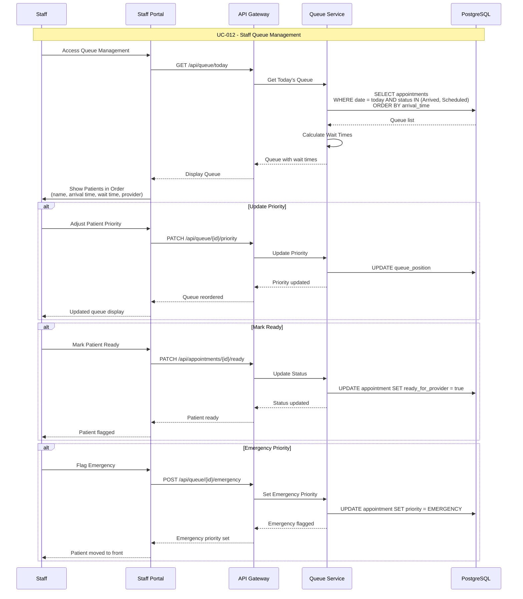
```mermaid
sequenceDiagram
    participant Staff
    participant UI as Staff Portal
    participant API as API Gateway
    participant QS as Queue Service
    participant DB as PostgreSQL

    Note over Staff,DB: UC-012 - Staff Queue Management

    Staff->>UI: Access Queue Management
    UI->>API: GET /api/queue/today
    API->>QS: Get Today's Queue
    QS->>DB: SELECT appointments<br/>WHERE date = today AND status IN (Arrived, Scheduled)<br/>ORDER BY arrival_time
    DB-->>QS: Queue list
    QS->>QS: Calculate Wait Times
    QS-->>API: Queue with wait times
    API-->>UI: Display Queue
    
    UI->>Staff: Show Patients in Order<br/>(name, arrival time, wait time, provider)
    
    alt Update Priority
        Staff->>UI: Adjust Patient Priority
        UI->>API: PATCH /api/queue/{id}/priority
        API->>QS: Update Priority
        QS->>DB: UPDATE queue_position
        QS-->>API: Priority updated
        API-->>UI: Queue reordered
        UI-->>Staff: Updated queue display
    end
    
    alt Mark Ready
        Staff->>UI: Mark Patient Ready
        UI->>API: PATCH /api/appointments/{id}/ready
        API->>QS: Update Status
        QS->>DB: UPDATE appointment SET ready_for_provider = true
        QS-->>API: Status updated
        API-->>UI: Patient ready
        UI-->>Staff: Patient flagged
    end
    
    alt Emergency Priority
        Staff->>UI: Flag Emergency
        UI->>API: POST /api/queue/{id}/emergency
        API->>QS: Set Emergency Priority
        QS->>DB: UPDATE appointment SET priority = EMERGENCY
        QS-->>API: Emergency flagged
        API-->>UI: Emergency priority set
        UI-->>Staff: Patient moved to front
    end
```

---

### UC-013: Staff Mark Arrival
**Source**: [spec.md#UC-013](spec.md#UC-013)

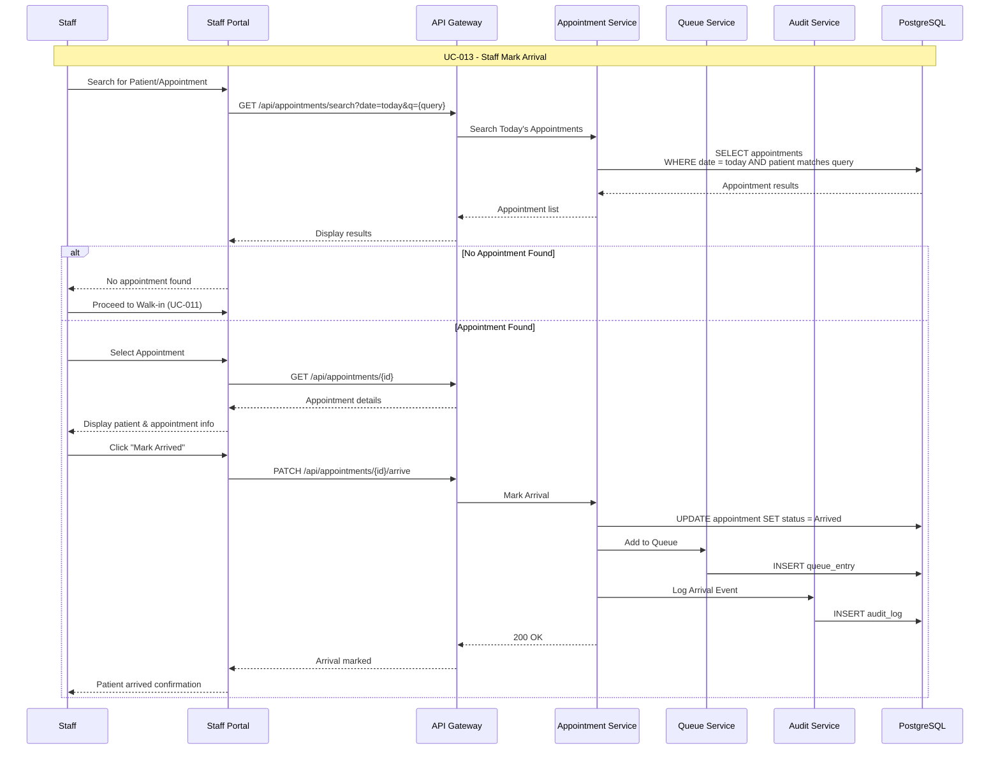
```mermaid
sequenceDiagram
    participant Staff
    participant UI as Staff Portal
    participant API as API Gateway
    participant AS as Appointment Service
    participant QS as Queue Service
    participant Audit as Audit Service
    participant DB as PostgreSQL

    Note over Staff,DB: UC-013 - Staff Mark Arrival

    Staff->>UI: Search for Patient/Appointment
    UI->>API: GET /api/appointments/search?date=today&q={query}
    API->>AS: Search Today's Appointments
    AS->>DB: SELECT appointments<br/>WHERE date = today AND patient matches query
    DB-->>AS: Appointment results
    AS-->>API: Appointment list
    API-->>UI: Display results
    
    alt No Appointment Found
        UI-->>Staff: No appointment found
        Staff->>UI: Proceed to Walk-in (UC-011)
    else Appointment Found
        Staff->>UI: Select Appointment
        UI->>API: GET /api/appointments/{id}
        API-->>UI: Appointment details
        UI-->>Staff: Display patient & appointment info
        
        Staff->>UI: Click "Mark Arrived"
        UI->>API: PATCH /api/appointments/{id}/arrive
        API->>AS: Mark Arrival
        AS->>DB: UPDATE appointment SET status = Arrived
        
        AS->>QS: Add to Queue
        QS->>DB: INSERT queue_entry
        
        AS->>Audit: Log Arrival Event
        Audit->>DB: INSERT audit_log
        
        AS-->>API: 200 OK
        API-->>UI: Arrival marked
        UI-->>Staff: Patient arrived confirmation
    end
```

---

### UC-014: Admin User Management
**Source**: [spec.md#UC-014](spec.md#UC-014)

```mermaid
sequenceDiagram
    participant Admin
    participant UI as Admin Portal
    participant API as API Gateway
    participant US as User Service
    participant Auth as Auth Service
    participant NS as Notification Service
    participant Audit as Audit Service
    participant DB as PostgreSQL
    participant Email as Email Service

    Note over Admin,Email: UC-014 - Admin User Management

    Admin->>UI: Navigate to User Management
    UI->>API: GET /api/admin/users
    API->>US: Get Staff/Admin Users
    US->>DB: SELECT users WHERE role IN (Staff, Admin)
    DB-->>US: User list
    US-->>API: Users
    API-->>UI: Display user list
    
    alt Create User
        Admin->>UI: Click "Create User"
        UI->>Admin: User creation form
        Admin->>UI: Enter user info & role
        UI->>API: POST /api/admin/users
        API->>US: Create User Account
        US->>DB: INSERT user (status: pending)
        DB-->>US: User created
        
        US->>NS: Send Activation Email
        NS->>Email: Account activation email
        Email-->>NS: Sent
        
        US->>Audit: Log Admin Action
        Audit->>DB: INSERT audit_log (action: CREATE_USER)
        
        US-->>API: 201 Created
        API-->>UI: User created
        UI-->>Admin: Confirmation
        
    else Edit User
        Admin->>UI: Select User & Edit
        Admin->>UI: Modify Info/Role
        UI->>API: PATCH /api/admin/users/{id}
        API->>US: Update User
        US->>DB: UPDATE user
        DB-->>US: Updated
        
        US->>Audit: Log Admin Action
        Audit->>DB: INSERT audit_log (action: UPDATE_USER)
        
        US-->>API: 200 OK
        API-->>UI: User updated
        UI-->>Admin: Confirmation
        
    else Deactivate User
        Admin->>UI: Select User & Deactivate
        UI->>API: DELETE /api/admin/users/{id}
        API->>US: Deactivate User
        US->>DB: UPDATE user SET is_active = false
        
        US->>Auth: Terminate Sessions
        Auth->>DB: DELETE sessions WHERE user_id = ?
        
        US->>Audit: Log Admin Action
        Audit->>DB: INSERT audit_log (action: DEACTIVATE_USER)
        
        US-->>API: 200 OK
        API-->>UI: User deactivated
        UI-->>Admin: Confirmation
    end
```

---

### UC-015: Verify Clinical Data (Staff)
**Source**: [spec.md#UC-015](spec.md#UC-015)

```mermaid
sequenceDiagram
    participant Staff
    participant UI as Staff Portal
    participant API as API Gateway
    participant CS as Clinical Data Service
    participant Audit as Audit Service
    participant DB as PostgreSQL

    Note over Staff,DB: UC-015 - Verify Clinical Data (Trust-First)

    Staff->>UI: Access Patient 360-View
    UI->>API: GET /api/patients/{id}/360-view
    API->>CS: Get Patient Data
    CS->>DB: SELECT extracted_clinical_data<br/>WHERE patient_id = ? AND verification_status = Pending
    DB-->>CS: Unverified data
    CS-->>API: Data with source refs
    API-->>UI: Display with unverified highlighted
    
    UI->>Staff: Show Data Elements<br/>(Yellow badge = AI-suggested)
    
    Staff->>UI: Select Data Element
    UI->>API: GET /api/clinical-data/{id}/source
    API->>CS: Get Source Reference
    CS->>DB: SELECT source_page, source_excerpt
    DB-->>CS: Source info
    CS-->>API: Source reference
    API-->>UI: Display source document excerpt
    
    Staff->>UI: Compare with Source Document
    
    alt Verify Data
        Staff->>UI: Click "Verify"
        UI->>API: PATCH /api/clinical-data/{id}/verify
        API->>CS: Verify Data Element
        CS->>DB: UPDATE verification_status = Verified<br/>verified_by = staff_id
        
        CS->>Audit: Log Verification
        Audit->>DB: INSERT audit_log (action: VERIFY_DATA)
        
        CS-->>API: 200 OK
        API-->>UI: Data verified (Green badge)
        UI-->>Staff: Badge updated
        
    else Correct Data
        Staff->>UI: Enter Correction
        UI->>API: PATCH /api/clinical-data/{id}
        API->>CS: Correct Data Element
        CS->>DB: UPDATE value, verification_status = Corrected
        
        CS->>Audit: Log Correction
        Audit->>DB: INSERT audit_log<br/>(action: CORRECT_DATA, old_value, new_value)
        
        CS-->>API: 200 OK
        API-->>UI: Data corrected
        UI-->>Staff: Updated with correction badge
        
    else Reject Data
        Staff->>UI: Click "Reject"
        UI->>API: DELETE /api/clinical-data/{id}
        API->>CS: Reject Data Element
        CS->>DB: UPDATE verification_status = Rejected
        
        CS->>Audit: Log Rejection
        Audit->>DB: INSERT audit_log (action: REJECT_DATA)
        
        CS-->>API: 200 OK
        API-->>UI: Data rejected
        UI-->>Staff: Element removed from view
    end
```

---

### UC-016: Resolve Data Conflicts
**Source**: [spec.md#UC-016](spec.md#UC-016)

```mermaid
sequenceDiagram
    participant Staff
    participant UI as Staff Portal
    participant API as API Gateway
    participant CS as Clinical Data Service
    participant Profile as Profile Service
    participant Audit as Audit Service
    participant DB as PostgreSQL

    Note over Staff,DB: UC-016 - Resolve Data Conflicts

    Staff->>UI: View Patient Profile
    UI->>API: GET /api/patients/{id}/conflicts
    API->>CS: Get Identified Conflicts
    CS->>DB: SELECT identified_conflicts<br/>FROM patient_profile
    DB-->>CS: Conflict list
    CS-->>API: Conflicts with sources
    API-->>UI: Display Conflict Alerts
    
    UI->>Staff: Highlight Conflicts<br/>(e.g., conflicting medications)
    
    Staff->>UI: Select Conflict to Review
    UI->>API: GET /api/conflicts/{id}
    API->>CS: Get Conflict Details
    CS->>DB: SELECT conflicting data points<br/>with source documents
    DB-->>CS: Conflict details
    CS-->>API: Data points + source refs
    API-->>UI: Display side-by-side comparison
    
    UI->>Staff: Show conflicting values<br/>with document sources
    
    alt Select Authoritative Source
        Staff->>UI: Choose Correct Value
        UI->>API: POST /api/conflicts/{id}/resolve
        API->>CS: Resolve Conflict
        CS->>DB: UPDATE correct value as verified<br/>Mark other as superseded
        
        CS->>Profile: Update Profile
        Profile->>DB: UPDATE patient_profile<br/>REMOVE from conflicts
        
        CS->>Audit: Log Resolution
        Audit->>DB: INSERT audit_log<br/>(action: RESOLVE_CONFLICT, rationale)
        
        CS-->>API: 200 OK
        API-->>UI: Conflict resolved
        UI-->>Staff: Conflict cleared
        
    else Enter Manual Value
        Staff->>UI: Enter Corrected Value
        Staff->>UI: Add Rationale
        UI->>API: POST /api/conflicts/{id}/manual-resolve
        API->>CS: Manual Resolution
        CS->>DB: INSERT new verified value<br/>Mark conflicting as superseded
        
        CS->>Profile: Update Profile
        Profile->>DB: UPDATE patient_profile
        
        CS->>Audit: Log Manual Resolution
        Audit->>DB: INSERT audit_log<br/>(action: MANUAL_RESOLVE, rationale)
        
        CS-->>API: 200 OK
        API-->>UI: Conflict resolved
        UI-->>Staff: Updated profile displayed
        
    else Flag for Clinical Review
        Staff->>UI: Flag for Provider Review
        UI->>API: POST /api/conflicts/{id}/flag
        API->>CS: Flag Conflict
        CS->>DB: UPDATE conflict status = FlaggedForReview
        
        CS->>Audit: Log Flag
        Audit->>DB: INSERT audit_log (action: FLAG_CONFLICT)
        
        CS-->>API: 200 OK
        API-->>UI: Flagged for review
        UI-->>Staff: Conflict flagged indicator
    end
```
