# Requirements Specification

## Feature Goal

Build a **Unified Patient Access & Clinical Intelligence Platform** that bridges patient scheduling and clinical data management. The platform will deliver:

- **Current State**: Healthcare organizations experience disconnected data pipelines causing 15% no-show rates, 20+ minutes manual clinical data extraction, and fragmented solutions lacking clinical context.
- **Desired End State**: An intelligent, integration-ready aggregator providing intuitive appointment booking with dynamic slot swapping, AI-assisted patient intake, and a "Trust-First" 360-Degree Patient View that transforms clinical prep from 20 minutes to 2-minute verification.

## Business Justification

- **Revenue Protection**: Reduce no-show rates through smart reminders and dynamic preferred slot swap, minimizing scheduling gaps and revenue loss
- **Operational Efficiency**: Automate clinical data extraction from unstructured PDF reports, eliminating manual data entry bottleneck
- **Patient Experience**: Deliver modern, patient-centric booking with waitlist functionality and flexible intake options (AI conversational or manual)
- **Clinical Safety**: Surface critical data conflicts (e.g., conflicting medications) through consolidated patient views, preventing potential safety risks
- **Trust-First AI**: Address "Black Box" trust deficit by providing verified, linked clinical data that staff can quickly validate
- **Integration Readiness**: Design for future EHR integration while operating standalone in Phase 1

## Feature Scope

### User-Visible Behavior

**Patient Portal**:

- Self-service registration and authentication
- Provider/service browsing with real-time availability
- Appointment booking with preferred slot swap option
- Waitlist enrollment with automatic notification
- Dual-mode patient intake (AI conversational or traditional form)
- Clinical document upload with processing status
- Personal health dashboard with 360-Degree view (read-only)
- Multi-channel appointment reminders (SMS/Email)
- Calendar integration (Google/Outlook)

**Staff Portal**:

- Walk-in booking with optional patient account creation
- Same-day queue management
- Arrival status marking
- Patient search and appointment management
- Clinical data verification interface
- Conflict resolution workflow

**Admin Portal**:

- User management (create, update, deactivate)
- Role assignment and permissions
- Audit log access
- System configuration

### Technical Requirements

- **Technology Stack**: React (TypeScript) + Tailwind CSS frontend, .NET 8 ASP.NET Core Web API backend, PostgreSQL with pgvector extension
- **Hosting**: Free platforms (Netlify, Vercel, GitHub Codespaces) - no paid cloud infrastructure
- **Security**: 100% HIPAA-compliant data handling, encryption at rest and in transit
- **Caching**: Upstash Redis for session and data caching
- **Deployment**: Windows Services/IIS native deployment capabilities

### Success Criteria

- [ ] Demonstrable reduction in baseline no-show rate through automated reminders and slot management
- [ ] Patient dashboards created and appointments successfully booked through the platform
- [ ] AI-Human Agreement Rate of >98% for suggested clinical data and medical codes
- [ ] Critical data conflicts identified and surfaced for staff review before patient encounters
- [ ] Clinical prep time reduced from 20+ minutes to under 2 minutes per patient
- [ ] 99.9% platform uptime with robust session management

## Functional Requirements

### Authentication & User Management

- FR-001: [DETERMINISTIC] System MUST allow patients to register accounts with email validation, capturing name, date of birth, contact information, and creating secure credentials
- FR-002: [DETERMINISTIC] System MUST authenticate users via email/password with secure session token generation and 15-minute automatic session timeout
- FR-003: [DETERMINISTIC] System MUST enforce role-based access control (RBAC) restricting functionality based on user role (Patient, Staff, Admin)
- FR-004: [DETERMINISTIC] System MUST provide Admin users capability to create, update, and deactivate Staff and Admin user accounts
- FR-005: [DETERMINISTIC] System MUST maintain immutable audit logs for all authentication events including login, logout, failed attempts, and session timeouts

### Appointment Booking - Patient

- FR-006: [DETERMINISTIC] System MUST display available providers/services with filtering and search capabilities
- FR-007: [DETERMINISTIC] System MUST show real-time appointment availability with calendar view and time slot selection
- FR-008: [DETERMINISTIC] System MUST allow patients to book appointments by selecting provider, date, time, and visit reason
- FR-009: [DETERMINISTIC] System MUST support waitlist enrollment when preferred slots are unavailable, capturing patient preferences and contact method
- FR-010: [DETERMINISTIC] System MUST implement dynamic preferred slot swap allowing patients to book an available slot while selecting a preferred unavailable slot, automatically swapping and releasing the original slot when preferred becomes available
- FR-011: [DETERMINISTIC] System MUST allow patients to cancel or reschedule appointments with configurable advance notice requirements
- FR-012: [DETERMINISTIC] System MUST generate appointment confirmation PDF and deliver via email after successful booking

### Appointment Booking - Staff

- FR-013: [DETERMINISTIC] System MUST restrict walk-in booking functionality exclusively to Staff users, with optional patient account creation during booking
- FR-014: [DETERMINISTIC] System MUST provide Staff users with same-day queue management interface showing chronological patient order and estimated wait times
- FR-015: [DETERMINISTIC] System MUST enable Staff users to mark patients as "Arrived" status; patients MUST NOT have capability to self-check-in via app or QR code
- FR-016: [DETERMINISTIC] System MUST provide Staff users with patient search functionality to locate existing patient records

### Patient Intake

- FR-017: [AI-CANDIDATE] System MUST provide AI-assisted conversational intake interface that guides patients through health history, current medications, allergies, and visit concerns using natural language processing
- FR-018: [DETERMINISTIC] System MUST provide traditional manual form intake as alternative/fallback option with structured fields for all required intake data
- FR-019: [HYBRID] System MUST allow patients to freely switch between AI conversational and manual form intake at any time during the intake process, preserving entered data
- FR-020: [DETERMINISTIC] System MUST support editing of intake responses without requiring human assistance
- FR-021: [DETERMINISTIC] System MUST perform insurance pre-check validation against internal predefined set of dummy insurance records, verifying insurance name and ID

### Notifications & Calendar Integration

- FR-022: [DETERMINISTIC] System MUST send automated multi-channel reminders (SMS and Email) at configurable intervals before appointments
- FR-023: [AI-CANDIDATE] System MUST implement rule-based no-show risk assessment considering factors such as appointment lead time, previous no-show history, and confirmation response rate
- FR-024: [DETERMINISTIC] System MUST provide Google Calendar synchronization via free API, creating calendar events for booked appointments
- FR-025: [DETERMINISTIC] System MUST provide Microsoft Outlook Calendar synchronization via free API, creating calendar events for booked appointments
- FR-026: [DETERMINISTIC] System MUST send waitlist notifications when preferred slots become available, allowing patients to confirm or decline the swap

### Clinical Document Management

- FR-027: [DETERMINISTIC] System MUST allow patients to upload historical clinical documents in PDF format with upload progress indication and confirmation
- FR-028: [AI-CANDIDATE] System MUST extract clinical data from uploaded unstructured PDF reports including vitals, medical history, medications, allergies, lab results, and diagnoses using AI-powered document processing
- FR-029: [DETERMINISTIC] System MUST provide document upload status tracking showing processing state (uploaded, processing, completed, failed)

### Clinical Intelligence - 360-Degree Patient View

- FR-030: [AI-CANDIDATE] System MUST aggregate extracted data from multiple clinical documents into a de-duplicated, consolidated patient profile
- FR-031: [HYBRID] System MUST explicitly highlight critical data conflicts (e.g., conflicting medications, inconsistent diagnoses) requiring staff verification before clinical use
- FR-032: [AI-CANDIDATE] System MUST generate 360-Degree Patient View displaying unified patient health summary including demographics, conditions, medications, allergies, vital trends, and recent encounters
- FR-033: [DETERMINISTIC] System MUST display 360-Degree Patient View as read-only for patients, showing their consolidated health information

### Medical Coding

- FR-034: [AI-CANDIDATE] System MUST map extracted clinical data to appropriate ICD-10 diagnosis codes with confidence scores
- FR-035: [AI-CANDIDATE] System MUST map extracted clinical data to appropriate CPT procedure codes with confidence scores
- FR-036: [HYBRID] System MUST present suggested ICD-10 and CPT codes to staff for verification, enabling acceptance, modification, or rejection of AI suggestions

### Clinical Data Verification (Trust-First Workflow)

- FR-037: [DETERMINISTIC] System MUST provide Staff interface for reviewing AI-extracted clinical data with source document references
- FR-038: [DETERMINISTIC] System MUST allow Staff to verify, correct, or reject AI-extracted data points, maintaining audit trail of all modifications
- FR-039: [DETERMINISTIC] System MUST track verification status for each data element, distinguishing between AI-suggested and staff-verified information

### Audit & Compliance

- FR-040: [DETERMINISTIC] System MUST maintain immutable audit logs for all patient data access, modifications, and clinical document views with timestamp, user ID, and action type
- FR-041: [DETERMINISTIC] System MUST encrypt all Protected Health Information (PHI) at rest using AES-256 encryption
- FR-042: [DETERMINISTIC] System MUST encrypt all data in transit using TLS 1.2 or higher
- FR-043: [DETERMINISTIC] System MUST implement minimum necessary access principle, restricting data access based on role and need-to-know

## Use Case Analysis

### Actors & System Boundary

- **Patient**: Primary end-user who registers, books appointments, completes intake, uploads documents, and views their health dashboard
- **Staff** (Front Desk/Call Center): Healthcare organization employee who manages walk-ins, queues, arrivals, and verifies clinical data
- **Admin**: System administrator responsible for user management, role assignment, and system configuration
- **Calendar System** (Google/Outlook): External system providing calendar synchronization services
- **Notification Service**: External system delivering SMS and Email communications
- **AI Processing Engine**: Internal system component handling natural language processing, document extraction, and code mapping

### Use Case Specifications

#### UC-001: Patient Registration

- **Actor(s)**: Patient
- **Goal**: Create a new patient account to access the platform
- **Preconditions**: Patient has a valid email address and is not already registered
- **Success Scenario**:
  1. Patient navigates to registration page
  2. Patient enters personal information (name, date of birth, email, phone)
  3. Patient creates password meeting security requirements
  4. System validates email format and password strength
  5. System sends email verification link
  6. Patient clicks verification link
  7. System activates account and redirects to login
- **Extensions/Alternatives**:
  - 4a. Email already registered: System displays error and offers password recovery option
  - 4b. Password does not meet requirements: System displays specific requirements and requests new password
  - 6a. Verification link expired: System allows resending verification email
- **Postconditions**: Patient account is created, verified, and ready for login

##### Use Case Diagram

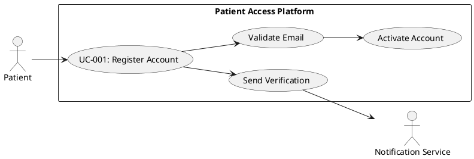

---

#### UC-002: Patient Login

- **Actor(s)**: Patient, Staff, Admin
- **Goal**: Authenticate and access role-appropriate platform features
- **Preconditions**: User has an active, verified account
- **Success Scenario**:
  1. User navigates to login page
  2. User enters email and password
  3. System validates credentials
  4. System generates session token with 15-minute timeout
  5. System redirects user to role-appropriate dashboard
  6. System logs authentication event
- **Extensions/Alternatives**:
  - 3a. Invalid credentials: System displays generic error, increments failed attempt counter
  - 3b. Account locked (5+ failed attempts): System displays lockout message with contact information
  - 3c. Account deactivated: System displays account status message
- **Postconditions**: User is authenticated with active session; audit log updated

##### Use Case Diagram

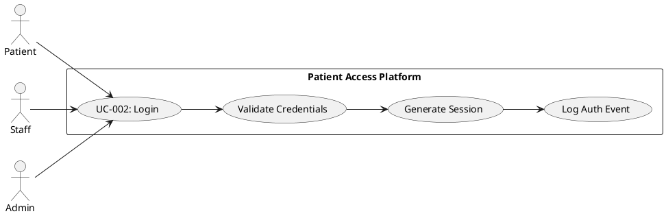

---

#### UC-003: Book Appointment

- **Actor(s)**: Patient
- **Goal**: Schedule an appointment with a healthcare provider
- **Preconditions**: Patient is logged in; providers have available appointment slots
- **Success Scenario**:
  1. Patient selects provider or service type
  2. System displays available time slots in calendar view
  3. Patient selects desired date and time
  4. Patient optionally selects a preferred unavailable slot for swap
  5. Patient enters visit reason
  6. System validates slot availability
  7. System creates appointment record
  8. System generates confirmation PDF
  9. System sends confirmation email with PDF attachment
  10. System creates calendar event (if calendar integration enabled)
- **Extensions/Alternatives**:
  - 3a. No available slots: System offers waitlist enrollment (UC-004)
  - 4a. Patient selects preferred slot swap: System enables dynamic swap functionality (UC-005)
  - 6a. Slot no longer available (concurrent booking): System displays message and refreshes availability
- **Postconditions**: Appointment is booked; confirmation sent; calendar updated

##### Use Case Diagram

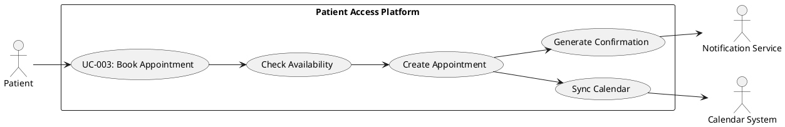

---

#### UC-004: Join Waitlist

- **Actor(s)**: Patient
- **Goal**: Enroll in waitlist for preferred unavailable appointment slot
- **Preconditions**: Patient is logged in; desired time slot is not available
- **Success Scenario**:
  1. Patient views unavailable preferred time slot
  2. Patient clicks "Join Waitlist" option
  3. System displays waitlist enrollment form
  4. Patient confirms preferred date/time range and notification preferences
  5. System creates waitlist entry with priority timestamp
  6. System sends waitlist confirmation notification
- **Extensions/Alternatives**:
  - 4a. Patient already on waitlist for same provider/date: System displays existing waitlist status
- **Postconditions**: Patient is enrolled in waitlist; notification preferences saved

##### Use Case Diagram

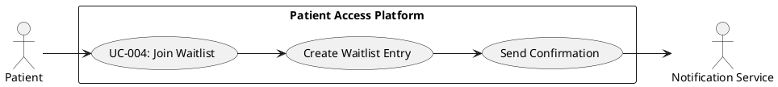

---

#### UC-005: Dynamic Slot Swap

- **Actor(s)**: Patient, System (automated)
- **Goal**: Automatically swap patient to preferred slot when it becomes available
- **Preconditions**: Patient has booked appointment with preferred slot swap enabled; preferred slot becomes available
- **Success Scenario**:
  1. System detects preferred slot availability (via cancellation or schedule change)
  2. System validates patient's swap preference is still active
  3. System automatically books patient into preferred slot
  4. System releases original booked slot
  5. System sends swap confirmation notification to patient
  6. System updates calendar integration with new time
- **Extensions/Alternatives**:
  - 2a. Patient cancelled swap preference: System skips swap process
  - 3a. Preferred slot filled by another patient first: System maintains original booking, notifies patient
- **Postconditions**: Patient appointment moved to preferred slot; original slot released for booking

##### Use Case Diagram

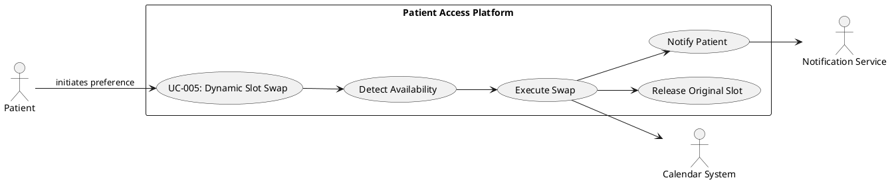

---

#### UC-006: Cancel/Reschedule Appointment

- **Actor(s)**: Patient
- **Goal**: Cancel or reschedule an existing appointment
- **Preconditions**: Patient is logged in; has existing upcoming appointment
- **Success Scenario (Cancel)**:
  1. Patient navigates to appointments list
  2. Patient selects appointment to cancel
  3. System displays cancellation confirmation with policy notice
  4. Patient confirms cancellation
  5. System updates appointment status to cancelled
  6. System releases slot for booking
  7. System sends cancellation confirmation
  8. System removes calendar event
- **Success Scenario (Reschedule)**:
  1. Patient navigates to appointments list
  2. Patient selects appointment to reschedule
  3. System displays available alternative slots
  4. Patient selects new date/time
  5. System updates appointment record
  6. System sends reschedule confirmation
  7. System updates calendar event
- **Extensions/Alternatives**:
  - 3a. Within restricted cancellation window: System displays policy and may prevent cancellation
- **Postconditions**: Appointment cancelled/rescheduled; notifications sent; calendar updated

##### Use Case Diagram

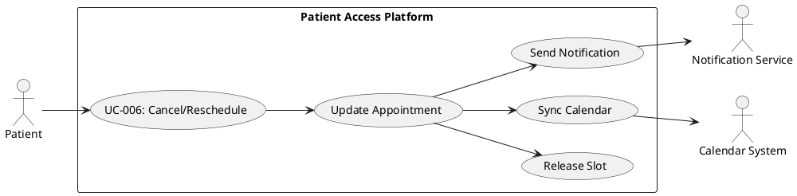

---

#### UC-007: Complete Patient Intake (AI Conversational)

- **Actor(s)**: Patient, AI Processing Engine
- **Goal**: Complete pre-visit intake using AI-assisted conversational interface
- **Preconditions**: Patient is logged in; has upcoming appointment
- **Success Scenario**:
  1. Patient accesses intake for upcoming appointment
  2. Patient selects AI conversational intake option
  3. AI engine initiates guided conversation
  4. AI asks about current symptoms, medical history, medications, allergies
  5. Patient responds in natural language
  6. AI extracts structured data from responses
  7. AI confirms understanding and asks clarifying questions as needed
  8. Patient reviews AI-extracted summary
  9. Patient confirms or edits information
  10. System saves intake data linked to appointment
- **Extensions/Alternatives**:
  - 5a. AI cannot understand response: AI requests clarification or offers manual form option
  - 9a. Patient wants to switch to manual form: System preserves data and transitions (UC-008)
- **Postconditions**: Intake data captured and linked to appointment; available for clinical review

##### Use Case Diagram

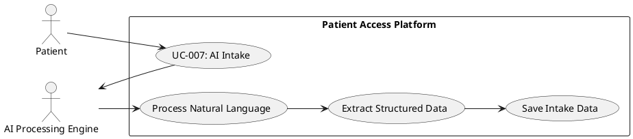

---

#### UC-008: Complete Patient Intake (Manual Form)

- **Actor(s)**: Patient
- **Goal**: Complete pre-visit intake using traditional structured form
- **Preconditions**: Patient is logged in; has upcoming appointment
- **Success Scenario**:
  1. Patient accesses intake for upcoming appointment
  2. Patient selects manual form intake option
  3. System displays structured intake form
  4. Patient enters medical history, current medications, allergies, visit reason
  5. Patient completes insurance information
  6. System validates required fields
  7. Patient submits form
  8. System saves intake data linked to appointment
- **Extensions/Alternatives**:
  - 4a. Patient wants to switch to AI intake: System preserves data and transitions (UC-007)
  - 6a. Validation errors: System highlights fields requiring correction
- **Postconditions**: Intake data captured and linked to appointment; available for clinical review

##### Use Case Diagram

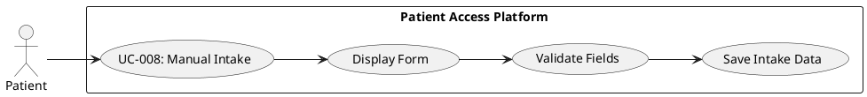

---

#### UC-009: Upload Clinical Documents

- **Actor(s)**: Patient, AI Processing Engine
- **Goal**: Upload historical clinical documents for data extraction and consolidation
- **Preconditions**: Patient is logged in
- **Success Scenario**:
  1. Patient navigates to document upload section
  2. Patient selects PDF file(s) to upload
  3. System validates file format and size
  4. System uploads file with progress indication
  5. System queues document for AI processing
  6. AI engine extracts clinical data (vitals, history, medications, diagnoses)
  7. System updates document status to "Processing Complete"
  8. System consolidates extracted data into patient profile
  9. System notifies patient of successful processing
- **Extensions/Alternatives**:
  - 3a. Invalid file format: System displays supported formats and rejects upload
  - 6a. AI extraction fails: System marks document for manual review, notifies patient
- **Postconditions**: Document stored; clinical data extracted and added to patient profile

##### Use Case Diagram

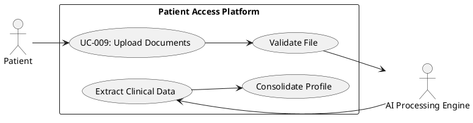

---

#### UC-010: View 360-Degree Patient View

- **Actor(s)**: Patient (read-only), Staff (verification)
- **Goal**: Access consolidated patient health summary
- **Preconditions**: User is logged in; patient has clinical data in system
- **Success Scenario (Patient)**:
  1. Patient navigates to health dashboard
  2. System retrieves and displays 360-Degree Patient View
  3. Patient views consolidated health summary (demographics, conditions, medications, allergies, vitals)
  4. Patient views document source references
- **Success Scenario (Staff)**:
  1. Staff searches for patient record
  2. System displays patient's 360-Degree View
  3. Staff reviews AI-extracted data with source references
  4. Staff identifies verified vs. unverified data elements
  5. Staff proceeds to verification workflow if needed (UC-015)
- **Extensions/Alternatives**:
  - 2a. No clinical data available: System displays empty state with upload prompt
- **Postconditions**: User has viewed consolidated patient health information

##### Use Case Diagram

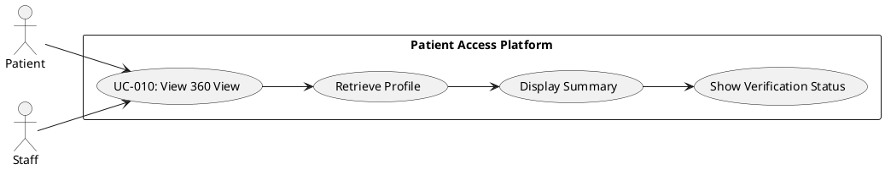

---

#### UC-011: Staff Walk-in Booking

- **Actor(s)**: Staff
- **Goal**: Book appointment for walk-in patient
- **Preconditions**: Staff is logged in
- **Success Scenario**:
  1. Staff selects "Walk-in Booking" option
  2. Staff searches for existing patient or creates new account
  3. System displays patient record or registration form
  4. Staff enters/confirms patient information
  5. Staff selects provider and available time slot
  6. Staff enters visit reason
  7. System creates appointment with "Walk-in" flag
  8. System optionally sends confirmation to patient (if contact provided)
- **Extensions/Alternatives**:
  - 2a. New patient: Staff creates account with minimal information, patient completes registration later
  - 5a. No same-day availability: Staff adds to queue (UC-012)
- **Postconditions**: Walk-in appointment created; patient account exists

##### Use Case Diagram

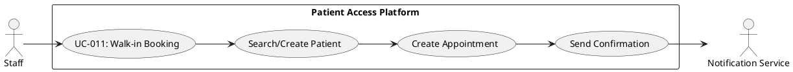

---

#### UC-012: Staff Queue Management

- **Actor(s)**: Staff
- **Goal**: Manage same-day patient queue
- **Preconditions**: Staff is logged in; patients are waiting
- **Success Scenario**:
  1. Staff accesses queue management interface
  2. System displays patients in chronological order with wait times
  3. Staff views patient details and appointment information
  4. Staff updates queue order if needed (priority adjustment)
  5. Staff marks patient ready for next available provider
- **Extensions/Alternatives**:
  - 4a. Emergency priority: Staff flags patient for immediate attention
- **Postconditions**: Queue reflects current patient status and order

##### Use Case Diagram

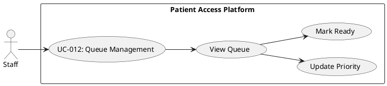

---

#### UC-013: Staff Mark Arrival

- **Actor(s)**: Staff
- **Goal**: Mark patient as arrived for appointment
- **Preconditions**: Staff is logged in; patient has appointment today
- **Success Scenario**:
  1. Staff searches for patient or scans from schedule
  2. System displays patient's appointment details
  3. Staff clicks "Mark Arrived"
  4. System updates appointment status to "Arrived"
  5. System adds patient to queue (if applicable)
  6. System logs arrival event
- **Extensions/Alternatives**:
  - 2a. No appointment found: Staff proceeds with walk-in booking (UC-011)
- **Postconditions**: Patient status updated to "Arrived"; audit log updated

##### Use Case Diagram

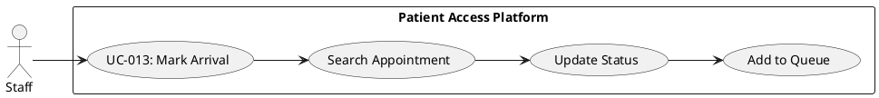

---

#### UC-014: Admin User Management

- **Actor(s)**: Admin
- **Goal**: Manage Staff and Admin user accounts
- **Preconditions**: Admin is logged in
- **Success Scenario**:
  1. Admin navigates to user management section
  2. System displays list of Staff and Admin users
  3. Admin selects action (create, edit, or deactivate)
  4. Admin enters/modifies user information and role
  5. System validates input
  6. System saves changes
  7. System logs administrative action
- **Extensions/Alternatives**:
  - 4a. Create user: System sends account activation email to new user
  - 4b. Deactivate user: System terminates active sessions and prevents future login
- **Postconditions**: User account created/modified/deactivated; audit log updated

##### Use Case Diagram

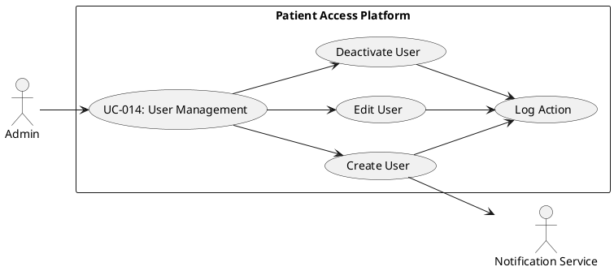

---

#### UC-015: Verify Clinical Data (Staff)

- **Actor(s)**: Staff, AI Processing Engine
- **Goal**: Review and verify AI-extracted clinical data
- **Preconditions**: Staff is logged in; patient has AI-extracted clinical data pending verification
- **Success Scenario**:
  1. Staff accesses patient's 360-Degree View
  2. System highlights unverified data elements
  3. Staff reviews AI-extracted data point
  4. System displays source document reference
  5. Staff compares extraction with source document
  6. Staff marks data as verified, corrects inaccuracies, or rejects
  7. System updates verification status
  8. System logs verification action with staff ID and timestamp
- **Extensions/Alternatives**:
  - 6a. Staff corrects data: System saves correction with audit trail
  - 6b. Staff rejects data: System flags for re-extraction or manual entry
- **Postconditions**: Clinical data verified/corrected; audit trail maintained

##### Use Case Diagram

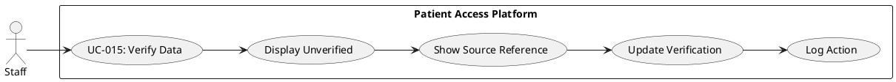

---

#### UC-016: Resolve Data Conflicts

- **Actor(s)**: Staff
- **Goal**: Review and resolve critical data conflicts identified by AI
- **Preconditions**: Staff is logged in; patient has identified data conflicts
- **Success Scenario**:
  1. Staff views conflict alerts on patient profile
  2. System displays conflicting data points with source references
  3. Staff reviews each conflict (e.g., conflicting medications from different documents)
  4. Staff selects authoritative source or enters corrected value
  5. System resolves conflict and updates patient profile
  6. System logs resolution action with rationale
- **Extensions/Alternatives**:
  - 4a. Unable to resolve: Staff flags for clinical review by provider
- **Postconditions**: Data conflict resolved; patient profile updated; audit trail maintained

##### Use Case Diagram

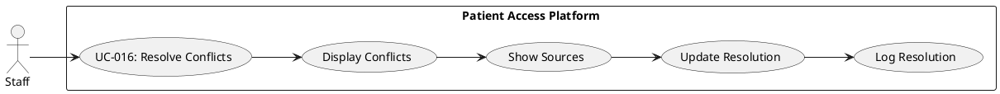

## Risks & Mitigations

| Risk | Impact | Probability | Mitigation |
|------|--------|-------------|------------|
| AI extraction accuracy below 98% target | High | Medium | Implement confidence scoring with mandatory human verification for low-confidence extractions; continuous model training with verified data |
| HIPAA compliance violations during document processing | Critical | Low | Encrypt all PHI at rest and in transit; implement strict access controls; conduct regular security audits; maintain comprehensive audit logs |
| Free hosting platform limitations affect availability | Medium | Medium | Design for horizontal scaling; implement caching layer; have contingency deployment options; monitor usage against platform limits |
| Clinical document format variability causes extraction failures | High | High | Support multiple PDF parsing strategies; implement fallback manual entry; maintain document format registry; provide clear upload guidelines |
| No-show prediction algorithm creates patient profiling concerns | Medium | Low | Transparent algorithm disclosure; patient opt-out capability; use aggregated risk factors only; avoid demographic-based profiling |

## Constraints & Assumptions

| Type | Description | Rationale |
|------|-------------|-----------|
| Constraint | No paid cloud infrastructure (AWS, Azure) | Budget limitation for Phase 1; free hosting platforms only |
| Constraint | No provider logins or provider-facing actions | Out of scope for current phase; focus on patient and staff workflows |
| Constraint | No direct EHR integration | Standalone system for Phase 1; integration-ready architecture for future |
| Assumption | Patients have email access for account verification | Required for secure account creation and communication |
| Assumption | Clinical documents are primarily English-language PDFs | AI extraction models trained on English medical terminology |
