# Requirements Specification

## Feature Goal

Build a **Unified Patient Access & Clinical Intelligence Platform** that bridges the gap between patient scheduling and clinical data management. The platform combines a modern, patient-centric appointment booking system with a "Trust-First" clinical intelligence engine, providing a seamless end-to-end data lifecycle from initial booking to post-visit data consolidation.

**Current State:**
- Healthcare organizations experience up to 15% no-show rates due to complex booking processes
- Clinical staff spend 20+ minutes manually extracting patient data from unstructured PDF reports
- Existing solutions are fragmented: booking tools lack clinical data context
- AI coding tools face "Black Box" trust deficit requiring manual verification

**Desired End State:**
- Intuitive appointment scheduling with dynamic preferred slot swap and smart reminders
- 20-minute manual extraction transformed into 2-minute verification action
- Unified, verified "360-Degree Patient View" with extracted ICD-10/CPT codes
- >98% AI-Human Agreement Rate for clinical suggestions

## Business Justification

- **Revenue Protection:** Reduce 15% no-show rate through simplified booking and intelligent reminders, directly impacting provider revenue and schedule utilization
- **Operational Efficiency:** Transform clinical preparation from 20+ minute manual data extraction to 2-minute verification, freeing clinical staff for patient care
- **Safety Enhancement:** Proactive identification of critical data conflicts (e.g., conflicting medications) to prevent safety risks and claim denials
- **Patient Satisfaction:** Flexible intake options (AI conversational or manual) with seamless editing without forcing human assistance
- **Scalability:** Standalone, integration-ready architecture prepared for future EHR connectivity and claims submission

## Feature Scope

### User-Visible Behaviors

**Patient Experience:**
- Self-service appointment booking with calendar visualization
- Dynamic preferred slot swap (book available, request preferred)
- Flexible intake: AI conversational OR traditional manual form (switchable anytime)
- Clinical document upload with automated data extraction
- Personal dashboard with 360-degree patient view
- Multi-channel reminders (SMS/Email) with calendar sync

**Staff Experience:**
- Walk-in booking management (with optional patient account creation)
- Same-day queue management dashboard
- Patient arrival marking (centralized, no self-check-in)
- Clinical data conflict review and resolution
- Medical code (ICD-10/CPT) verification interface
- Insurance pre-check validation

**Admin Experience:**
- User account management and role configuration
- Role-based access control administration
- Audit log viewing and compliance monitoring

### Technical Requirements

**Technology Stack:**
- UI Layer: React with TypeScript and Tailwind
- API Layer: .NET 8 Web API
- Database: PostgreSQL
- Cache: Upstash Redis
- Hosting: Netlify, Vercel, GitHub Codespaces (free tier only)
- Deployment: Windows Services/IIS native

**Compliance Requirements:**
- 100% HIPAA-compliant data handling, transmission, and storage
- Role-based access control
- Immutable audit logging for all patient and staff actions
- 15-minute automatic session timeout
- 99.9% uptime target

### Success Criteria

- [ ] No-show rate demonstrates measurable reduction from 15% baseline
- [ ] Staff administrative time per appointment measurably decreased
- [ ] High volume of patient dashboards created and appointments booked
- [ ] AI-Human Agreement Rate >98% for suggested clinical data and medical codes
- [ ] "Critical Conflicts Identified" metric actively tracking prevented safety risks

## Functional Requirements

### Account & Authentication

- FR-001: [DETERMINISTIC] System MUST allow patients to create accounts with email validation and secure password requirements
- FR-002: [DETERMINISTIC] System MUST authenticate users (Patient, Staff, Admin) with role-based session management
- FR-003: [DETERMINISTIC] System MUST enforce 15-minute automatic session timeout with graceful re-authentication

### Appointment Booking

- FR-004: [DETERMINISTIC] System MUST display available appointment slots in a calendar view with real-time availability updates
- FR-005: [DETERMINISTIC] System MUST allow patients to book appointments by selecting an available time slot
- FR-006: [DETERMINISTIC] System MUST implement dynamic preferred slot swap allowing patients to book an available slot while selecting a different preferred unavailable slot
- FR-007: [DETERMINISTIC] System MUST automatically swap appointments when preferred slots become available and release original slots
- FR-008: [DETERMINISTIC] System MUST support waitlist enrollment when desired slots are unavailable
- FR-009: [DETERMINISTIC] System MUST allow patients to cancel or reschedule appointments with appropriate notice

### Patient Intake

- FR-010: [AI-CANDIDATE] System MUST provide AI-driven conversational intake that collects patient information through natural language dialogue
- FR-011: [DETERMINISTIC] System MUST provide traditional manual form-based intake as an alternative to AI conversation
- FR-012: [DETERMINISTIC] System MUST allow patients to freely switch between AI and manual intake modes at any time during the process
- FR-013: [DETERMINISTIC] System MUST allow patients to edit intake information without requiring human assistance

### Clinical Document Management

- FR-014: [DETERMINISTIC] System MUST allow patients to upload historical clinical documents in PDF format
- FR-015: [AI-CANDIDATE] System MUST extract structured data (vitals, medical history, medications) from uploaded clinical documents
- FR-016: [AI-CANDIDATE] System MUST generate a unified 360-degree patient view by aggregating data from multiple uploaded documents
- FR-017: [HYBRID] System MUST detect and explicitly highlight critical data conflicts (e.g., conflicting medications) for human review
- FR-018: [DETERMINISTIC] System MUST de-duplicate patient data when consolidating multiple document sources

### Medical Coding

- FR-019: [AI-CANDIDATE] System MUST map extracted clinical data to appropriate ICD-10 diagnostic codes
- FR-020: [AI-CANDIDATE] System MUST map extracted clinical data to appropriate CPT procedure codes
- FR-021: [DETERMINISTIC] System MUST provide a verification interface for staff to confirm or modify AI-suggested codes
- FR-022: [DETERMINISTIC] System MUST maintain >98% AI-Human Agreement Rate target for suggested codes

### Notifications & Calendar Integration

- FR-023: [DETERMINISTIC] System MUST send automated appointment reminders via SMS channel
- FR-024: [DETERMINISTIC] System MUST send automated appointment reminders via Email channel
- FR-025: [DETERMINISTIC] System MUST generate PDF appointment confirmation and deliver via email after booking
- FR-026: [DETERMINISTIC] System MUST synchronize appointments with Google Calendar via free API integration
- FR-027: [DETERMINISTIC] System MUST synchronize appointments with Outlook Calendar via free API integration

### Insurance Validation

- FR-028: [DETERMINISTIC] System MUST perform soft insurance pre-check by validating insurance name and ID against internal predefined dummy records
- FR-029: [DETERMINISTIC] System MUST display clear pass/fail validation results for insurance pre-check

### Staff Operations

- FR-030: [DETERMINISTIC] System MUST allow staff to create walk-in appointments with option to create patient account post-booking
- FR-031: [DETERMINISTIC] System MUST provide same-day queue management dashboard for staff
- FR-032: [DETERMINISTIC] System MUST allow staff to mark patients as "Arrived" (no patient self-check-in via apps or QR codes)
- FR-033: [HYBRID] System MUST display no-show risk assessment based on rule-based weightings and pattern detection

### Administration

- FR-034: [DETERMINISTIC] System MUST allow admins to create, update, deactivate, and manage user accounts
- FR-035: [DETERMINISTIC] System MUST enforce role-based access control for Patient, Staff, and Admin roles
- FR-036: [DETERMINISTIC] System MUST maintain immutable audit logs for all patient and staff actions
- FR-037: [DETERMINISTIC] System MUST allow admins to view and search audit log history

### Data Security & Compliance

- FR-038: [DETERMINISTIC] System MUST encrypt all PHI data at rest using AES-256 encryption
- FR-039: [DETERMINISTIC] System MUST encrypt all data in transit using TLS 1.3
- FR-040: [DETERMINISTIC] System MUST implement HIPAA-compliant access controls with minimum necessary standard

## Use Case Analysis

### Actors & System Boundary

- **Patient**: Healthcare consumer who books appointments, completes intake forms, uploads clinical documents, and views their health dashboard
- **Staff**: Front desk or call center personnel who manage walk-in bookings, handle same-day queues, mark arrivals, review clinical data, and verify medical codes
- **Admin**: System administrator who manages user accounts, configures roles, and monitors audit compliance
- **Google Calendar**: External system for appointment synchronization
- **Outlook Calendar**: External system for appointment synchronization
- **SMS Gateway**: External system for SMS reminder delivery
- **Email Gateway**: External system for email and PDF delivery

### Use Case Specifications

#### UC-001: Book Standard Appointment

- **Actor(s)**: Patient
- **Goal**: Schedule an appointment for a healthcare visit
- **Preconditions**: 
  - Patient has valid account and is authenticated
  - Available appointment slots exist in the system
- **Success Scenario**:
  1. Patient navigates to appointment booking interface
  2. System displays calendar view with available slots
  3. Patient selects desired date and time slot
  4. System confirms slot availability in real-time
  5. Patient confirms booking details
  6. System creates appointment record
  7. System generates PDF confirmation
  8. System sends confirmation email with PDF attachment
  9. System triggers calendar sync (Google/Outlook if configured)
- **Extensions/Alternatives**:
  - 4a. Selected slot no longer available → System notifies patient and refreshes availability
  - 5a. Patient wants different slot → Return to step 3
  - 7a. PDF generation fails → Log error, send text-only confirmation
- **Postconditions**: 
  - Appointment record created
  - Patient receives confirmation email with PDF
  - Reminder schedule activated

##### Use Case Diagram

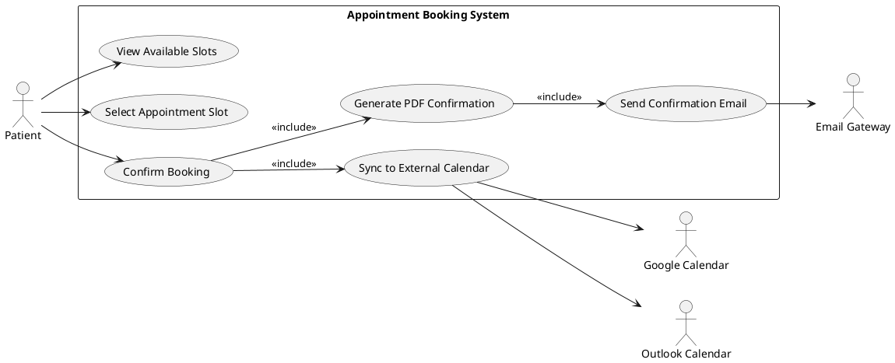

#### UC-002: Request Preferred Slot Swap

- **Actor(s)**: Patient
- **Goal**: Book an available slot while requesting automatic swap to a preferred unavailable slot
- **Preconditions**:
  - Patient has valid account and is authenticated
  - Patient has identified both available and preferred unavailable slots
- **Success Scenario**:
  1. Patient selects an available slot for immediate booking
  2. Patient indicates a different preferred slot (currently unavailable)
  3. System validates both slot selections
  4. System creates appointment for available slot
  5. System registers preferred slot preference for monitoring
  6. System confirms booking with swap preference noted
  7. When preferred slot becomes available, system automatically swaps
  8. System releases original slot
  9. System notifies patient of successful swap
- **Extensions/Alternatives**:
  - 3a. Preferred slot becomes available during selection → System prompts patient to book directly
  - 7a. Preferred slot never opens → Appointment remains at original slot
  - 7b. Multiple patients prefer same slot → First-registered preference wins
- **Postconditions**:
  - Appointment booked at available slot
  - Swap preference registered and monitored
  - Patient notified of any swap execution

##### Use Case Diagram

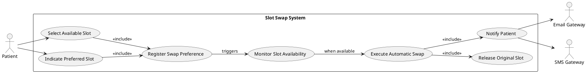

#### UC-003: Complete Patient Intake (AI Conversational)

- **Actor(s)**: Patient
- **Goal**: Provide required intake information through AI-guided conversation
- **Preconditions**:
  - Patient has booked appointment or is in booking flow
  - AI conversational service is available
- **Success Scenario**:
  1. Patient selects AI conversational intake option
  2. System initiates conversational interface
  3. AI guides patient through information collection via natural dialogue
  4. Patient responds to AI prompts naturally
  5. AI extracts and structures responses into intake form
  6. System displays summary for patient review
  7. Patient confirms or edits collected information
  8. System saves completed intake
- **Extensions/Alternatives**:
  - 4a. Patient wants to switch to manual form → System preserves current data, transitions to manual form
  - 6a. Patient identifies errors → System allows inline corrections
  - 3a. AI fails to understand response → AI rephrases question or offers manual input for field
- **Postconditions**:
  - Intake information captured and stored
  - Data available for clinical preparation

##### Use Case Diagram

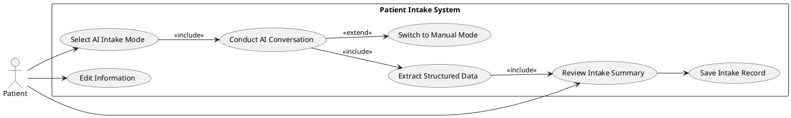

#### UC-004: Complete Patient Intake (Manual Form)

- **Actor(s)**: Patient
- **Goal**: Provide required intake information through traditional form interface
- **Preconditions**:
  - Patient has booked appointment or is in booking flow
- **Success Scenario**:
  1. Patient selects manual form intake option
  2. System displays structured intake form
  3. Patient fills in required fields
  4. System validates input in real-time
  5. Patient reviews completed form
  6. Patient submits intake form
  7. System saves completed intake
- **Extensions/Alternatives**:
  - 3a. Patient wants to switch to AI mode → System preserves current data, transitions to AI conversation
  - 4a. Validation error detected → System highlights field with clear error message
  - 5a. Patient wants to edit → System allows inline corrections
- **Postconditions**:
  - Intake information captured and stored
  - Data available for clinical preparation

##### Use Case Diagram

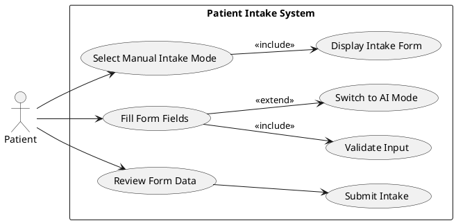

#### UC-005: Upload Clinical Documents

- **Actor(s)**: Patient
- **Goal**: Upload historical clinical documents for data extraction
- **Preconditions**:
  - Patient has valid account and is authenticated
  - Patient has clinical documents in supported formats (PDF)
- **Success Scenario**:
  1. Patient navigates to document upload interface
  2. Patient selects documents for upload
  3. System validates file format and size
  4. System uploads and stores documents securely
  5. System queues documents for data extraction
  6. System extracts structured data (vitals, history, medications)
  7. System updates 360-degree patient view
  8. System identifies and flags any data conflicts
  9. Patient can view extracted data summary
- **Extensions/Alternatives**:
  - 3a. Invalid file format → System displays supported formats error
  - 6a. Extraction fails → System logs error, notifies patient that manual review needed
  - 8a. Critical conflicts detected → System prominently highlights for review
- **Postconditions**:
  - Documents securely stored
  - Extracted data added to patient profile
  - Conflicts flagged for review

##### Use Case Diagram

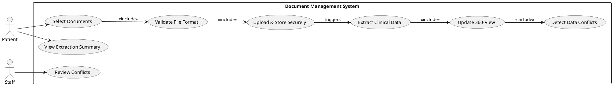

#### UC-006: View 360-Degree Patient Profile

- **Actor(s)**: Patient, Staff
- **Goal**: View consolidated patient health information from all sources
- **Preconditions**:
  - User is authenticated with appropriate role permissions
  - Patient has data in the system (intake, documents, or appointments)
- **Success Scenario**:
  1. User navigates to patient dashboard/profile
  2. System retrieves consolidated patient data
  3. System displays unified 360-degree view including:
     - Demographics and contact information
     - Medical history summary
     - Current medications (de-duplicated)
     - Vital signs history
     - Appointment history
     - Uploaded documents list
  4. System highlights any unresolved data conflicts
  5. System displays AI-suggested ICD-10/CPT codes (if applicable)
- **Extensions/Alternatives**:
  - 2a. Patient has no data → System displays empty state with guidance
  - 4a. User clicks on conflict → System shows conflict details with source documents
  - 5a. Staff verifies codes → System records verification
- **Postconditions**:
  - User views comprehensive patient information
  - Conflicts visible for resolution

##### Use Case Diagram

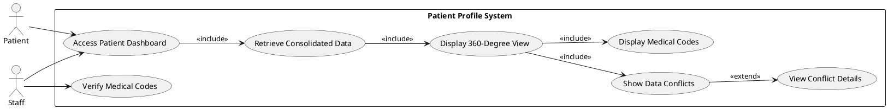

#### UC-007: Handle Walk-in Booking

- **Actor(s)**: Staff
- **Goal**: Create appointment for walk-in patient
- **Preconditions**:
  - Staff member is authenticated
  - Same-day appointment slots are available
- **Success Scenario**:
  1. Staff selects walk-in booking function
  2. Staff searches for existing patient account
  3. If patient exists: Staff selects patient
  4. If patient does not exist: Staff enters minimal patient info
  5. Staff selects available same-day slot
  6. System creates appointment record
  7. System adds patient to same-day queue
  8. Staff optionally creates full patient account for future visits
- **Extensions/Alternatives**:
  - 3a. Multiple patient matches → Staff verifies identity and selects correct record
  - 5a. No same-day slots → Staff offers next available or adds to waitlist
  - 8a. Patient declines account creation → Walk-in processed without persistent account
- **Postconditions**:
  - Walk-in appointment created
  - Patient added to same-day queue
  - Patient account created if requested

##### Use Case Diagram

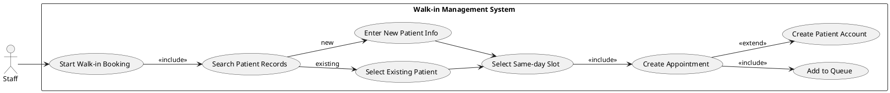

#### UC-008: Manage Same-Day Queue

- **Actor(s)**: Staff
- **Goal**: Monitor and manage same-day patient queue
- **Preconditions**:
  - Staff member is authenticated
  - Same-day appointments exist
- **Success Scenario**:
  1. Staff accesses same-day queue dashboard
  2. System displays ordered list of scheduled and walk-in patients
  3. System shows appointment times, wait times, and status
  4. Staff monitors queue for arrival status
  5. Staff reorders queue as needed (walk-ins, delays)
  6. System updates display in real-time
- **Extensions/Alternatives**:
  - 4a. High wait times detected → System highlights for staff attention
  - 5a. Patient cancels → Staff removes from queue
- **Postconditions**:
  - Queue accurately reflects current patient status
  - Staff has visibility into flow

##### Use Case Diagram

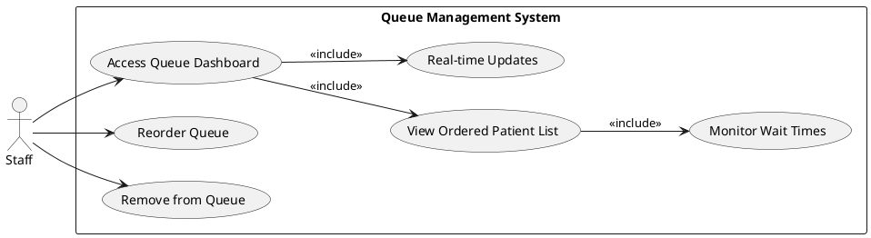

#### UC-009: Mark Patient Arrival

- **Actor(s)**: Staff
- **Goal**: Update patient status to "Arrived" when they check in
- **Preconditions**:
  - Staff member is authenticated
  - Patient has scheduled appointment for current day
- **Success Scenario**:
  1. Patient arrives and approaches front desk
  2. Staff searches for patient in today's appointments
  3. Staff verifies patient identity
  4. Staff marks patient as "Arrived"
  5. System updates patient status
  6. System adjusts queue position if applicable
  7. System logs arrival time
- **Extensions/Alternatives**:
  - 2a. Patient not found in today's schedule → Staff offers walk-in booking
  - 3a. Identity verification fails → Staff requests additional identification
- **Postconditions**:
  - Patient status updated to "Arrived"
  - Arrival time recorded
  - Queue updated accordingly

##### Use Case Diagram

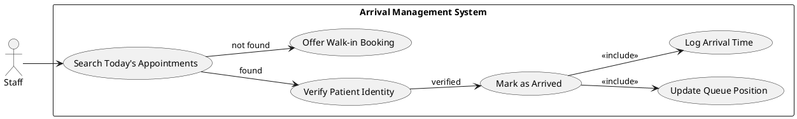

#### UC-010: Perform Insurance Pre-Check

- **Actor(s)**: Staff
- **Goal**: Validate patient insurance information before appointment
- **Preconditions**:
  - Patient has provided insurance information
  - Internal dummy insurance records exist for validation
- **Success Scenario**:
  1. Staff accesses insurance validation screen
  2. Staff enters or confirms insurance name and ID
  3. System validates against internal predefined records
  4. System returns validation result (pass/fail)
  5. Staff records validation outcome
- **Extensions/Alternatives**:
  - 4a. Validation fails → System displays failure reason, staff notes for follow-up
  - 2a. Insurance info missing → Staff requests from patient
- **Postconditions**:
  - Insurance validation status recorded
  - Staff aware of any validation issues

##### Use Case Diagram

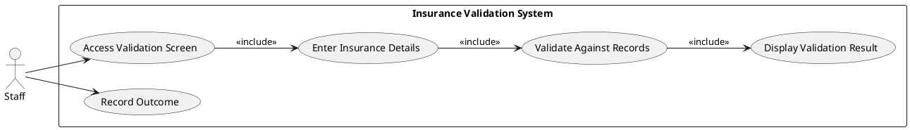

#### UC-011: Review Clinical Data Conflicts

- **Actor(s)**: Staff
- **Goal**: Review and resolve data conflicts from multiple clinical documents
- **Preconditions**:
  - Patient has uploaded multiple clinical documents
  - System has detected data conflicts
- **Success Scenario**:
  1. Staff accesses conflict review interface
  2. System displays list of patients with unresolved conflicts
  3. Staff selects patient to review
  4. System shows conflicting data with source document references
  5. Staff reviews source documents
  6. Staff selects correct value or marks for clinical review
  7. System updates patient record with resolution
  8. System logs resolution with staff identity
- **Extensions/Alternatives**:
  - 4a. Critical conflict (e.g., medications) → System prominently highlights severity
  - 6a. Staff cannot resolve → Staff escalates to clinical staff
- **Postconditions**:
  - Conflict resolved or escalated
  - Resolution logged in audit trail
  - Patient 360-view updated

##### Use Case Diagram

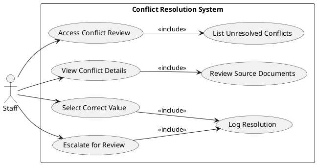

#### UC-012: Verify Medical Codes

- **Actor(s)**: Staff
- **Goal**: Review and verify AI-suggested ICD-10 and CPT codes
- **Preconditions**:
  - System has extracted clinical data and generated code suggestions
  - Staff has appropriate permissions
- **Success Scenario**:
  1. Staff accesses medical code verification interface
  2. System displays AI-suggested codes with confidence scores
  3. System shows supporting evidence from clinical documents
  4. Staff reviews each suggested code
  5. Staff confirms, modifies, or rejects each code
  6. System records verification decision
  7. System updates agreement rate metrics
- **Extensions/Alternatives**:
  - 4a. Low confidence code → System flags for extra attention
  - 5a. Staff adds code not suggested by AI → System includes in patient record
- **Postconditions**:
  - Medical codes verified and recorded
  - Agreement rate metrics updated
  - Audit trail maintained

##### Use Case Diagram

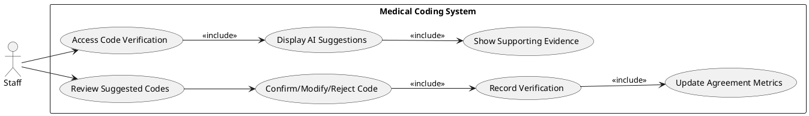

#### UC-013: Manage User Accounts

- **Actor(s)**: Admin
- **Goal**: Create, update, or deactivate user accounts
- **Preconditions**:
  - Admin is authenticated with admin role
- **Success Scenario**:
  1. Admin accesses user management console
  2. Admin selects action (create/edit/deactivate)
  3. For create: Admin enters user details and assigns role
  4. For edit: Admin modifies user information
  5. For deactivate: Admin disables account (preserves data)
  6. System validates changes
  7. System applies changes
  8. System logs action in audit trail
- **Extensions/Alternatives**:
  - 6a. Validation fails → System displays error, admin corrects
  - 5a. Attempt to delete last admin → System prevents action
- **Postconditions**:
  - User account created/modified/deactivated
  - Action logged for compliance

##### Use Case Diagram

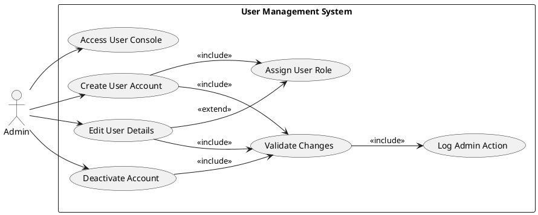

#### UC-014: Send Appointment Reminders

- **Actor(s)**: System (Automated)
- **Goal**: Deliver timely appointment reminders to patients
- **Preconditions**:
  - Appointments exist with future dates
  - Patient contact information available
  - Reminder scheduling configured
- **Success Scenario**:
  1. System identifies appointments requiring reminders (per schedule)
  2. System prepares reminder content
  3. System sends SMS reminder via gateway
  4. System sends Email reminder via gateway
  5. System logs delivery status
  6. System handles delivery failures with retry logic
- **Extensions/Alternatives**:
  - 3a. SMS delivery fails → System logs failure, attempts retry
  - 4a. Email delivery fails → System logs failure, attempts retry
  - 6a. Max retries exceeded → System marks as failed notification
- **Postconditions**:
  - Reminders sent via configured channels
  - Delivery status logged

##### Use Case Diagram

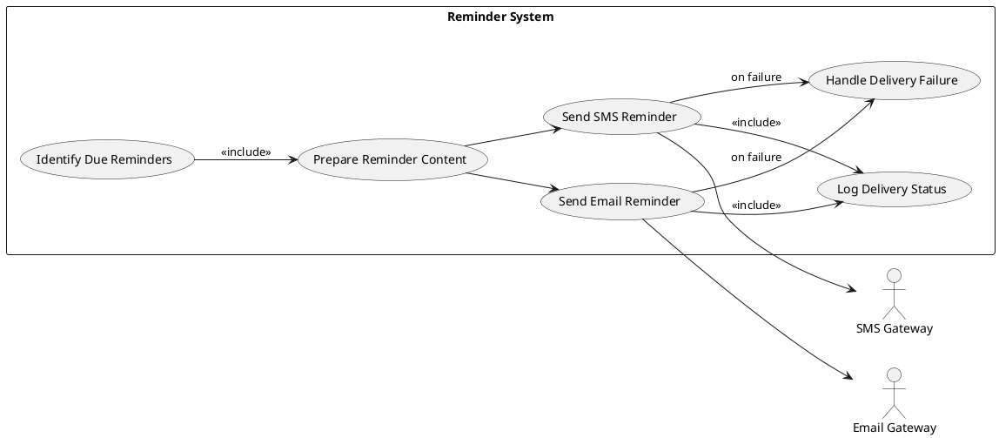

#### UC-015: Extract Clinical Document Data

- **Actor(s)**: System (Automated)
- **Goal**: Process uploaded documents and extract structured clinical data
- **Preconditions**:
  - clinical document uploaded and stored
  - Document processing service available
- **Success Scenario**:
  1. System receives document for processing
  2. System performs text extraction (OCR if needed)
  3. System applies NLP/AI to identify clinical entities
  4. System extracts vitals, medications, medical history
  5. System generates confidence scores
  6. System stores extracted data in patient profile
  7. System compares with existing data for conflicts
  8. System flags conflicts for review
- **Extensions/Alternatives**:
  - 2a. OCR fails → System logs error, marks document for manual review
  - 3a. Low extraction confidence → System flags for human verification
- **Postconditions**:
  - Structured data extracted from document
  - Conflicts identified and flagged
  - Data available in 360-degree view

##### Use Case Diagram

```plantuml
@startuml UC-015 Extract Clinical Document Data
left to right direction
skinparam packageStyle rectangle

rectangle "Document Processing System" {
  usecase "Receive Document" as UC015a
  usecase "Perform Text Extraction" as UC015b
  usecase "Apply NLP Entity Recognition" as UC015c
  usecase "Extract Clinical Data" as UC015d
  usecase "Generate Confidence Scores" as UC015e
  usecase "Store in Patient Profile" as UC015f
  usecase "Detect Data Conflicts" as UC015g
  usecase "Flag for Manual Review" as UC015h
}

UC015a --> UC015b : <<include>>
UC015b --> UC015c : <<include>>
UC015c --> UC015d : <<include>>
UC015d --> UC015e : <<include>>
UC015e --> UC015f : <<include>>
UC015f --> UC015g : <<include>>
UC015g --> UC015h : conflicts found
UC015c --> UC015h : low confidence
@enduml
```

## Risks & Mitigations

| Risk ID | Risk | Impact | Likelihood | Mitigation |
|---------|------|--------|------------|------------|
| R-001 | AI extraction accuracy below 98% target | Clinical errors, trust deficit | Medium | Mandatory human verification workflow; confidence thresholds; continuous model training |
| R-002 | Free-tier API rate limits for calendar sync | Failed synchronizations, poor UX | Medium | Implement queuing with retry logic; batch updates; graceful degradation messaging |
| R-003 | PDF document format variability causing extraction failures | Incomplete patient profiles, manual fallback burden | High | Support multiple extraction methods; OCR fallback; clear format guidance; manual entry option |
| R-004 | HIPAA compliance gaps in free hosting infrastructure | Legal liability, data breach | Low | Encrypt all PHI; conduct security audit; document compliance controls; regular penetration testing |
| R-005 | Session timeout (15 min) causing data loss during intake | Patient frustration, abandoned intake | Medium | Implement auto-save; warn before timeout; allow session extension; preserve partial data |

## Constraints & Assumptions

| ID | Type | Statement | Rationale |
|----|------|-----------|-----------|
| C-001 | Constraint | Platform must use exclusively free, open-source hosting (Netlify, Vercel, GitHub Codespaces) | BRD Section 5: Paid cloud hosting (AWS, Azure) strictly out of scope for Phase 1 |
| C-002 | Constraint | System must be deployable via Windows Services/IIS | BRD Section 7: Native deployment capabilities required |
| C-003 | Constraint | Patient self-check-in (mobile, web, QR code) is explicitly excluded | BRD Section 6: Only staff can mark patient as "Arrived" |
| A-001 | Assumption | Internal dummy insurance records will be sufficient for Phase 1 validation | Full insurance integration out of scope; soft validation against known test records |
| A-002 | Assumption | Patients uploading documents will primarily use PDF format | System designed for PDF; other formats may require future enhancement |
