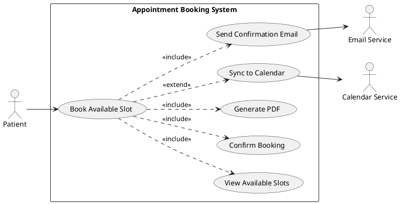
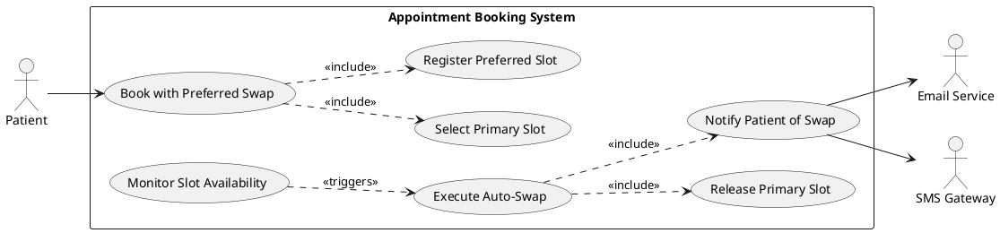
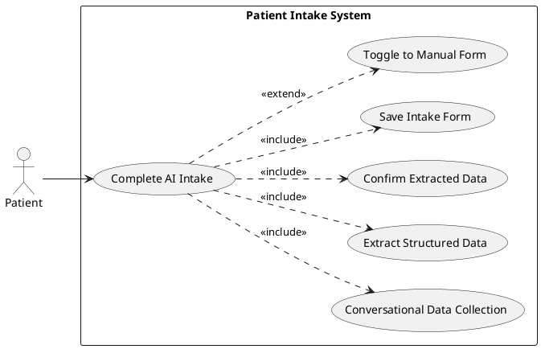
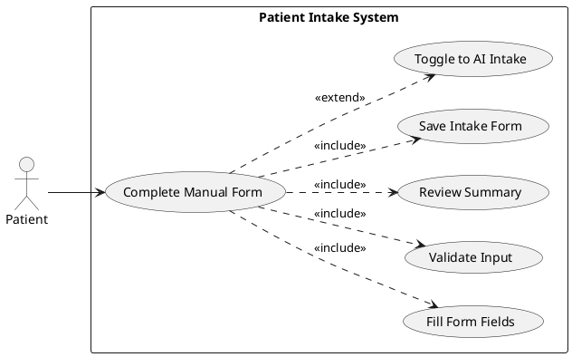
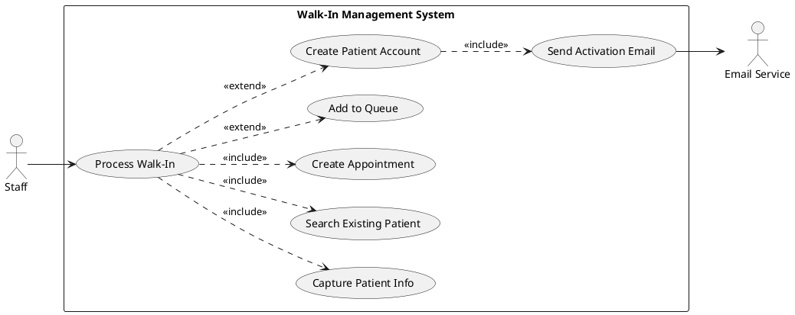
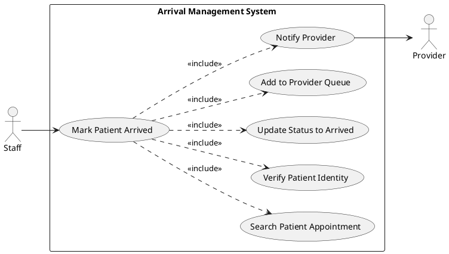
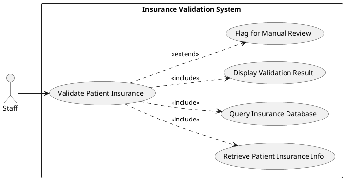
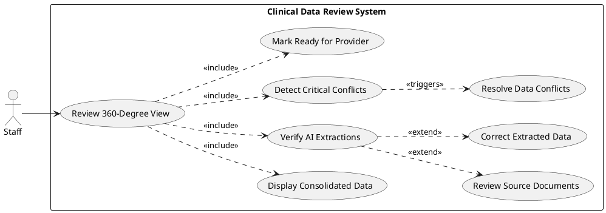
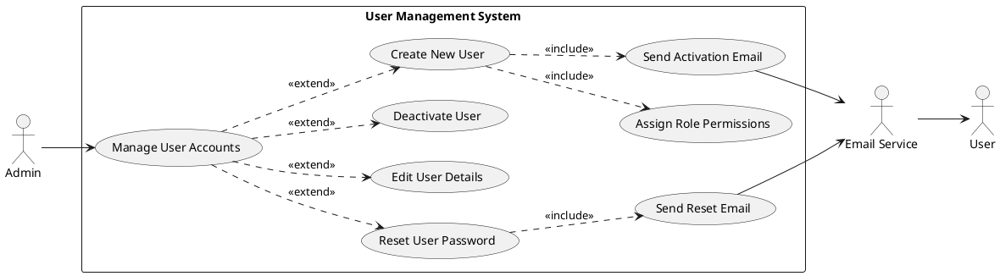
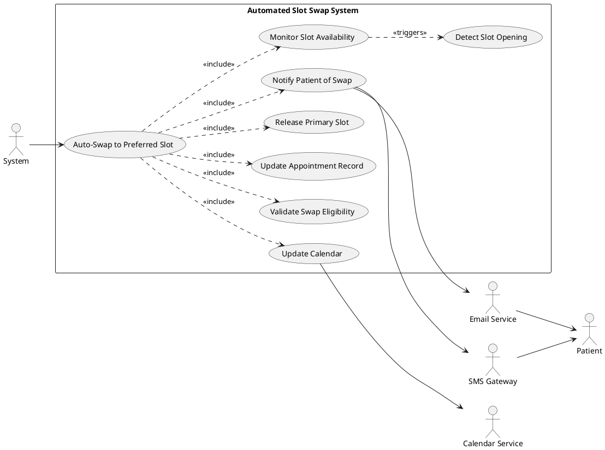

# Requirements Specification

## Feature Goal

Build a unified, standalone healthcare platform that bridges patient scheduling and clinical data management. The platform simplifies appointment booking, reduces no-show rates through intelligent features, and eliminates manual extraction of patient data from unstructured reports. The system serves three user roles (Patients, Staff, Admins) and provides a seamless data lifecycle from initial booking to post-visit data consolidation with automated ICD-10/CPT code mapping.

**Current State:** Healthcare organizations suffer from disconnected data pipelines with 15% no-show rates, 20+ minute manual clinical data extraction, and fragmented booking tools that lack clinical context.

**Desired End State:** Unified platform with <15% no-show rate, 2-minute data verification (down from 20 minutes), >98% AI-human agreement rate for clinical data, deployed on free infrastructure with 99.9% uptime.

## Business Justification

- **Operational Efficiency:** Reduces staff administrative time by 90% (20 min → 2 min) for clinical prep via AI-powered data extraction
- **Revenue Protection:** Decreases no-show rates through dynamic preferred slot swap and intelligent reminders, recovering lost appointment revenue
- **Market Differentiation:** Bridges the "Black Box" trust deficit in AI coding tools by providing transparent, verifiable clinical data extraction with explicit conflict highlighting
- **User Experience:** Flexible patient intake (AI conversational OR manual) respects user autonomy while streamlining data collection
- **Compliance & Security:** HIPAA-compliant architecture with immutable audit logs and role-based access control
- **Cost Optimization:** Exclusive use of free hosting platforms (Netlify/Vercel, GitHub Codespaces) eliminates infrastructure costs

**Integration with Existing Features:** Greenfield project with integration touchpoints for future EHR systems, calendar APIs (Google/Outlook), and insurance validation services.

**Problems Solved:**
- **For Patients:** Complex booking processes causing missed appointments; forced data entry methods
- **For Staff:** Manual PDF report reading bottleneck; disconnected scheduling systems
- **For Providers:** Incomplete patient data views; delayed clinical prep; trust deficit in AI-generated codes

## Feature Scope

### In-Scope (Phase 1)

**User Roles:**
- Patients (appointment booking, intake management, dashboard access)
- Staff (walk-in management, arrival tracking, clinical data review)
- Admin (user account management, system configuration)

**Appointment Booking & Scheduling:**
- Real-time slot availability with dynamic preferred slot swap
- Waitlist functionality for fully booked schedules
- Automated multi-channel reminders (SMS/Email) with no-show risk scoring
- Google/Outlook calendar sync via free APIs
- PDF appointment confirmation via email

**Patient Intake:**
- AI conversational intake OR manual form (user-selectable, togglable anytime)
- Editable intake without staff assistance

**Staff-Controlled Operations:**
- Walk-in booking with optional account creation
- Same-day queue management
- "Arrived" status marking (no patient self-check-in allowed)

**Insurance Pre-Check:**
- Soft validation against internal dummy records (name + ID only)

**Clinical Data Aggregation:**
- Multi-format PDF upload and AI extraction
- 360-Degree Patient View with de-duplication
- Critical data conflict highlighting (e.g., medication discrepancies)
- Post-visit clinical note ingestion

**Medical Coding:**
- ICD-10 code extraction from aggregated patient data
- CPT code mapping based on patient profiles

**Security & Compliance:**
- HIPAA-compliant data handling, transmission (TLS 1.2+), and storage (encrypted at rest)
- Role-based access control (RBAC)
- Immutable audit logging for all actions
- 15-minute automatic session timeout

**Technology Stack:**
- Frontend: React (TypeScript) + Tailwind CSS
- Backend: .NET 8 (ASP.NET Core Web API)
- Database: PostgreSQL with pgvector extension
- Hosting: Free platforms only (Netlify/Vercel for frontend, GitHub Codespaces or equivalent for backend)

### Out-of-Scope (Phase 1)

- Provider logins or provider-facing workflows
- Payment gateway integration (reserved for future reservation fees)
- Family member profile features
- Patient self-check-in (mobile, web portal, or QR code)
- Direct bi-directional EHR integration
- Full claims submission workflows
- Paid cloud infrastructure (AWS, Azure, GCP)

### Success Criteria

- [ ] Demonstrable reduction in baseline no-show rate (target: <15%)
- [ ] Staff administrative time reduced to ≤2 minutes per appointment for clinical prep
- [ ] AI-human agreement rate >98% for extracted clinical data and medical codes
- [ ] 99.9% platform uptime achieved on free hosting infrastructure
- [ ] Critical conflicts identified metric tracks ≥5 prevented safety risks or claim denials per 100 appointments
- [ ] HIPAA compliance audit passes with zero findings
- [ ] 100% of appointments successfully synced to patient calendars (Google/Outlook)
- [ ] Patient dashboard creation volume meets adoption targets (baseline TBD in pilot)

## Functional Requirements

### Appointment Booking & Scheduling

- **FR-001: System MUST display real-time appointment slot availability**
  - Display available slots filtered by provider, location, and appointment type
  - Update availability within 5 seconds of slot status change
  - Show time zones clearly for multi-location practices
  - Acceptance Criteria: User sees only bookable slots; booked slots disappear immediately; timezone displayed next to each slot

- **FR-002: [DETERMINISTIC] System MUST allow patients to book available appointment slots**
  - Enable single-click booking for displayed available slots
  - Confirm booking within 3 seconds with confirmation number
  - Send immediate email confirmation with PDF attachment
  - Acceptance Criteria: Patient selects slot → receives confirmation email with PDF within 60 seconds; booking appears in patient dashboard

- **FR-003: [HYBRID] System MUST enable dynamic preferred slot swap functionality**
  - Allow patient to book available slot while selecting preferred unavailable slot
  - Automatically swap to preferred slot when it becomes available
  - Release original slot back to availability pool upon swap
  - Notify patient of successful swap via email/SMS
  - Acceptance Criteria: Patient books Slot A (available), selects Slot B (unavailable, preferred) → Slot B opens → system auto-swaps → patient receives swap notification; Slot A returns to pool

- **FR-004: [DETERMINISTIC] System MUST maintain waitlist for fully booked schedules**
  - Allow patients to join waitlist for fully booked dates
  - Notify waitlisted patients when slots open (FIFO order)
  - Provide 2-hour response window before offering to next waitlist member
  - Acceptance Criteria: All slots filled → patient joins waitlist → slot opens → first waitlisted patient notified; no response in 2 hours → next patient notified

- **FR-005: [DETERMINISTIC] System MUST sync appointments to Google Calendar via free API**
  - Create calendar event in patient's Google Calendar upon booking
  - Include appointment details (provider, location, time, instructions)
  - Update calendar event if appointment rescheduled or canceled
  - Acceptance Criteria: Patient authorizes Google Calendar → booking creates calendar entry; reschedule updates entry; cancel removes entry

- **FR-006: [DETERMINISTIC] System MUST sync appointments to Outlook Calendar via free API**
  - Create calendar event in patient's Outlook Calendar upon booking
  - Include appointment details (provider, location, time, instructions)
  - Update calendar event if appointment rescheduled or canceled
  - Acceptance Criteria: Patient authorizes Outlook Calendar → booking creates calendar entry; reschedule updates entry; cancel removes entry

- **FR-007: [DETERMINISTIC] System MUST generate PDF appointment confirmation**
  - Generate PDF containing appointment details, provider info, location, instructions
  - Include QR code for future features (no functionality in Phase 1)
  - Format PDF for mobile and desktop viewing
  - Acceptance Criteria: PDF generated within 10 seconds of booking; contains all required fields; renders correctly on mobile/desktop

- **FR-008: [DETERMINISTIC] System MUST send appointment details via email**
  - Send confirmation email with PDF attachment within 60 seconds of booking
  - Include plain text appointment summary in email body
  - Provide calendar file attachment (.ics) as fallback for manual calendar add
  - Acceptance Criteria: Patient receives email within 60 seconds; PDF attachment opens correctly; .ics file imports to calendar apps

### Patient Intake Management

- **FR-009: [AI-CANDIDATE] System MUST provide AI conversational intake option**
  - Offer natural language conversational interface for intake data collection
  - Collect standard intake fields (demographics, medical history, medications, allergies, reason for visit)
  - Allow patient to pause and resume conversation at any time
  - Extract structured data from conversational responses
  - Acceptance Criteria: Patient selects AI intake → conversational UI appears → patient provides information naturally → system extracts structured data accurately (>95% field completion accuracy)

- **FR-010: [DETERMINISTIC] System MUST provide manual form intake option**
  - Display traditional form with standard intake fields
  - Support field validation (required fields, format checks)
  - Allow save-as-draft functionality
  - Acceptance Criteria: Patient selects manual intake → form appears with all standard fields → validation prevents invalid submissions; draft saves successfully

- **FR-011: [DETERMINISTIC] System MUST allow patients to toggle between AI and manual intake anytime**
  - Provide visible toggle switch on intake interface
  - Preserve entered data when switching modes
  - Display confirmation prompt before mode switch with unsaved changes
  - Acceptance Criteria: Patient starts AI intake → toggles to manual → data preserved; manual form → toggle to AI → data carries over; unsaved changes trigger confirmation dialog

- **FR-012: [DETERMINISTIC] System MUST allow intake editing without staff assistance**
  - Enable patient to edit submitted intake data before appointment
  - Show edit history with timestamps
  - Lock intake editing 24 hours before appointment (configurable)
  - Acceptance Criteria: Patient submits intake → edits within allowed window → changes saved; edit attempt after lock time shows error message; staff can view edit history

### Reminders & Notifications

- **FR-013: [DETERMINISTIC] System MUST send automated SMS reminders**
  - Send SMS reminder 24 hours before appointment
  - Include appointment date, time, provider, location
  - Provide reply-to-confirm functionality
  - Acceptance Criteria: Appointment booked → SMS sent 24 hours prior; patient replies "C" or "Confirm" → confirmation recorded

- **FR-014: [DETERMINISTIC] System MUST send automated email reminders**
  - Send email reminder 48 hours and 24 hours before appointment
  - Include appointment details and reschedule/cancel links
  - Track email open and link click rates
  - Acceptance Criteria: Appointment booked → emails sent at T-48h and T-24h; reschedule link opens scheduler; cancel link prompts confirmation

- **FR-015: [HYBRID] System MUST assess no-show risk using rule-based scoring**
  - Calculate risk score based on: historical no-show rate, late cancellations, reminder non-responses, appointment lead time
  - Flag high-risk appointments (score >70) for staff review
  - Suggest interventions (confirmation call, deposit requirement) for high-risk cases
  - Acceptance Criteria: System calculates score for each booking; high-risk appointments flagged in staff dashboard; intervention suggestions displayed

### Staff-Controlled Operations

- **FR-016: [DETERMINISTIC] Staff MUST create walk-in bookings exclusively**
  - Provide staff interface to create walk-in appointments
  - Block patient-initiated walk-in bookings
  - Allow walk-in booking without existing patient account
  - Acceptance Criteria: Staff logs in → creates walk-in appointment from staff dashboard; patient cannot create walk-in from patient portal

- **FR-017: [DETERMINISTIC] Staff MUST optionally create patient accounts post walk-in**
  - Provide account creation workflow accessible after walk-in check-in
  - Pre-populate account with walk-in intake data
  - Send account activation email to patient
  - Acceptance Criteria: Walk-in checked in → staff selects "Create Account" → account created with pre-filled data; patient receives activation email

- **FR-018: [DETERMINISTIC] Staff MUST manage same-day appointment queues**
  - Display same-day appointment queue with arrival status
  - Allow drag-and-drop queue reordering
  - Show expected wait time for each patient in queue
  - Acceptance Criteria: Same-day appointments appear in queue view; staff reorders queue → order persists; wait time calculated based on provider schedule

- **FR-019: [DETERMINISTIC] Staff MUST mark patients as "Arrived"**
  - Provide "Check In" button in staff dashboard for scheduled appointments
  - Update patient status to "Arrived" with timestamp
  - Trigger notification to provider when patient arrives
  - Acceptance Criteria: Patient arrives → staff clicks "Check In" → status updates to "Arrived"; provider receives notification

- **FR-020: [DETERMINISTIC] System MUST prevent patient self-check-in via all channels**
  - Block patient portal check-in functionality
  - Disable QR code check-in features
  - Disable mobile app check-in features
  - Acceptance Criteria: Patient logs in → no check-in button visible; QR code scan shows "Staff Check-In Required" message

### Insurance Pre-Check

- **FR-021: [DETERMINISTIC] System MUST validate insurance name and ID against internal records**
  - Compare entered insurance name and member ID against internal dummy record database
  - Display validation status (Match Found / No Match / Manual Review Required)
  - Flag mismatches for staff follow-up
  - Acceptance Criteria: Patient enters insurance info → system validates against dummy DB; match displays green checkmark; mismatch displays warning and flags for staff

### Clinical Data Aggregation

- **FR-022: [AI-CANDIDATE] System MUST extract patient data from uploaded PDF documents**
  - Accept multi-format PDF uploads (lab reports, imaging results, referral notes)
  - Extract structured data: vitals, diagnoses, medications, allergies, procedures, lab values
  - Tag extracted data with confidence scores (High >90%, Medium 70-90%, Low <70%)
  - Display low-confidence extractions for staff verification
  - Acceptance Criteria: PDF uploaded → data extracted within 30 seconds; structured data displayed with confidence scores; low-confidence items highlighted for review

- **FR-023: [AI-CANDIDATE] System MUST consolidate multi-document patient data into 360-Degree View**
  - Aggregate data from intake forms, uploaded documents, and post-visit notes
  - De-duplicate identical data points across sources
  - Merge compatible data (e.g., medication lists from multiple documents)
  - Display unified timeline view of patient history
  - Acceptance Criteria: Multiple documents uploaded → system consolidates data; duplicates removed; merged data displayed in timeline; each data point shows source document

- **FR-024: [DETERMINISTIC] System MUST highlight critical data conflicts explicitly**
  - Detect conflicts: medication discrepancies, allergy mismatches, vital sign anomalies
  - Display conflicts in prominent warning UI element
  - Require staff acknowledgment before proceeding with appointment
  - Log conflict resolutions in audit trail
  - Acceptance Criteria: Conflicting data detected (e.g., Document A: "No allergies", Document B: "Penicillin allergy") → system displays red warning banner; staff must review and resolve; resolution logged with timestamp and user ID

- **FR-025: [AI-CANDIDATE] System MUST ingest post-visit clinical notes**
  - Import clinical notes from staff after appointment completion
  - Extract new diagnoses, procedures performed, medications prescribed
  - Update 360-Degree Patient View with post-visit data
  - Tag data source as "Post-Visit [Date]"
  - Acceptance Criteria: Staff uploads post-visit note → data extracted and added to patient view; new diagnoses/meds appear in timeline; source tagged with visit date

### Medical Coding

- **FR-026: [AI-CANDIDATE] System MUST extract ICD-10 codes from patient data**
  - Analyze aggregated patient data (diagnoses, symptoms, procedures)
  - Suggest relevant ICD-10 codes with confidence scores
  - Display code descriptions and documentation requirements
  - Allow staff to accept, reject, or modify suggested codes
  - Acceptance Criteria: Patient data analyzed → ICD-10 codes suggested with >90% relevance accuracy; staff reviews and confirms codes; accepted codes saved to patient record

- **FR-027: [AI-CANDIDATE] System MUST map CPT codes based on patient profile**
  - Analyze procedures documented in patient data
  - Suggest relevant CPT codes with confidence scores
  - Display code descriptions, modifiers, and billing requirements
  - Allow staff to accept, reject, or modify suggested codes
  - Acceptance Criteria: Procedure data analyzed → CPT codes suggested with >90% relevance accuracy; staff reviews and confirms codes; accepted codes saved to patient record

### User & Session Management

- **FR-028: [DETERMINISTIC] System MUST enforce role-based access control (Patient, Staff, Admin)**
  - Restrict Patient role to: booking, intake, dashboard, document upload
  - Restrict Staff role to: walk-in management, arrival tracking, clinical data review, coding review
  - Restrict Admin role to: user management, system configuration, audit log access
  - Deny access to features outside assigned role
  - Acceptance Criteria: Patient logs in → cannot access staff features; Staff logs in → cannot access admin panel; Admin logs in → full access; unauthorized access attempts logged

- **FR-029: [DETERMINISTIC] System MUST implement 15-minute automatic session timeout**
  - Track user inactivity (no clicks, keyboard input, or API calls)
  - Display timeout warning at 13 minutes
  - Log user out after 15 minutes of inactivity
  - Preserve unsaved form data in secure session storage for 1 hour post-logout
  - Acceptance Criteria: User inactive for 13 min → warning appears; no action for 2 more min → auto-logout; user logs back in → unsaved data recoverable (if within 1 hour)

- **FR-030: [DETERMINISTIC] Admin MUST manage user accounts**
  - Create, edit, deactivate user accounts (Patient, Staff roles)
  - Reset user passwords
  - Assign and modify role permissions
  - View user activity logs
  - Acceptance Criteria: Admin logs in → creates new staff user → user receives activation email; Admin deactivates user → user cannot log in; Admin resets password → user receives reset link

### Security & Compliance

- **FR-031: [DETERMINISTIC] System MUST log all patient and staff actions immutably**
  - Record: user ID, action type, timestamp, affected resources, IP address
  - Store logs in append-only database table
  - Prevent log modification or deletion
  - Retain logs for 7 years (HIPAA requirement)
  - Acceptance Criteria: User performs action → log entry created with all required fields; admin attempts log edit → operation fails; logs retained for 7 years

- **FR-032: [DETERMINISTIC] System MUST encrypt data transmission using TLS 1.2+**
  - Enforce HTTPS for all client-server communication
  - Use TLS 1.2 or higher with strong cipher suites
  - Reject connections using deprecated protocols (SSL, TLS 1.0, TLS 1.1)
  - Acceptance Criteria: All API endpoints require HTTPS; HTTP requests redirect to HTTPS; TLS <1.2 handshakes rejected

- **FR-033: [DETERMINISTIC] System MUST encrypt data at rest**
  - Encrypt database files using AES-256
  - Encrypt uploaded PDF files using AES-256
  - Store encryption keys in secure key management system (separate from application)
  - Acceptance Criteria: Database backup files encrypted; uploaded files stored encrypted; decryption possible only with proper key access

### Infrastructure & Performance

- **FR-034: [DETERMINISTIC] System MUST achieve 99.9% uptime target**
  - Implement health check endpoints for monitoring
  - Configure auto-restart on failures (within free platform limits)
  - Display maintenance mode page during planned downtime
  - Track uptime metrics and alert on degradation
  - Acceptance Criteria: Monthly uptime ≥99.9% (44 min max downtime); health check responds within 500ms; failures trigger auto-restart

- **FR-035: [DETERMINISTIC] System MUST deploy on free hosting platforms only**
  - Frontend deployed on Netlify or Vercel free tier
  - Backend deployed on GitHub Codespaces, Render free tier, or equivalent
  - Database hosted on free PostgreSQL providers (ElephantSQL free tier, Supabase free tier)
  - Use only free-tier APIs for calendar sync and notifications
  - Acceptance Criteria: Zero hosting costs incurred; all infrastructure components on free platforms; no paid API usage

## Use Case Analysis

### Actors & System Boundary

- **Primary Actor: Patient**
  - Role: End user seeking healthcare appointments and managing personal health information
  - Responsibilities: Book appointments, complete intake forms, upload medical documents, review appointment confirmations

- **Primary Actor: Staff (Front Desk / Call Center)**
  - Role: Administrative personnel managing patient flow and clinical data preparation
  - Responsibilities: Handle walk-in appointments, mark patient arrivals, validate insurance, review and verify clinical data extractions, manage same-day queues

- **Primary Actor: Admin**
  - Role: System administrator managing user accounts and system configuration
  - Responsibilities: Create/edit/deactivate user accounts, assign role permissions, review audit logs, configure system settings

- **System Actor: Calendar Integration Service**
  - Role: External system (Google Calendar, Outlook Calendar) receiving appointment sync requests
  - Interaction: Accepts calendar event creation/update/deletion requests via free APIs

- **System Actor: Email Service**
  - Role: External SMTP service for transactional emails
  - Interaction: Receives email send requests (confirmations, reminders, notifications)

- **System Actor: SMS Gateway**
  - Role: External SMS service for text message reminders
  - Interaction: Receives SMS send requests via free-tier API

### Use Case Specifications

#### UC-001: Patient Books Appointment with Available Slot

- **Actor(s)**: Patient
- **Goal**: Book an appointment in a specific available time slot
- **Preconditions**: 
  - Patient has active account and is logged in
  - At least one appointment slot is available
  - Patient has completed intake form (or will do so after booking)
- **Success Scenario**:
  1. Patient navigates to appointment booking interface
  2. System displays available slots filtered by provider/location/type
  3. Patient selects desired available slot
  4. System prompts for appointment confirmation
  5. Patient confirms booking
  6. System creates appointment record with confirmation number
  7. System generates PDF confirmation with appointment details
  8. System sends confirmation email with PDF attachment within 60 seconds
  9. System syncs appointment to patient's linked calendar (Google/Outlook)
  10. System displays success message with confirmation number
- **Extensions/Alternatives**:
  - 3a. Patient selects unavailable slot → System displays "Slot No Longer Available" message → Return to step 2
  - 7a. PDF generation fails → System logs error, sends email with plain text details only, notifies admin
  - 9a. Calendar sync fails → System logs warning, appointment still confirmed, patient can manually add via .ics file attachment
- **Postconditions**: 
  - Appointment record created in database
  - Slot marked as unavailable
  - Confirmation email sent
  - Calendar event created (if sync successful)
  - Audit log entry recorded

##### Use Case Diagram

#### UC-002: Patient Books with Preferred Slot Swap

- **Actor(s)**: Patient
- **Goal**: Book available slot while registering interest in currently unavailable preferred slot
- **Preconditions**: 
  - Patient has active account and is logged in
  - At least one appointment slot is available (but not patient's preferred slot)
  - Patient's preferred slot is currently booked by another patient
- **Success Scenario**:
  1. Patient navigates to appointment booking interface
  2. System displays available slots and unavailable slots (grayed out)
  3. Patient selects available slot as primary booking
  4. System prompts "Would you prefer a different time?" with option to select preferred slot
  5. Patient selects currently unavailable preferred slot
  6. System books available slot and registers preferred slot swap request
  7. System creates appointment record with primary slot and swap request
  8. System sends confirmation email explaining booking with swap request
  9. [Time passes - preferred slot becomes available]
  10. System detects preferred slot availability
  11. System automatically swaps appointment from primary slot to preferred slot
  12. System releases primary slot back to availability pool
  13. System sends swap confirmation email/SMS to patient
- **Extensions/Alternatives**:
  - 5a. Patient declines preferred slot selection → Complete booking with primary slot only (UC-001)
  - 10a. Preferred slot never becomes available before appointment date → Patient attends primary slot appointment
  - 11a. Patient has canceled appointment before preferred slot opens → Swap request canceled, slot remains available
- **Postconditions**: 
  - Appointment record created with primary slot
  - Swap request registered in database
  - Patient notified of booking with swap possibility
  - When swap occurs: appointment updated to preferred slot, primary slot released, patient notified

##### Use Case Diagram

#### UC-003: Patient Completes AI Conversational Intake

- **Actor(s)**: Patient
- **Goal**: Complete pre-appointment intake questionnaire using AI conversational interface
- **Preconditions**: 
  - Patient has booked appointment (or is in booking flow)
  - Patient has active account and is logged in
  - Patient chooses AI intake option
- **Success Scenario**:
  1. Patient selects "Start AI Intake" option
  2. System displays conversational AI interface with initial greeting
  3. AI asks for demographic information in natural language
  4. Patient responds with free-text answers
  5. AI extracts structured data from responses and asks follow-up questions
  6. AI proceeds through medical history, medications, allergies, reason for visit
  7. AI confirms extracted information with patient
  8. Patient reviews and confirms or corrects extracted data
  9. System saves completed intake form to patient record
  10. System displays "Intake Complete" confirmation
- **Extensions/Alternatives**:
  - 4a. Patient provides incomplete answer → AI asks clarifying follow-up question
  - 7a. Patient wants to pause intake → Patient clicks "Save & Continue Later" → System saves progress → Patient can resume anytime
  - 8a. Patient identifies incorrect extraction → Patient corrects via inline edit → AI learns from correction
  - Any step: Patient toggles to manual form (FR-011) → System preserves entered data → Switch to form interface (UC-004)
- **Postconditions**: 
  - Intake form completed and saved to patient record
  - Structured data extracted and stored in database
  - Patient ready to attend appointment

##### Use Case Diagram

#### UC-004: Patient Completes Manual Form Intake

- **Actor(s)**: Patient
- **Goal**: Complete pre-appointment intake questionnaire using traditional form interface
- **Preconditions**: 
  - Patient has booked appointment (or is in booking flow)
  - Patient has active account and is logged in
  - Patient chooses manual form option
- **Success Scenario**:
  1. Patient selects "Start Manual Form" option
  2. System displays traditional intake form with standard fields
  3. Patient enters demographic information in form fields
  4. System validates required fields and formats in real-time
  5. Patient proceeds through medical history, medications, allergies, reason for visit sections
  6. Patient clicks "Review" button
  7. System displays summary of entered information
  8. Patient confirms accuracy and submits form
  9. System saves completed intake form to patient record
  10. System displays "Intake Complete" confirmation
- **Extensions/Alternatives**:
  - 4a. Required field left blank → System displays inline error message → Patient completes field
  - 4b. Invalid format (e.g., phone number) → System displays format example → Patient corrects
  - Any step: Patient clicks "Save Draft" → System saves progress → Patient can resume anytime
  - Any step: Patient toggles to AI intake (FR-011) → System preserves entered data → Switch to AI interface (UC-003)
- **Postconditions**: 
  - Intake form completed and saved to patient record
  - Structured data stored in database
  - Patient ready to attend appointment

##### Use Case Diagram

#### UC-005: Staff Processes Walk-In Appointment

- **Actor(s)**: Staff
- **Goal**: Create appointment for patient who arrives without prior booking
- **Preconditions**: 
  - Staff member is logged in
  - Patient is physically present at facility
  - At least one same-day slot is available OR provider can accommodate walk-in
- **Success Scenario**:
  1. Staff member navigates to "Walk-In Management" interface
  2. Staff member clicks "New Walk-In" button
  3. System displays walk-in intake form
  4. Staff member enters patient information (name, contact, reason for visit)
  5. System searches for existing patient record by name/DOB
  6. No match found → System treats as new patient
  7. Staff member selects available provider/time or adds to same-day queue
  8. System creates walk-in appointment record
  9. System prompts "Create patient account for future bookings?"
  10. Staff member selects "Yes" and enters patient email
  11. System creates patient account with temporary password
  12. System sends account activation email to patient
  13. System displays walk-in confirmation with queue position or appointment time
- **Extensions/Alternatives**:
  - 5a. Existing patient found → System loads patient record → Skip to step 7
  - 7a. No same-day slots available → Staff adds to walk-in queue → System estimates wait time
  - 10a. Staff selects "No" or "Later" → Walk-in processed without account creation → End use case
  - 10b. Patient declines account creation → Staff marks "Account Declined" → End use case
- **Postconditions**: 
  - Walk-in appointment record created
  - Patient added to same-day schedule or queue
  - Optional: Patient account created and activation email sent
  - Staff can proceed to check-in when patient is ready (UC-006)

##### Use Case Diagram

#### UC-006: Staff Marks Patient as Arrived

- **Actor(s)**: Staff
- **Goal**: Check in patient upon arrival for scheduled appointment
- **Preconditions**: 
  - Staff member is logged in
  - Patient has scheduled appointment for current date
  - Patient is physically present at facility
- **Success Scenario**:
  1. Staff member navigates to "Arrival Management" interface
  2. System displays list of appointments for current date
  3. Staff member searches for patient by name or appointment time
  4. System displays patient appointment details
  5. Staff member verifies patient identity (name, DOB)
  6. Staff member clicks "Check In" button
  7. System updates appointment status to "Arrived" with timestamp
  8. System adds patient to provider's queue
  9. System sends notification to provider (patient checked in)
  10. System displays updated queue with estimated wait time
- **Extensions/Alternatives**:
  - 3a. Patient name not found → Staff verifies appointment details → Check if walk-in (UC-005)
  - 6a. Patient arrives early (>30 min before slot) → System displays warning → Staff can check in anyway or ask patient to return later
  - 6b. Patient arrives late (>15 min after slot) → System flags as late arrival → Staff notifies provider
- **Postconditions**: 
  - Patient status updated to "Arrived"
  - Provider notified of patient arrival
  - Patient visible in provider's queue
  - Audit log entry recorded with check-in timestamp

##### Use Case Diagram

#### UC-007: Staff Validates Patient Insurance

- **Actor(s)**: Staff
- **Goal**: Verify patient insurance information against internal records
- **Preconditions**: 
  - Staff member is logged in
  - Patient has provided insurance name and member ID (via intake form or verbally)
  - Internal dummy insurance database is populated
- **Success Scenario**:
  1. Staff member navigates to patient record
  2. System displays patient insurance information entered during intake
  3. Staff member clicks "Validate Insurance" button
  4. System queries internal dummy insurance database
  5. Match found for insurance name and member ID
  6. System displays "Validation Successful" with green checkmark
  7. System updates patient record with validation timestamp
  8. Staff member proceeds with appointment check-in
- **Extensions/Alternatives**:
  - 5a. No match found → System displays "Validation Failed - No Match" → Staff member flags for manual verification
  - 5b. Partial match (name matches, ID doesn't) → System displays "Manual Review Required" → Staff member contacts insurance or patient
  - 5c. Insurance info missing from intake → Staff prompts patient for information → Updates patient record → Return to step 3
- **Postconditions**: 
  - Insurance validation status recorded in patient record
  - Staff can proceed with appointment or escalate to manual verification
  - Audit log entry recorded with validation result

##### Use Case Diagram

#### UC-008: Staff Reviews 360-Degree Patient View

- **Actor(s)**: Staff
- **Goal**: Access consolidated patient clinical data for appointment preparation
- **Preconditions**: 
  - Staff member is logged in
  - Patient has uploaded at least one clinical document OR completed intake form
  - AI extraction has processed uploaded documents (FR-022, FR-023)
- **Success Scenario**:
  1. Staff member navigates to patient record
  2. Staff member clicks "360-Degree View" tab
  3. System displays unified patient timeline with:
     - Demographics from intake
     - Medical history from uploaded documents
     - Medications from all sources (consolidated)
     - Allergies from all sources (consolidated)
     - Lab results and vitals from uploaded reports
     - Previous diagnoses and ICD-10 codes
  4. Staff member reviews consolidated data
  5. Staff member verifies AI-extracted data marked with confidence scores
  6. AI-extracted data with HIGH confidence (>90%) displayed normally
  7. AI-extracted data with MEDIUM confidence (70-90%) highlighted yellow
  8. AI-extracted data with LOW confidence (<70%) highlighted red for verification
  9. Staff member clicks red-highlighted item to review source document
  10. Staff member confirms or corrects extracted data
  11. System updates patient record with verified data
  12. [If critical conflicts detected (FR-024)] System displays red warning banner
  13. Staff member reviews conflict details (e.g., "Document A: No allergies" vs "Document B: Penicillin allergy")
  14. Staff member resolves conflict by selecting correct data or flagging for provider review
  15. System logs conflict resolution with staff member ID and timestamp
  16. Staff member completes review and marks patient as "Ready for Provider"
- **Extensions/Alternatives**:
  - 3a. No uploaded documents → 360-Degree View shows intake form data only
  - 10a. Staff identifies additional errors → Staff edits data inline → System records correction
  - 12a. No conflicts detected → Skip to step 16
  - 14a. Conflict requires provider input → Staff flags as "Provider Review Required" → Provider reviews during appointment
- **Postconditions**: 
  - Staff has reviewed consolidated patient data
  - Low-confidence extractions verified or flagged
  - Critical conflicts resolved or escalated
  - Patient marked as ready for provider (or flagged for provider review)
  - Audit log entries recorded for all verifications and corrections

##### Use Case Diagram

#### UC-009: Admin Manages User Accounts

- **Actor(s)**: Admin
- **Goal**: Create, edit, deactivate, and manage permissions for user accounts
- **Preconditions**: 
  - Admin is logged in with admin role
  - Admin has permission to manage users
- **Success Scenario - Create User**:
  1. Admin navigates to "User Management" interface
  2. Admin clicks "Create New User" button
  3. System displays user creation form
  4. Admin enters user information (name, email, role: Patient/Staff/Admin)
  5. Admin assigns role-specific permissions
  6. Admin clicks "Create User" button
  7. System validates email uniqueness
  8. System creates user account with temporary password
  9. System sends activation email to user with temporary password
  10. System displays "User Created Successfully" confirmation
  11. New user appears in user list
- **Success Scenario - Deactivate User**:
  1. Admin navigates to "User Management" interface
  2. Admin searches for user by name or email
  3. System displays user details
  4. Admin clicks "Deactivate User" button
  5. System prompts "Confirm deactivation?" with reason field
  6. Admin enters deactivation reason and confirms
  7. System deactivates user account (disables login)
  8. System logs deactivation with admin ID, timestamp, and reason
  9. User appears as "Inactive" in user list
- **Success Scenario - Reset Password**:
  1. Admin navigates to "User Management" interface
  2. Admin searches for user by name or email
  3. System displays user details
  4. Admin clicks "Reset Password" button
  5. System generates password reset token
  6. System sends password reset email to user
  7. System displays "Reset Email Sent" confirmation
- **Extensions/Alternatives**:
  - 7a (Create). Email already exists → System displays error "User with this email already exists"
  - 6a (Deactivate). User has active appointments → System warns "User has upcoming appointments" → Admin can proceed or cancel
  - 5a (Reset). User email bounces → System logs bounce → Admin manually provides new password
- **Postconditions**: 
  - User account created, deactivated, or password reset
  - Audit log entry recorded with admin action details
  - User receives appropriate email notification

##### Use Case Diagram

#### UC-010: System Automatically Swaps Preferred Slot When Available

- **Actor(s)**: System (automated process), Patient (notified)
- **Goal**: Automatically move patient to preferred slot when it becomes available
- **Preconditions**: 
  - Patient has active appointment in primary slot
  - Patient has registered preferred slot swap request
  - Preferred slot becomes available (cancellation or slot added)
  - Current time is at least 24 hours before preferred slot time
- **Success Scenario**:
  1. System monitors preferred slot availability every 5 minutes
  2. Preferred slot status changes from "Booked" to "Available"
  3. System detects availability change
  4. System retrieves patient appointment details and swap request
  5. System verifies patient appointment still active (not canceled)
  6. System updates appointment record:
     - Old slot: Primary slot time → New slot: Preferred slot time
     - Marks swap request as "Completed"
  7. System releases primary slot back to availability pool
  8. System sends swap confirmation email to patient:
     - Subject: "Great News! Your Preferred Appointment Slot is Now Available"
     - Body: Original slot → New slot details with updated PDF
  9. System sends swap confirmation SMS to patient
  10. System updates patient's linked calendar (delete old event, create new event)
  11. System generates new PDF confirmation with preferred slot details
  12. System logs swap action in audit trail
- **Extensions/Alternatives**:
  - 5a. Patient canceled appointment before preferred slot opened → System cancels swap request → Preferred slot remains available for other patients
  - 6a. Preferred slot becomes unavailable during swap processing (race condition) → System aborts swap → Patient remains in primary slot → System logs failed swap attempt
  - 10a. Calendar sync fails → System logs warning → Swap still successful → Patient notified to manually update calendar
- **Postconditions**: 
  - Patient appointment moved to preferred slot
  - Primary slot released and available for booking
  - Patient notified via email and SMS
  - Calendar updated with new appointment time
  - Audit log entry recorded with swap details

##### Use Case Diagram

## Risks & Mitigations

1. **Risk: HIPAA Compliance Violation Due to Free Hosting Limitations**
   - **Impact**: Legal penalties, loss of trust, project shutdown
   - **Likelihood**: Medium (free platforms may lack full HIPAA compliance)
   - **Mitigation**: 
     - Select hosting providers with HIPAA-compliant free tiers (e.g., Supabase free tier with encryption)
     - Implement end-to-end encryption for PHI in transit and at rest (FR-032, FR-033)
     - Conduct pre-launch HIPAA compliance audit
     - Use Business Associate Agreements (BAAs) where available on free tiers
     - Fall back to self-hosted open source options (PostgreSQL on free VPS with encryption)

2. **Risk: Low AI Accuracy Leading to Clinical Errors**
   - **Impact**: Incorrect ICD-10/CPT codes, patient safety risks, claim denials
   - **Likelihood**: Medium (AI extraction accuracy dependent on document quality)
   - **Mitigation**: 
     - Implement confidence scoring for all AI extractions (FR-022, FR-026, FR-027)
     - Require staff verification for all low-confidence extractions (<70%)
     - Display explicit conflict warnings for critical data discrepancies (FR-024)
     - Track AI-human agreement rate (target >98%) and retrain model if below threshold
     - Provide "view source document" feature for inline verification during review

3. **Risk: Infrastructure Performance Degradation on Free Tiers**
   - **Impact**: Slow response times, failed bookings, poor user experience, uptime <99.9%
   - **Likelihood**: High (free tiers have strict resource limits)
   - **Mitigation**: 
     - Implement aggressive caching strategy (Redis for session data, API responses)
     - Optimize database queries and add indexes for common queries
     - Use lazy loading for document previews and 360-Degree View
     - Implement health check monitoring with auto-restart on failures (FR-034)
     - Design graceful degradation (e.g., disable AI intake under high load, fall back to manual form)
     - Conduct load testing pre-launch to identify breaking points

4. **Risk: Patient Adoption Failure Due to AI Intake Resistance**
   - **Impact**: Low platform usage, continued manual processes, failed no-show rate reduction
   - **Likelihood**: Medium (some users distrust AI or prefer traditional forms)
   - **Mitigation**: 
     - Provide always-available manual form option with no penalties (FR-010, FR-011)
     - Allow seamless toggle between AI and manual modes at any time (FR-011)
     - Use friendly, non-technical language in AI conversational interface
     - Conduct user testing with diverse patient demographics pre-launch
     - Provide opt-out option with clear "Use Traditional Form Instead" button

5. **Risk: Preferred Slot Swap Causing Confusion or Dissatisfaction**
   - **Impact**: Patients miss appointments due to confusion about slot changes, increased cancellations
   - **Likelihood**: Low (clear communication can prevent most issues)
   - **Mitigation**: 
     - Send prominent swap notification via both email and SMS (UC-010)
     - Include both old and new appointment times in swap notification
     - Update calendar automatically to prevent slot confusion (FR-005, FR-006)
     - Provide "Swap History" view in patient dashboard showing all changes
     - Require patient confirmation of swap within 24 hours (future enhancement consideration)

## Constraints & Assumptions

### Constraints

1. **Infrastructure Cost Constraint**: All hosting, APIs, and services MUST use free tiers or open-source alternatives; zero paid subscriptions allowed in Phase 1 (FR-035)

2. **No Patient Self-Check-In**: Patients cannot check themselves in via any channel (mobile app, web portal, QR code) per business rule; only staff can mark "Arrived" status (FR-020)

3. **Technology Stack Locked**: React (TypeScript) + Tailwind CSS for frontend, .NET 8 for backend, PostgreSQL with pgvector for database; deviations not permitted

4. **Phase 1 Role Limitation**: Provider-facing features excluded; only Patient, Staff, and Admin roles implemented

5. **Session Timeout Non-Negotiable**: 15-minute automatic session timeout required for HIPAA compliance (FR-029)

### Assumptions

1. **Patient Email Access**: Assumes all patients have email access for appointment confirmations, reminders, and swap notifications; SMS serves as secondary channel

2. **Document Upload Quality**: Assumes uploaded clinical documents (PDFs) are machine-readable text (not handwritten or low-quality scans); OCR for scanned documents is out of scope for Phase 1

3. **Internal Insurance Database Availability**: Assumes pre-populated internal dummy insurance database exists for soft validation (FR-021); external real-time insurance API verification is out of scope

4. **Free API Availability**: Assumes Google Calendar API and Outlook Calendar API free tiers remain available and sufficient for calendar sync functionality throughout Phase 1

5. **Internet Connectivity**: Assumes patients and staff have reliable internet access; offline mode is out of scope for Phase 1
